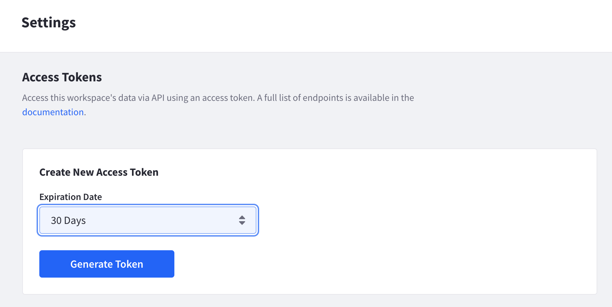
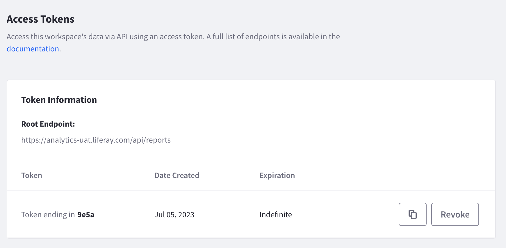

# Authentication

In order for developers to call any of the API endpoints provided, they need to first create a personal access token by accessing their Liferay Analytics Cloud workspace.



The generated token is usable for a default period of 30 days. Once the token expires, a new token must be generated to perform additional API calls.



The token must be copied and set to the request authorization header on every API call. If you’re using curl command line, this can be done by setting the following request header.

```
curl -i -L -H "Authorization: Bearer {token}"
```
