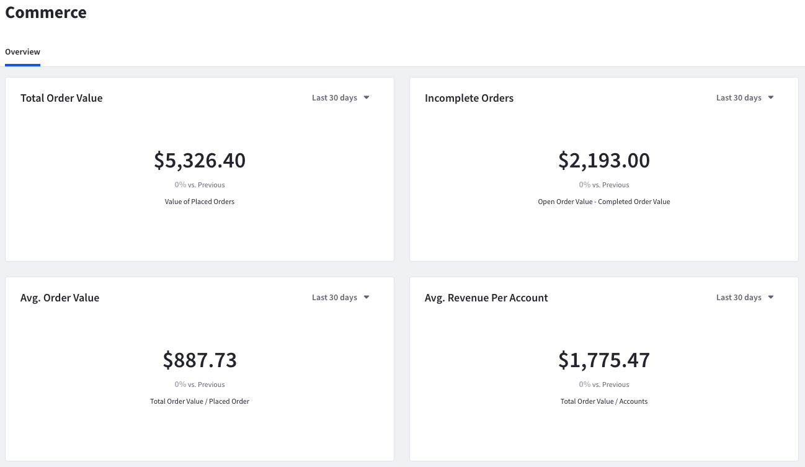
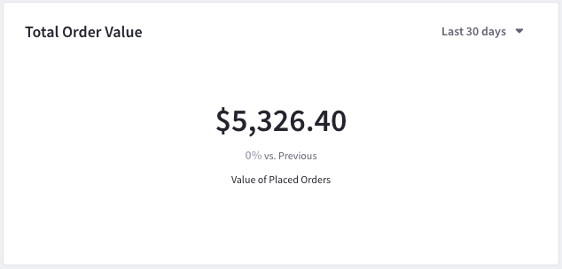
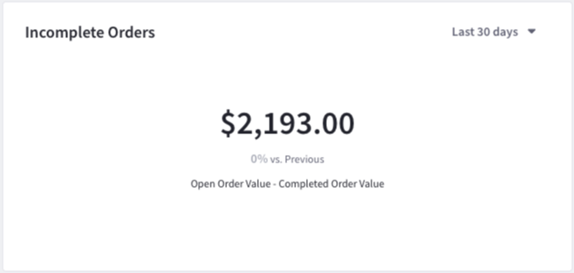
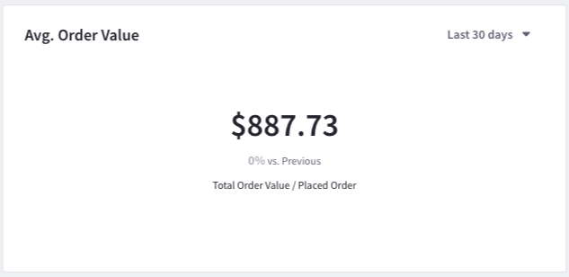
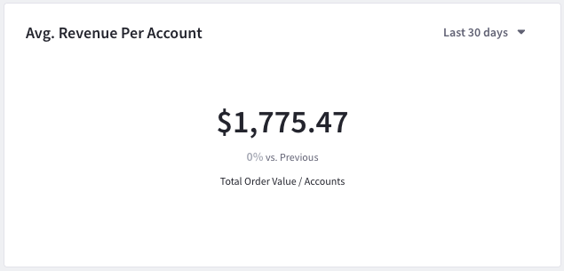

# Commerce Dashboard

After [enabling Commerce](../getting-started/connecting-liferay-dxp-to-analytics-cloud.md), you can review Commerce data via the Analytics Cloud dashboard. This dashboard organizes data into four cards.

* Total Order Value
* Incomplete Orders
* Average Order Value
* Average Revenue Per Account

You can filter Commerce data by date and compare current metrics with previous performance data.



```{note}
Please allow up to 2 hours for the Commerce data to appear on the dashboard after connecting Liferay DXP to Analytics Cloud.
```

## Total Order Value



This card displays the total order value across all accounts from synced channels.

## Incomplete Orders



This card displays the total value of incomplete orders across all accounts from synced channels. Incomplete orders are orders that aren't checked out.

## Average Order Value



This card displays the average order value across all accounts from synced channels. This divides the total order value by the number of orders placed.

## Average Revenue Per Account



This card displays the average revenue relative to the number of accounts that have placed orders in synced channels. This divides the total order value by the number of accounts that placed orders.

```{note}
Analytics Cloud uses the currency of the synced Commerce channels.
```
