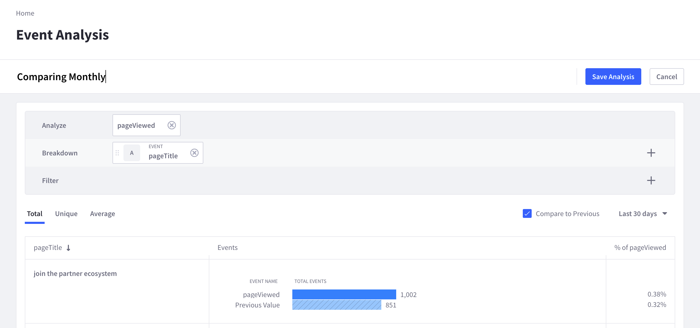

---
toc:
- ./getting-started/connecting-liferay-dxp-to-analytics-cloud.md
- ./getting-started/syncing-sites-and-contacts.md
- ./getting-started/understanding-your-sites-data.md
- ./getting-started/paths-and-pages.md
- ./getting-started/assets-and-events.md
- ./getting-started/understanding-your-audience.md
- ./getting-started/individuals.md
- ./getting-started/segments.md
---
# Getting Started

```{toctree}
:maxdepth: 3

getting-started/connecting-liferay-dxp-to-analytics-cloud.md
getting-started/syncing-sites-and-contacts.md
getting-started/understanding-your-sites-data.md
getting-started/paths-and-pages.md
getting-started/assets-and-events.md
getting-started/understanding-your-audience.md
getting-started/individuals.md
./getting-started/segments.md
```

Welcome to Liferay Analytics Cloud. This learning path will take you on a journey to learn how to setup and start using Analytics Cloud to get the most out of its different features. Delivering an awesome digital experience is important to you. But knowing how to craft your site and make future improvements only comes from understanding who your users are and knowing how they interact with your site. With the integration of Analytics Cloud and Liferay DXP, you can both measure what's happening on your site and easily put the data into action through site improvements.

Some key differences between Liferay Analytics Cloud versus other analytics solutions:

| Liferay Analytics Cloud | Other analytics products |
| :--- | :--- |
| Quick setup and out-of-the-box integration | Potentially lengthy setup process and manual integration |
| Both site-level and individual page analytics | Analytics mostly focused on individual pages |
| Insights into both known and anonymous visitors | Only anonymous visitor data (depending on site setup) |

Before diving into [Setting Up Your Analytics Cloud](#setting-up-you-analytics-cloud), let's take a quick tour of the major features that can bring your business the most value. In Analytics Cloud, all your analytics data is easily accessed through the navigation menu on the left of the screen. The [Touchpoints](#touchpoints) section reports on what's happening with your website, your individual pages, and different assets. The [People](#people) section reports on what individuals are doing on your website and on any segment data of groups of individuals.


## Touchpoints

From the moment you sync your DXP site, Analytics Cloud automatically begins collecting data across all your pages and assets. There's no need for additional configuration.  

### Sites

The [Sites Dashboard](./touchpoints/sites-dashboard.md) is a site-wide report that aggregates analytics data across your entire site in one comprehensive dashboard.


View analytics such as visitor data across time, most visited pages, and traffic sources.

Click the _Pages_ tab to see detailed analytics of every page on your site. Click any page to drill down on the specific analytics of that page.


Get actionable data such as how long visitors stay on a page or what percent of visitors leave a page. As you make improvements to your pages or promote them through marketing, use Analytics Cloud to track their performance over time.

From a page's analytics, click the _Path_ tab to see where the page's traffic is coming from (i.e. organic or referral traffic). This is especially useful if you are paying for ad traffic and want to know whether your marketing efforts are working.

### Assets

As background, the term _asset_ refers to any type of content that exists in a Liferay instance. This could be a blog post, a document, a file, a form, or other web content. Analytics Cloud tracks how visitors interact with these assets on your site. Click _Assets_ in the navigation menu to see analytics data of the various assets of your site.


The assets are organized by different types. Click on the different tabs at the top to see analytics for each type of asset.

### Events

The term _event_ refers to various user interactions that are tracked by Analytics Cloud. These are events such as page views, interactions with assets, and various other user actions. The [Events Analysis](./touchpoints/events/events-analysis.md) tool is a powerful tool to help break down and filter these events in ways that are meaningful to your business. 

For example, use the tool to compare the monthly page views of specific pages. 



The Events Analysis tool can become even more powerful if you [Define Custom Events](./workspace-data/definitions/definitions-for-events.md#custom-events) that are tailored to your site. See [Tracking Events](./touchpoints/events/tracking-events.md) to learn more.

## People

After syncing your Liferay DXP contacts, Analytics Cloud will begin tracking visitor data for you to analyze.

### Segments

Use the [Segments](./people/segments/segments.md) tool to group individuals based on common attributes. The segmentation can be set up dynamically by attributes you select, or set up statically with the individuals you specifically choose. For example, you could create a dynamic segment of managers by filtering any users on your site with a job title that contains the word "manager".


The overview tab gives you a quick view of the number of people in the segment and their top interests.

### Individuals

The [Individuals Dashboard](./people/individuals/individuals-dashboard.md) gives an overview of all your visitors. See which portion of your visitors are known users who are logged in to your site and which visitors are unknown. Click the _Known Individuals_ tab to drill down on a particular individual.


These [Individual Profiles](./people/individuals/individual-profiles.md) provide detailed analytics on how each user is interacting with your site. Understanding individual behavior and interests can help you make better decisions when improving your site to tailor user experience.

## Setting Up You Analytics Cloud

Now that you've seen some of the capabilities of Analytics Cloud, let's get your workspace set up. The first step is to connect your Liferay DXP instance to Analytics Cloud. This is, in essence, giving Analytics Cloud permission to view what's happening on your Liferay instance.

See [Connecting Liferay DXP to Analytics Cloud](./getting-started/connecting-liferay-dxp-to-analytics-cloud.md) and follow the steps.

The contents of the article are also covered in this video tutorial [What is Analytics Cloud?](https://youtu.be/RGGvIG3YPyg).