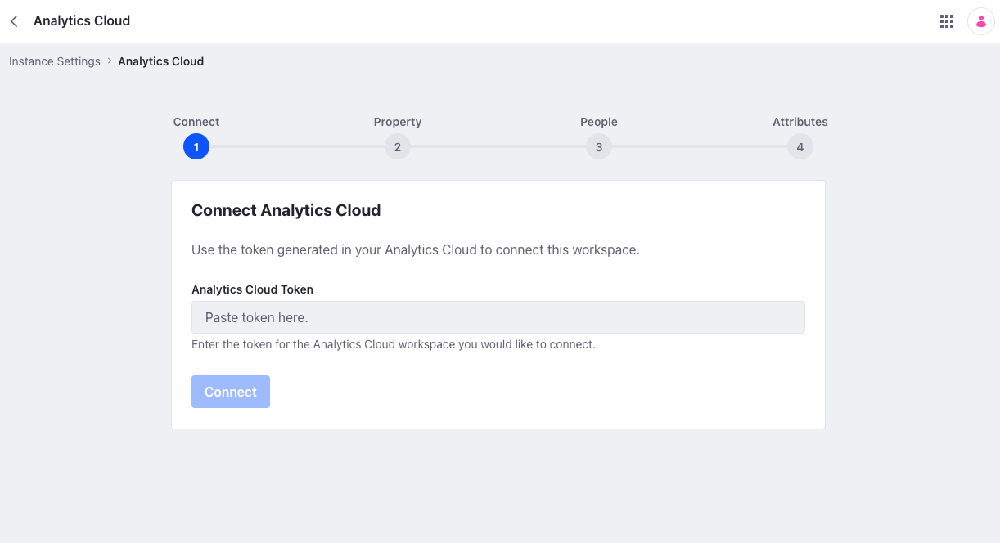
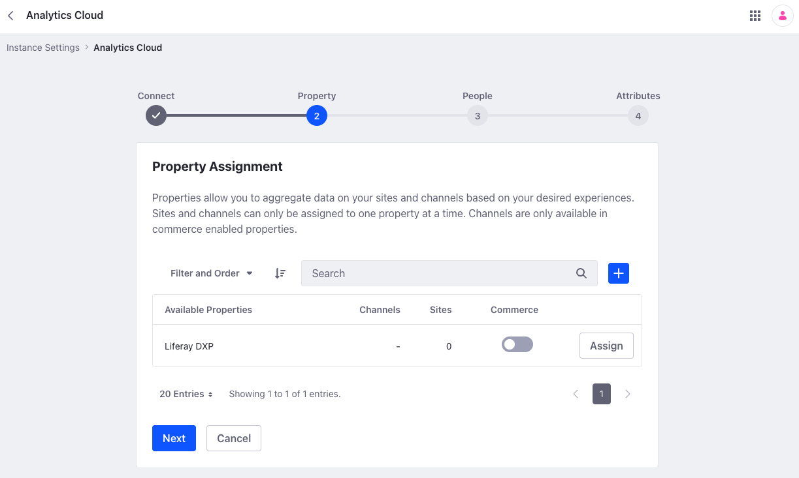
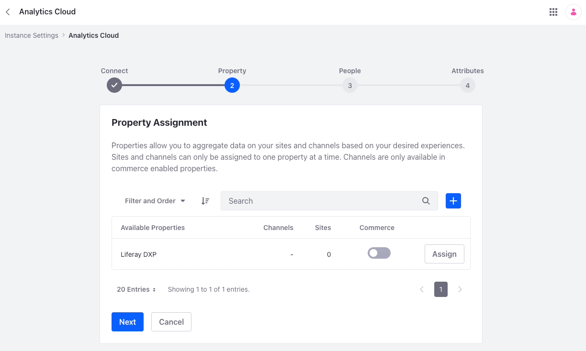
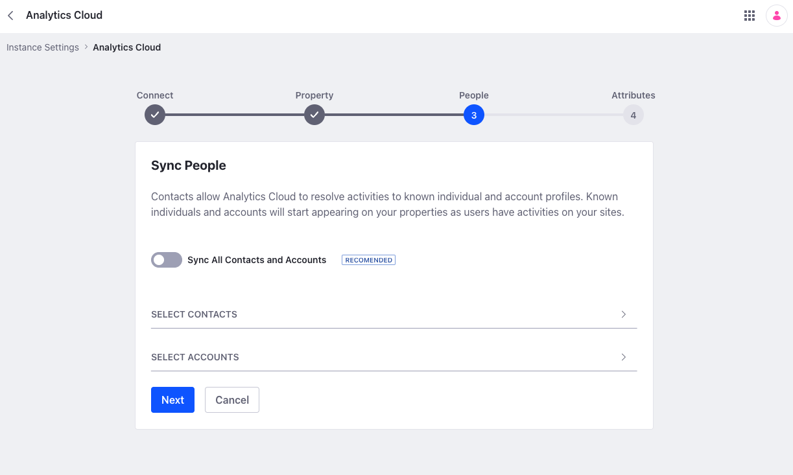
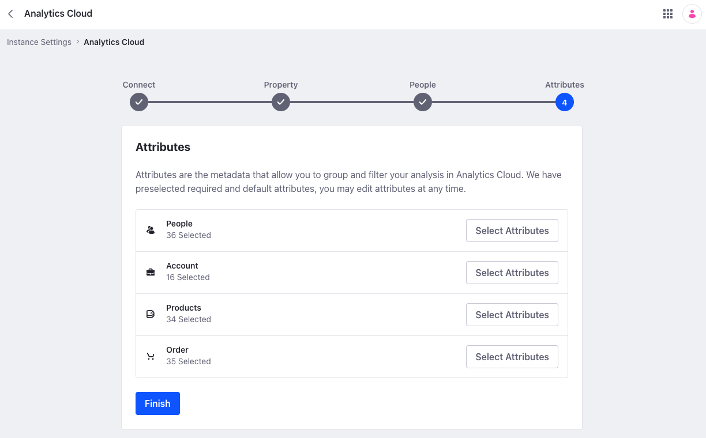
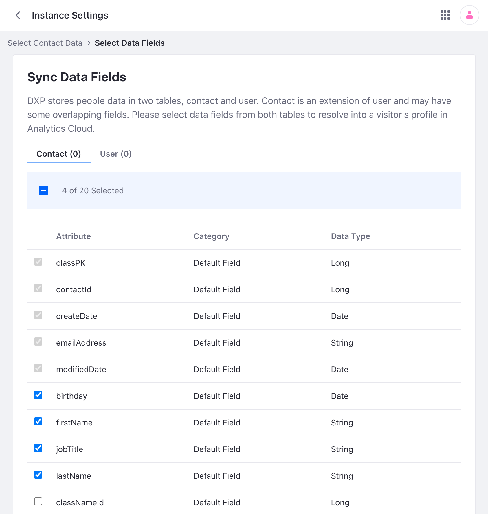

# Connecting Liferay DXP to Analytics Cloud

{bdg-secondary}`Liferay DXP 7.4 U112+`

Liferay DXP and Analytics Cloud connect via a secure, encrypted token. This token is generated by Analytics Cloud and must be added to your Liferay DXP configuration. Once connected, you can determine which data to sync.

!!! note
    This process varies for different Liferay DXP versions, though prerequisites are the same. See [Connecting Liferay DXP 7.3 to Analytics Cloud](#connecting-liferay-dxp-73-to-analytics-cloud) for alternative instructions.

## Prerequisites

Connecting Liferay DXP to Analytics Cloud has these prerequisites:

1. You need a [liferay.com](https://www.liferay.com) account. If you don't have one, you can [create an account](https://login.liferay.com/signin/register).

1. When you visit [analytics.liferay.com](https://analytics.liferay.com/) for the first time, you must set up multi-factor authentication for the account. See [Multi-Factor Authentication](../reference/multi-factor-authentication.md) for details.

1. Your Liferay DXP installation must meet one of the following minimum versions:

   - 7.4 U112+
   - 7.3 U30+ (hotfix required)

1. You must have access to at least one Analytics Cloud workspace. As a paid Analytics Cloud user, you should see your workspace upon login. If you don't, contact support through [help.liferay.com](https://help.liferay.com/).

1. (Optional) Liferay DXP's batch engine is used for syncing users. Increase the batch size if syncing a very large number of users. In Liferay DXP, navigate to *Global Menu* &rarr; *Instance Settings* &rarr; *Batch Engine*. Set the *Export Batch Size* and *Import Batch Size* to `1000`.

## Using the Onboarding Guide

1. Log into Analytics Cloud and select your workspace. If this is your first time logging in, the onboarding guide appears. Click *Next* and copy the Analytics Cloud token.

   

   Alternatively, you can find the token under *Settings* &rarr; *Data Sources*. Click *Add Data Source*, select *Liferay DXP*, and copy the Analytics Cloud token.

1. Log into your Liferay DXP instance.

1. Open the *Global Menu* (), go to the *Control Panel* tab, and click *Instance Settings*.

1. Under *Platform*, click *Analytics Cloud*. You see a four-step onboarding guide the first time you do this.

1. Enter the Analytics Cloud token and click *Connect*.

   

1. Select an existing Analytics Cloud property or click *Add* () to create one. Once selected, click *Assign*.

   !!! note
       Properties are labels associated with one or more Liferay sites and determine how Analytics Cloud aggregates your data.

   

1. Select the sites you want to assign to the property. Enable the *Commerce* toggle to assign Commerce [channels](https://learn.liferay.com/w/commerce/store-management/channels/introduction-to-channels) as well.

   You can assign the same site or channel to only one property at a time. See [Scoping Sites and Individuals Using Properties](../workspace-settings/scoping-sites-and-individuals-using-properties.md) for more information.

   

1. Click *Next*.

1. Select the individual and account profiles you want to sync. Use the toggle to sync all contact and account data or select subsets based on user group, organization, and account group.

   

   !!! important
       Analytics Cloud provides tools to sync and manage individual contact data. However, these tools do not guarantee compliance with privacy regulations (e.g. GDPR). You must carefully determine the practices and configurations necessary for complying with the privacy laws where your sites store and process personal data.

1. Click *Next*.

1. Select the desired attributes for each entity. If you're syncing Commerce channels, you can select attributes for Commerce entities. Analytics Cloud requires some fields to be synced; these fields are grayed out.

   

1. Click *Finish*. Verify this message appears:

   `Success: DXP has successfully connected to Analytics Cloud. You will begin to see data as activities occur on your sites.`

Great, now you're all set up! As users visit and interact with your site, Analytics Cloud begins tracking what's happening. Once that happens, you can take a dive into [Viewing the Analytics Dashboard](./viewing-the-analytics-dashboard.md) to see the different interactions that get tracked.

## Connecting Liferay DXP 7.3 to Analytics Cloud

### Connection Token

Liferay DXP and Analytics Cloud connect via a secure, encrypted token. This token is generated by Analytics Cloud and must be added to your Liferay DXP configuration. Once connected, you can determine which data to sync. The process is different depending on the version of Liferay DXP you have.

1. Log into Analytics Cloud and select your workspace. If this is your first time logging in, the onboarding guide appears. Click *Next* and copy the Analytics Cloud token.

   

   Alternatively, you can find the token under *Settings* &rarr; *Data Sources*. Click *Add Data Source*, select *Liferay DXP*, and copy the Analytics Cloud token.

1. Log into your Liferay DXP instance.

1. Open the *Global Menu* (), go to the *Control Panel* tab, and click *Instance Settings*.

1. Under Platform, click *Analytics Cloud*.

1. Paste the Analytics Cloud token and click *Connect*.

   

1. Verify this message appears:

   `Success: Your request completed successfully`

Congratulations, your Liferay instance is now connected to Analytics Cloud! The next step is syncing your Liferay site and your contacts.

### Syncing Sites

To sync sites, you must create properties and associate them with one or more sites. Analytics Cloud aggregates your data according to how you define your properties. This example shows a simple setup where a single site is associated with a property. To learn more about defining a property with multiple sites see [Scoping Sites and Individuals Using Properties](../workspace-settings/scoping-sites-and-individuals-using-properties.md).

1. In Analytics Cloud, navigate to *Settings* &rarr; *Properties*.

1. Click *New Property* and enter a label (e.g. Minium Site).

1. In your DXP instance, open the *Global Menu* (), go to the *Control Panel* tab, and click *Instance Settings*.

1. Under Platform, click *Analytics Cloud*.

1. Click *Select Sites*.

1. Select the new property under Available Properties.

1. Select the site you want to sync and click *Done*.

   

   Verify this message appears:

   `Success: Your request completed successfully`

### Syncing Contacts

1. In your DXP instance, open the *Global Menu* (), go to the *Control Panel* tab, and click *Instance Settings*.

1. Under Platform, click *Analytics Cloud*.

1. Click *Select Contacts*.

1. Under Contact Sync Options, click *Sync Contacts*. Toggle *Sync All* to sync all contacts. Alternatively, click *Sync by User Groups* or *Sync by Organizations* if you want to sync a subset of your contacts.

   !!! important
       Analytics Cloud provides tools to sync and manage individual contact data. However, these tools do not guarantee compliance with privacy regulations (e.g. GDPR). You must carefully determine the practices and configurations necessary for complying with the privacy laws where your sites store and process personal data.

1. Click *Save and Next*.

1. Switch between the *Contact* tab and *User* tab to select which fields to sync. Liferay DXP stores contact data in two separate tables (Contact and User). Analytics Cloud requires some fields to be synced; these fields are grayed out.

   

1. Click *Save*. Verify this message appears:

   `Success: Your request completed successfully`

Congratulations, your Liferay instance is now connected to Analytics Cloud!