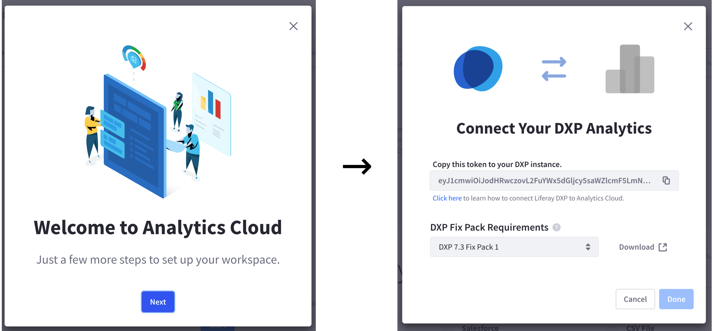
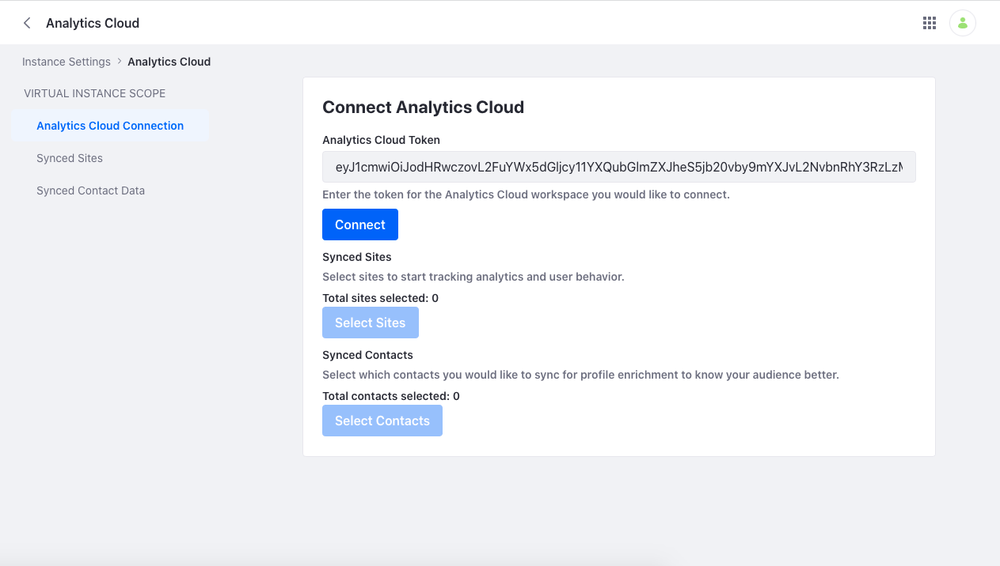
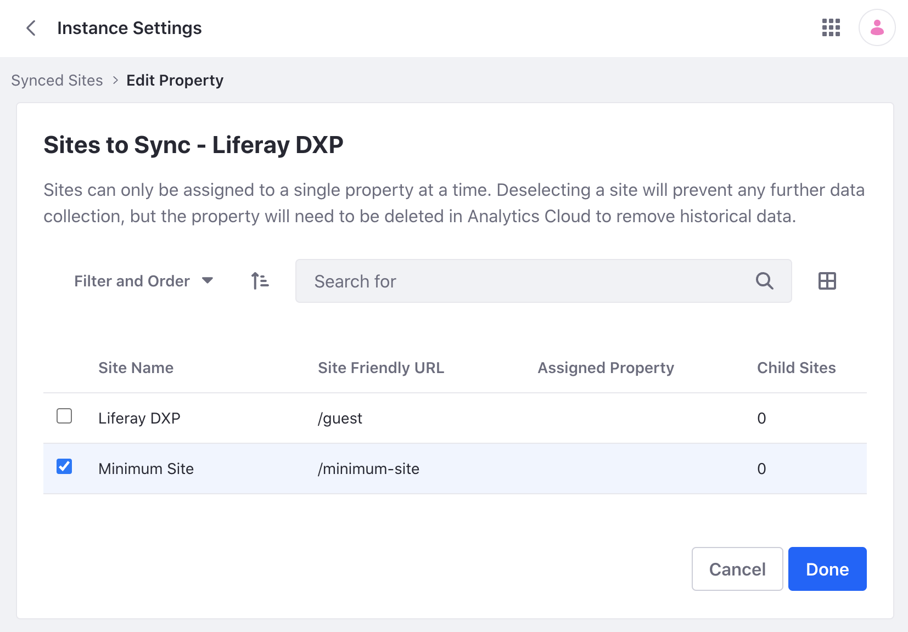
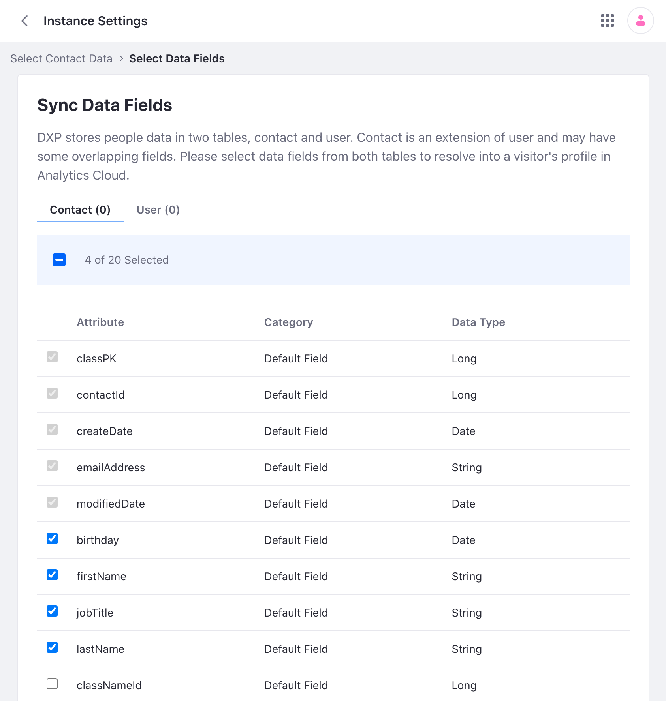

# Connecting Liferay DXP 7.3 to Analytics Cloud

{bdg-secondary}`Liferay DXP 7.3 U30+`

The steps to connect Liferay DXP 7.3 to Analytics Cloud differ slightly from [the steps to connect Liferay DXP 7.4](../connecting-liferay-dxp-to-analytics-cloud.md). Liferay DXP 7.3 requires a hotfix to be compatible with Analytics Cloud.

## Connection Token

Liferay DXP and Analytics Cloud connect via a secure, encrypted token. This token is generated by Analytics Cloud and must be added to your Liferay DXP configuration. Once connected, you can determine which data to sync. The process is different depending on the version of Liferay DXP you have.

1. Log into Analytics Cloud and select your workspace. If this is your first time logging in, the onboarding guide appears. Click *Next* and copy the Analytics Cloud token.

   

   Alternatively, you can find the token under *Settings* &rarr; *Data Sources*. Click *Add Data Source*, select *Liferay DXP*, and copy the Analytics Cloud token.

1. Log into your Liferay DXP instance.

1. Open the *Global Menu* (), go to the *Control Panel* tab, and click *Instance Settings*.

1. Under Platform, click *Analytics Cloud*.

1. Paste the Analytics Cloud token and click *Connect*.

   

1. Verify this message appears:

   `Success: Your request completed successfully`

Congratulations, your Liferay instance is now connected to Analytics Cloud! The next step is syncing your Liferay site and your contacts.

## Syncing Sites

To sync sites, you must create properties and associate them with one or more sites. Analytics Cloud aggregates your data according to how you define your properties. This example shows a simple setup where a single site is associated with a property. To learn more about defining a property with multiple sites see [Scoping Sites and Individuals Using Properties](../../workspace-settings/scoping-sites-and-individuals-using-properties.md).

1. In Analytics Cloud, navigate to *Settings* &rarr; *Properties*.

1. Click *New Property* and enter a label (e.g. Minium Site).

1. In your DXP instance, open the *Global Menu* (), go to the *Control Panel* tab, and click *Instance Settings*.

1. Under Platform, click *Analytics Cloud*.

1. Click *Select Sites*.

1. Select the new property under Available Properties.

1. Select the site you want to sync and click *Done*.

   

   Verify this message appears:

   `Success: Your request completed successfully`

## Syncing Contacts

1. In your DXP instance, open the *Global Menu* (), go to the *Control Panel* tab, and click *Instance Settings*.

1. Under Platform, click *Analytics Cloud*.

1. Click *Select Contacts*.

1. Under Contact Sync Options, click *Sync Contacts*. Toggle *Sync All* to sync all contacts. Alternatively, click *Sync by User Groups* or *Sync by Organizations* if you want to sync a subset of your contacts.

   !!! important
       Analytics Cloud provides tools to sync and manage individual contact data. However, these tools do not guarantee compliance with privacy regulations (e.g. GDPR). You must carefully determine the practices and configurations necessary for complying with the privacy laws where your sites store and process personal data.

1. Click *Save and Next*.

1. Switch between the *Contact* tab and *User* tab to select which fields to sync. Liferay DXP stores contact data in two separate tables (Contact and User). Analytics Cloud requires some fields to be synced; these fields are grayed out.

   

1. Click *Save*. Verify this message appears:

   `Success: Your request completed successfully`

Congratulations, your Liferay instance is now connected to Analytics Cloud!