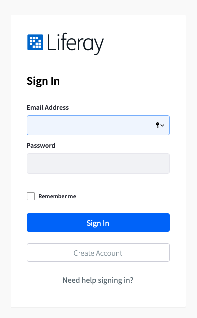
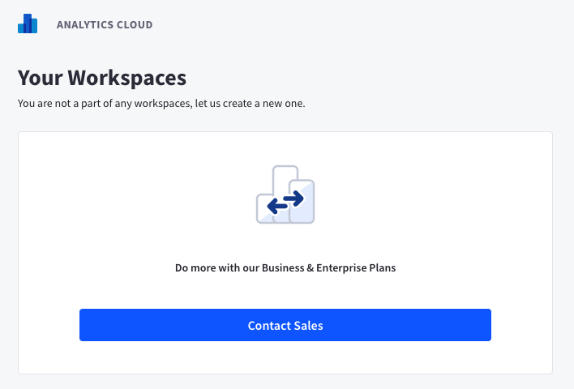

# Signing Up for a New Workspace

To start using Liferay Analytics Cloud, visit [analytics.liferay.com](https://analytics.liferay.com) and sign in with your [liferay.com](https://www.liferay.com) account email address. If you do not have a Liferay account, you can go to this link: [Create an account](https://login.liferay.com/signin/register). Or click the *Create Account* button from the login page.



If you have not already set up multi-factor authentication for your account, you are prompted to. See [Multi-Factor Authentication for more information](./multi-factor-authentication.md).

```{important}
Your Liferay DXP installation must meet the following fix pack minimum requirements:
* 7.4+
* 7.3 Fix Pack 1
* 7.2 Fix Pack 11
* 7.1 Fix Pack 22
* 7.0 Fix Pack 98
```

Once logged in, you can purchase a **paid tier** workspace by contacting sales. If you already have a workspace, you will also see your workspace listed after login.

<!-- Requires new screenshot  -->

## Buying Analytics Cloud workspace

To purchase a Business or Enterprise tier workspace, click on the Contact Sales button from the home screen.

Fill out the form, and a sales representative will contact you shortly.


Once you've successfully purchased your Analytic Cloud workspace, our team will provision a workspace for your account. Make sure you provide the email of the workspace owner, and your desired data center location to your sales representative to make this process as smooth as possible.

Your workspace owner will receive an invitation email once the workspace is provisioned. The owner can then login to [analytics.liferay.com](https://analytics.liferay.com) and finish configuring the workspace.

See the next section on how to [access your workspace](./accessing-your-workspace.md).
