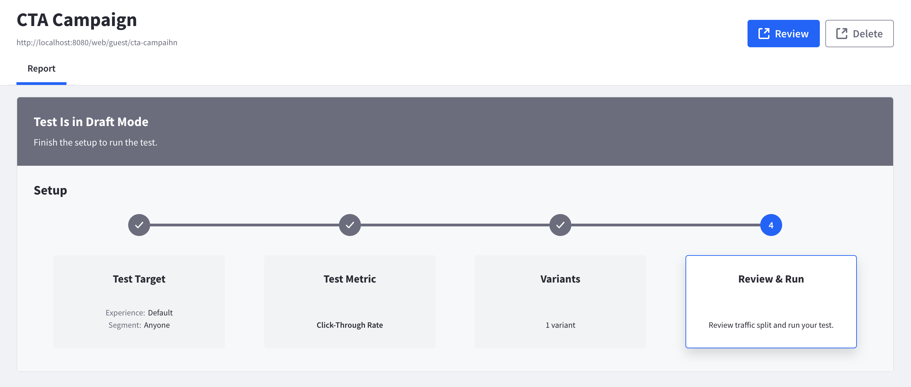
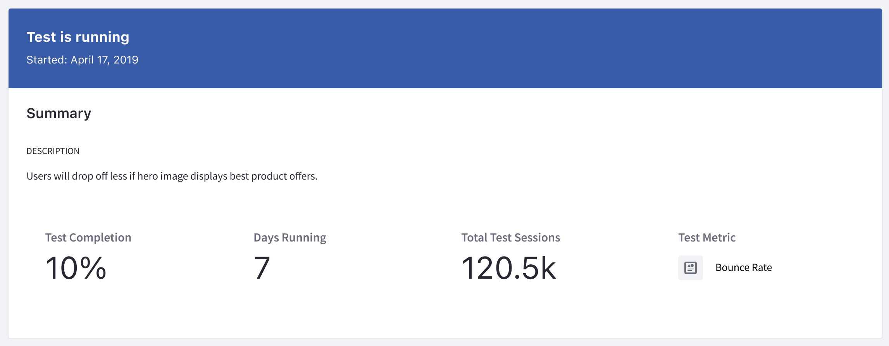
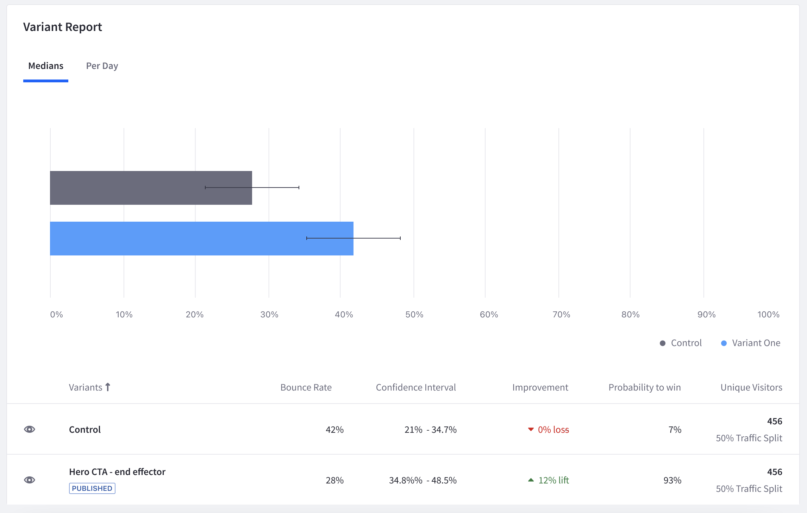
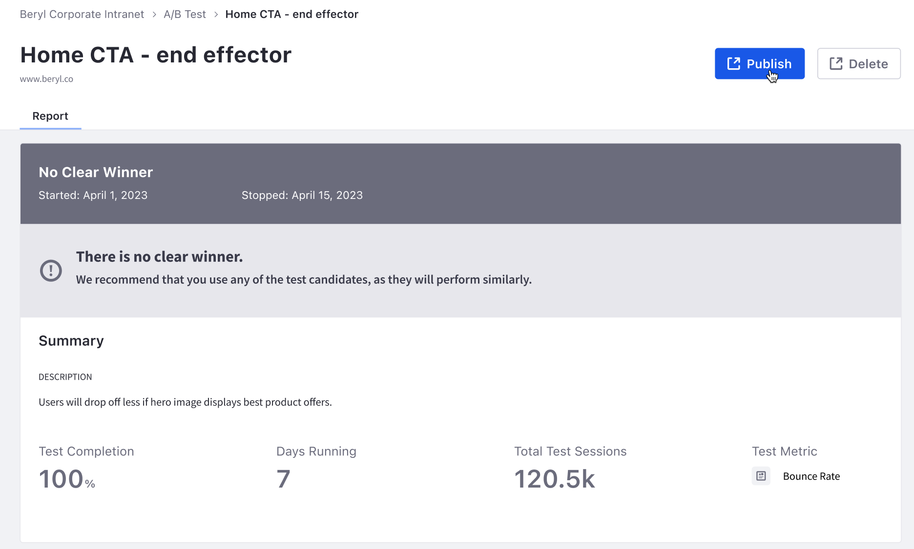
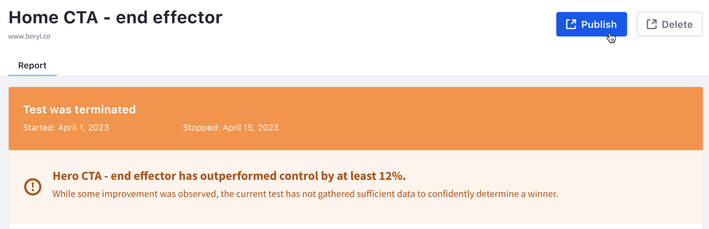

# A/B Testing

A/B testing evaluates the effectiveness of content pages by testing a variant design against the control design (i.e., the original). This process involves creating a page variant, testing it with a metric (e.g., clicks), and publishing the most effective variant. These tests can help you choose the best experience for your site's users.

You can learn more about creating an A/B test and configuring it for a content page in Liferay DXP's [A/B testing documentation](https://learn.liferay.com/w/dxp/site-building/optimizing-sites/ab-testing/ab-testing).

Analytics Cloud tracks all results from A/B tests running in Liferay DXP. When created, tests are synced automatically with Analytics Cloud. To view your A/B tests, click *Test* in the menu on the left.

!!! note
    Metrics only start appearing in the dashboards at around 1:00AM in the Analytics Cloud workspace timezone.

For drafted A/B tests, you can view these details:

- Target: the experience and user segment.
- Metric: the goal to track (e.g., bounce rate or click).
- Variant: the page variant for users to interact with.

To see the A/B test page in DXP, click *Review*. To delete the A/B test, click *Delete*.

Once your A/B test is running, Analytics Cloud offers these reports to keep you up-to-date on its progress:

- [Summary](#summary)
- [Variant Report](#variant-report)
- [Test Sessions](#test-sessions)

!!! important
    A/B testing is not supported if [staging](https://learn.liferay.com/w/dxp/site-building/publishing-tools/staging.md) is enabled in your Liferay instance.

## Summary

The Summary panel provides an overview of test details, including completion percentage, running time (in days), and total visitor sessions.

It also provides a quick summary of metric details and how the variant is performing against the control.

## Variant Report

The Variant report panel provides a detailed breakdown of how the variant is performing against the control.

Below are the metrics reported:

**Median:** The middle number in the set of sample values. This estimates a typical user's behavior.

**Bounce Rate or Click Through Rate:** The percentage of bounce rate or click through rate of the control and the variant. The displayed metric is based on the type of A/B test selected.

**Confidence Interval:** The range of values expected to contain the true mean of the population. For example, a 95% confidence interval is a range of values that the system is 95% sure contains the true mean. This gives the range of possible values that seem plausible for the measured goal.

**Improvement:** The relative improvement from the control group. This metric may also be known as lift. For example, assume the control page has a 15% retention rate and the variant page has a 16% retention rate. The improvement calculation would be `((16 - 15) / 15) = ~6.67%` improvement. This shows the impact of a change. If there is only a small improvement, it may not be worth implementing that change.

**Probability to Win:** Predicts the likelihood the variant will beat the control. This shows how multiple metrics compare to each other. For example, consider a horse racing event: each horse has a generated chance to win posted before a race (i.e., odds of winning), calculated by simulating the race thousands of times. This same method is used for your variants to calculate their probability of winning the A/B test.

**Unique Visitors:** The number of visitors contributing to the variant. A visitor randomly assigned a variant always sees the same variant until the end of the test. Besides knowing how much traffic is hitting a page, this metric also helps in determining configuration issues with the A/B test. For example, there could be too much traffic going to one variant (typically caused by a segment misconfiguration).

!!! important
    A minimum of 5 successes and 5 failures per variant is required for test data to be reported.

## Test Sessions

The Test Sessions panel shows the number of sessions viewing your test impressions per day over time. This helps you validate that your audiences are being directed to your A/B test impressions. It also portrays how your test affects the traffic to your page compared to before the test began.

## Test Status

When an A/B test is started, it has one of the following statuses:

- [Test is Running](#test-is-running)
- [Winner Declared](#winner-declared)
- [No Clear Winner](#no-clear-winner)
- [Test Terminated](#test-terminated)

### Test is Running

Your test is running and needs a larger sample size before reaching the desired confidence level and declaring a winner. You can view the current results.

When a test is running, you can terminate it by selecting *Terminate Test* from the summary bar.

!!! important
    Lots of traffic (i.e. several thousand hits a day) is expected for an A/B test to run successfully. This makes public-facing sites well suited for testing. It may take significantly longer for a test to finish for an internal website or portal.

### Winner Declared

Once your A/B test finishes successfully, a winner is declared (i.e. the variant or the control won). From here, you can perform these actions:

- Publish the winner as your default experience.
- Delete the test without publishing any changes.

### No Clear Winner

Sometimes, Analytics Cloud cannot determine a winner because the variant has not significantly outperformed the control page. In this case, you can still choose to publish the variant by clicking *Publish*. Or delete the A/B test by clicking *Delete*.

### Test Terminated

The test status shows as terminated if the A/B test is terminated before a winner is determined.

!!! note
    A terminated A/B test did not reach the specified confidence level and inherently has less reliable results.

You can still choose to publish the variant by clicking the *Publish* button. Or delete the A/B test by clicking *Delete*.