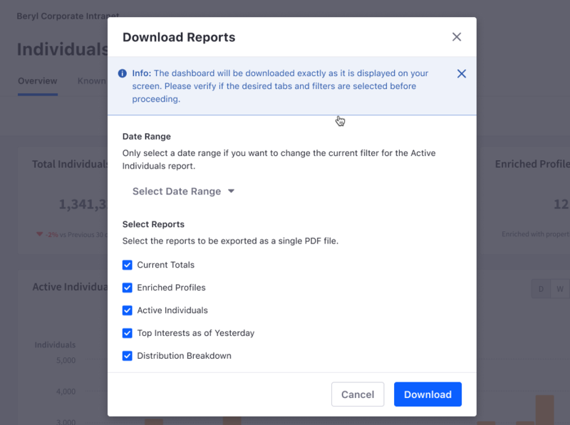

# Downloading Reports

In addition to [inviting team members](../workspace-settings/managing-users.md#inviting-users) to your Analytics Cloud workspace, you can share insights with your team by downloading reports.

Downloadable PDF reports are available for these dashboards:

- [Assets Dashboard for Blogs](../touchpoints/assets/blogs.md)
- [Assets Dashboard for Documents and Media](../touchpoints/assets/documents-and-media.md)
- [Assets Dashboard for Forms](../touchpoints/assets/forms.md)
- [Assets Dashboard for Web Content](../touchpoints/assets/web-content.md)
- [Individuals Dashboard](../people/individuals.md)
- [Segments Dashboard](../people/segments.md)
- [Site Page Dashboard](../touchpoints/pages.md)
- [Sites Dashboard](../touchpoints/sites-dashboard.md)

Each PDF report shows the same information as its respective dashboard (e.g. sites dashboard, individuals dashboard, site page dashboard, etc.)

Downloadable CSV reports are available for these lists:

- [Assets List for Blogs](../touchpoints/assets/blogs.md)
- [Assets List for Documents and Media](../touchpoints/assets/documents-and-media.md)
- [Assets List for Forms](../touchpoints/assets/forms.md)
- [Assets List for Web Content](../touchpoints/assets/web-content.md)
- [Known Individuals List](../people/individuals/individual-profiles.md)
- [Site Pages List](../touchpoints.md#viewing-page-data)

Each CSV report shows the same information as its respective list (e.g. list of site pages, list of blogs, list of documents and media, etc.). When you try to download a report with over 10000 entries as a CSV file, the report won't contain data on the remaining entries.

## Downloading a Report

After clicking *Download Reports*, a modal appears, containing a list of all possible reports you can publish in the file you'll download, along with a selectable date range. 

