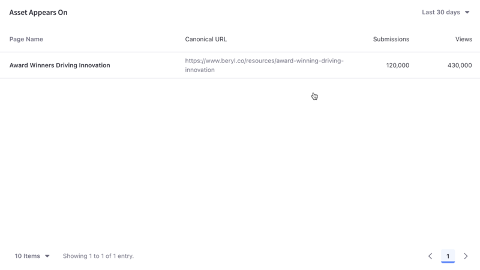

---
taxonomy-category-names:
- Platform
- Asset Analytics
- Forms
- Liferay Self-Hosted
- Liferay SaaS
- Liferay PaaS
uuid: ea56f3d5-74f0-4eb3-84b5-0f4d9ef8d4fe
---
# Forms

[Forms](https://learn.liferay.com/w/dxp/process-automation/forms/introduction-to-forms) are important direct data gathering tools for enterprises. Are your web forms providing you invaluable information or turning users away? Analytics Cloud gives you important insights.

A list of your site's forms appears along with different metrics. To download this data as a CSV file, click _Download Report_. See [downloading reports](../../reference/downloading-reports.md) to learn more.

!!! note
    Analytics data for forms is collected through the Form widget. For information on how to use other types of fragments and widgets to collect data on forms, see [Tracking Custom Assets](./tracking-custom-assets.md)

## Visitor Behavior

As with all asset types, the Visitors Behavior Chart is at the top of its page and provides a line graph with several trend lines. To download this dashboard view as a PDF file, click _Download Report_. See [downloading reports](../../reference/downloading-reports.md) to learn more.

The first chart, called visitor behavior, contains four important metrics:

1. Total Submissions
1. Total Views
1. Abandonment rate
1. Average Completion Time

### Submissions

Submissions counts the number of times the submit button was clicked on a form. It's the gold standard metric for a form, because that's why the form was created in the first place: to collect data entered into the form. If the submit button isn't clicked, you don't get the data you wanted.

The submissions trend line shows the number of times the submit button was clicked each day (or hour, if yesterday or last 24 hours are selected) over the selected time period. You can find more detailed information about this in [Asset Appears On](#asset-appears-on), at the bottom of the page.

### Views

Views is a common metric among all assets (and Pages).

Useful with the time period filter, Views is the number of views for a form in a given period of time. It's not the same as the number of visitors, because it doesn't try to count only unique IP addresses. So over the last 30 days, one visitor (IP address) could come back to the page 100 times. That means there are 100 page views, but only one visitor (assuming the same device was used to access the page each time). However, a unique view isn't logged for a single user unless at least 30 minutes of inactivity on the page passes before the user interacts with the page again. You can find more detailed information about this in [Asset Appears On](#asset-appears-on), at the bottom of the page.

### Abandonment

Abandonment is the daily (or hourly if yesterday or last 24 hours is selected) percentage of users that interacted with the form but stopped short of submitting an entry over the selected time period.

### Completion Time

Completion time is a daily average (or hourly if Yesterday or Last 24 Hours is selected) of the time it took for form users to go from their first interaction with the form until they hit the submit button.

The time series metrics displayed in the Visitors Behavior Chart are paramount to understanding asset performance over time. But there's more to asset analytics.

## Audience

The Audience report uses charts to present information about the audience interaction with the asset. It answers these questions:

- How many users are interacting with my content?
- Of these users, how many are known or anonymous?
- Of the known users who interacted with my content, how many belong to Analytics Cloud Segments?
- Of the users in Segments, what are the top 15 segments?

Here are the charts in the Audience report:

**Submissions:** A donut chart that presents the percentage of total unique visitors who are known or anonymous. The center shows the total number of unique visitors. Tooltips show the number of users for that section (e.g, the number of known or anonymous users).

!!! note
    Individuals are considered known when their email addresses are matched at login with user data synced with Analytics Cloud. When new users register on your site, it may take up to two hours for their data to sync with Analytics Cloud and appear as known individuals.

**Segmented Submissions:** A donut chart that presents the percentage of known individuals who belong or do not belong to one or more Analytics Cloud segments. The center shows the total number of known individuals. Tooltips show the number of known individuals for that section (e.g. the number of known individuals belonging to one or more segments).

**Viewer Segments:** A bar chart that shows the percentage of known individuals that comprise each segment. The chart shows a bar for each of the top five segments, and then aggregates the remaining segments into the last bar. A tooltip on the last bar shows the values for each of the remaining segments.

Note that the segmentation data presented about your audience is based on an individual belonging to a segment at the time of their visit.

## Submissions by Location

The map in this panel shows the number of submissions by country in the selected time period.

## Submissions by Technology

View a stacked bar graph of the page's submissions by operating system (grouped by device type) in the default Devices tab.

Click _Browsers_ to see a donut chart displaying up to the top eight web browsers over the selected time period. If applicable, remaining web browsers are aggregated in the ninth donut segment.

## Asset Appears On

You can view comprehensive statistics for each asset across various sites and channels where it's published on the Asset Appears On table. It includes the page name, the URL, the number of submissions, and the number of views on the page. Like any page data in Analytics Cloud, only pages that were interacted with in some way by site visitors are tracked and reported. It's important to note that the link doesn't take you to the actual page with the asset on it. Instead, it leads to the page Analytics view of the page. From there you can click the URL to the actual page.

## Related Topics

- [Forms](https://learn.liferay.com/web/guest/w/dxp/process-automation/forms)
- [Tracking Custom Assets](./tracking-custom-assets.md)