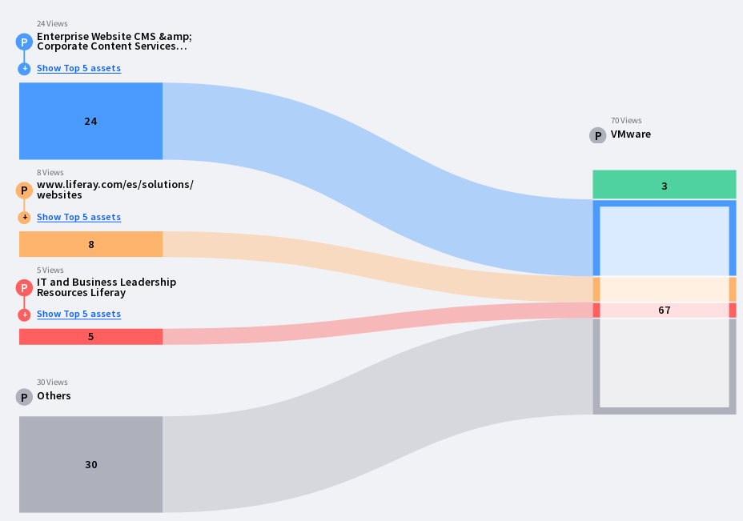
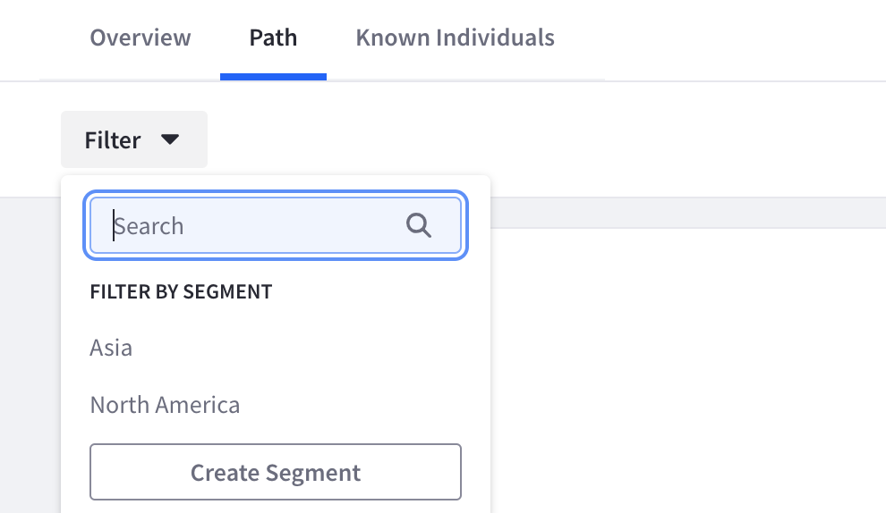

---
taxonomy-category-names:
- Sites
- Site Analytics
- Traffic and Path Analysis
- Liferay Self-Hosted
- Liferay SaaS
- Liferay PaaS
uuid: d05594ae-9ab2-442c-a894-cb28372fe1da
---
# Paths

Path analytics identifies how visitors arrive on a site page and where they go next. Knowing how your users are coming and going can empower you to better tailor your site's content to meet your users' needs. Then you can make informed decisions to optimize your page content and keep users engaged on your site.

## Viewing Page Path Analytics

A page’s path analytics are reported in the Path tab of a page’s screen. The diagram reports the most common traffic sources for the page.

The left side of the chart shows the top three referrers visitors are arriving from. All other referrers are aggregated under the other referrals path. Each path shows the total number of views that came from that traffic source. A total number of direct traffic views also appears.

The different paths converge to a total number shown in the center of the chart.

The right side of the chart displays the top three site pages users went next. The other site pages users went next are aggregated under the other pages path. Users who ended their sessions from this page (i.e. navigated out of your site or became inactive for over thirty minutes) are shown in the drop-off path.

## Filtering by Segments

The path analysis data can be filtered by segments. Segments that don't have any users who viewed this page are grayed out and disabled.

Click *Filter* and select the segment to view. See [creating segments](../../people/segments/creating-segments.md) to learn more about segments.

## Related Topics

- [Understanding Pages](https://learn.liferay.com/web/guest/w/dxp/site-building/creating-pages/understanding-pages)
- [Segments](../../people/segments.md)