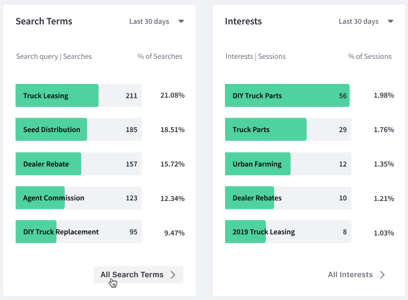

---
taxonomy-category-names:
- Sites
- Site Analytics
- Traffic and Path Analysis
- Liferay Self-Hosted
- Liferay SaaS
- Liferay PaaS
uuid: 195deacf-e16c-4594-b075-082b9c8a25ef
---
# Sites Dashboard

Liferay Analytics Cloud provides a sites dashboard for each Property in your Workspace. For example, when [Creating a Property](../workspace-settings/scoping-sites-and-individuals-using-properties.md#creating-a-property) each Property can be associated with one site or can be set to aggregate data from multiple sub-sites.

To view the dashboard,

1. Click *Sites* in the Touchpoints section of the menu.

1. Click the *Overview* tab (this tab is selected by default when you click sites).

The dashboard contains the following data panels:

- [Site Activities](#site-activities)
- [Top Pages](#top-pages)
- [Acquisitions](#acquisitions)
- [Visitors by Day and Time](#visitors-by-day-and-time)
- [Search Terms and Interests](#search-terms-and-interests)
- [Sessions by Location](#sessions-by-location)
- [Session Technology](#session-technology)
- [Cohort Analysis](#cohort-analysis)

To download this dashboard view as a PDF file, click *Download Reports*. See [Downloading Reports](../reference/downloading-reports.md) to learn more.

Each panel in the dashboard has a time period selector that recalculates the metrics for the selected time period. The following time periods are available:

!!! note
    Some metrics such as bounce rate, time on page, exits, etc. rely on a visitor’s session end (30 minutes of inactivity or signing out) to be calculated. Therefore analytics data within the last 24 hours is displayed after the end of a session.

**Last 24 hours:** Displays data generated over the last 24 hours.

**Last 7 days:** Displays data generated for the previous seven full days (the current day is excluded), in daily increments.

**Last 30 days (default):** Displays data generated for the previous 30 full days (the current day is excluded), in weekly increments.

**Last 90 days:** Displays data generated for the previous 90 full days (the current day is excluded), in 15 day increments.

**More Preset Periods:** Shows additional time periods: Yesterday, Last 28 days, Last 180 days, Last Year.

**Custom Range:** Select a start date and end date of your choice.

## Site Activities

The Site Activities panel presents a summary of how visitors interact with your site. This panel contains the following metrics:

**Unique Visitors:** The total number of individuals identified by a unique `userId` (i.e. user ID).

Visitors to your site are assigned unique `userId`s. When visitors log in with their email address, their analytics data continues to be associated with this `userId`. If the visitor previously logged in and was already assigned a `userId`, the analytics data is instead associated with this previously assigned `userId`.

A new `userId` is assigned if visitors use a different browser, log in with a different email address, or clear their browser cookies.

**Sessions per Visitor:** An average of the number of sessions for each unique visitor. A single visitor can open multiple sessions. A session is considered a new session if 30 minutes of inactivity pass since the previous session, or is the start of a new day (i.e. past midnight).

**Session Duration:** The length of time an average session lasts.

**Bounce Rate:** The percentage of sessions in which an individual visits a page on your site but has no further interactions before the session ends.

Clicking each metric changes the visualization in the panel to display the selected metric.

Note the legend at the bottom right shows a breakdown of the unique visitors between known visitors and anonymous visitors.

## Top Pages

The Top Pages panel shows visited pages, entrance pages, and exit pages:

**Visited Pages:** Your site's most visited pages and the number of visitors for each.

**Entrance Pages:** The most common pages that visitors view first upon entering your site and the number of entrances for each.

**Exit Pages:** The most common pages that visitors view when leaving your site and the exit percentage for each. The exit percentage is the percentage of visitors who interacted with the page (such as scrolling or clicking) and then left your site. It does not include bounce rate.

To view more detailed page analytics, click *View Pages* at the bottom of the panel. Alternatively, click the *Pages* tab at the top of the screen. Both take you to the page analytics discussed in [Viewing Page Data](../touchpoints.md#viewing-page-data).

## Acquisitions

The Acquisitions panel gives a comprehensive overview of how visitors arrive to your site. The data is presented from a high level view (i.e. Channels) down to a granular level (i.e. Referrers). The percentage of sessions shows an actual percentage of each traffic source. Having an understanding at these different levels leads to more informed business decisions.

**Channels:** A channel is a broad grouping of sources where users come from. For example, traffic coming from different search engines would all be grouped as organic search. Other possible channels are: direct, social, email, affiliates, referral, paid search, display, and other advertising. After identifying these different channels AC users can apply the data in different ways. For example, channel data on organic search could be applied to SEO efforts to improve search rankings.

**Source | Medium:** The source is the starting point of the visitor (e.g. search engine, website, etc.). The medium is a general category for the type of link the traffic came from (e.g. organic, ppc, referral, email, social, etc.). Having this data breakdown is very useful. For example seeing what traffic comes from paid advertising could validate your return on ad spend.

**Referrers:** For traffic that comes from another webpage, the webpage URL is passed along as a referrer from the user's web browser.

The reporting works best if your marketing campaign uses UTM parameters. UTM parameters allow Analytics Cloud to determine where visitors arrive from (e.g., the specific referrer or ad campaign).

## Visitors by Day and Time

The Visitors by Day and Time panel visualizes the days and times when visitors come to your site. This helps you understand when your site is most active. You can use this information, for example, to know when to release important information or launch an advertising campaign.

The panel contains a grid with the days of the week on one axis and the time of day on the other axis. Darker cells in the grid indicate heavier site traffic at the corresponding day and time. Tooltips for each cell show the number of visitors for that day and time.

!!! note
    This panel is not affected by the timezone setting but is based on the Analytics Cloud user's timezone.

## Search Terms and Interests

The Search Terms and Interests panels show your visitors' most common search terms and the topics they're interested in, respectively. Search terms are collected from the search query parameter in your site's URL. Interest topics are derived from the keyword metadata of the pages that visitors view.

The percentage of searches shows what percent of searches contained that search query term in the given time range. The percentage of sessions shows what percent of sessions contained that interest in the given time range.

Note that the Search Terms panel is based on the search query parameters that can be customized in settings. To view the full list of interest topics, click *All Search Terms* at the bottom of the panel. Alternatively, click the *Search Terms* tab at the top of the screen.

To view the full list of interest topics, click *All Interests* at the bottom of the panel. Alternatively, click the *Interests* tab at the top of the screen.

## Sessions by Location

The Sessions by Location panel shows the top countries from which visitors access your site. Countries with more visitors are shaded darker on the map. The country names appear below the map along with the number and percentage of visitors for each. The top five countries appear along with the percentage value they represent across all sessions. The remaining countries not in the top five are combined as a single percentage value.

## Session Technology

The Session Technology panel shows the devices, operating systems, and browsers used to visit your site. A breakdown by percentages are shown for different device types, different operating system types, and different browser types. Tooltips for each graph element display more detailed data for that element. On the Devices tab, for example, mouse over each bar on the bar graph to see the operating system data for that device.

## Cohort Analysis

The Cohort Analysis panel shows a [cohort analysis](https://en.wikipedia.org/wiki/Cohort_analysis) based on visitors from a specific acquisition date (the cohort) and whether they return to your site over a given time period.

Use the selector menus at the top left of the panel to select the visitor type (All, Anonymous, or Known) and time period (Day, Week, or Month).

For example, if you select All Visitors and Day, the percentage of visitors from a given acquisition date that return to your site appear in the chart for each following day.

## Related Topics

- [Understanding Interests](../people/individuals/understanding-interests/)
