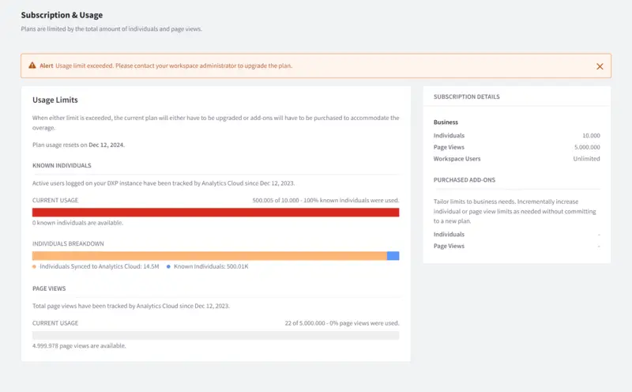

# Tracking Usage

Analytics Cloud plans are limited by the total amount of [Individuals](../people/individuals/individual-profiles.md) and [Page Views](../touchpoints/pages/pages.md) synced from data sources. When either limit is exceeded, Analytics Cloud users are prompted to upgrade their plans or purchase add-ons to accommodate the additional usage.

!!! note
    The Subscription & Usage page updates daily at 12:00 AM UTC.

## Usage Limits

Each plan has a limit to the number of known individuals (users with accounts on your DXP instance) and page views. The Current Usage bars show how close you are to reaching your limits. The Individuals Breakdown bar shows how many of your site's visitors count toward your plan's limit.

## Subscription

The Subscription Details section describes your plan's limits. Higher tier plans offer additional flexibility through higher limits and less expensive add-ons. You can upgrade from lower to higher tier plans.

| Plan Type                            | Basic    | Business     | Enterprise   |
| :----------------------------------- | :------- | :----------- | :----------- |
| Known Individuals Limit              | 1000     | 10000        | 100000       |
| Page View Limit                      | 300000   | 5000000      | 60000000     |
| Optional Add-Ons (Known Individuals) | &#10008; | 5000 each    | 5000 each    |
| Optional Add-Ons (Page Views)        | &#10008; | 5000000 each | 5000000 each |
| Yearly Reset *                       | &#10008; | &#10004;     | &#10004;     |

_\* The Business and Enterprise plans limit yearly usage. The count is reset on your workspace birthday. The Basic plan limits lifetime usage. If you exceed your limit, you must upgrade to a higher plan._

## Add-ons

Add-ons increase limits on Individuals or Page Views, without requiring you to upgrade to a new plan. Purchasing add-ons gives you commitment-free analytics capacity increases. Your add-ons appear on the Purchased Add-ons section under Subscription Details. Add-ons are available for the Business and Enterprise plans.

Contact your sales representative for further guidance on getting a plan that fits your organization's needs.

## Related Topics

- [Individual Profiles](../people/individuals/individual-profiles.md)
- [Pages](../touchpoints/pages/pages.md)
