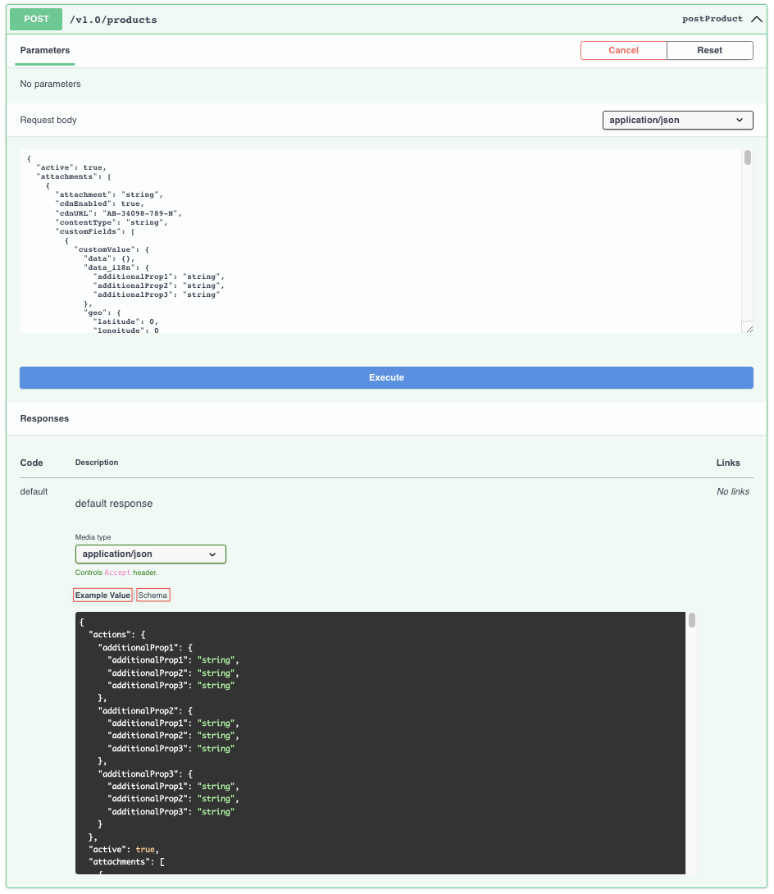
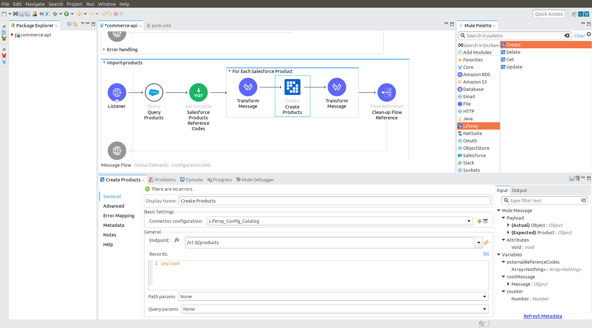

# Designing Mule Flows

After configuring the [Liferay Connector to MuleSoft](./configuring-the-mulesoft-connector.md), you can start building Mule flows. These operations are available for Liferay's OpenAPI endpoints.

* Create Records
* Delete Records
* Get Records
* Update Records
* Batch - Export Records
* Batch - Import Records - Create
* Batch - Import Records - Delete
* Batch - Import Records - Update

If you're working with large data sets, use Liferay's batch operations to submit and process data more quickly.

## Create Records Operation

This operation exposes all endpoints handled by the POST method for the chosen OpenAPI 3.0 document. Use Liferay's API Explorer at `http://[host]:[port]/o/api` as a reference for the different operations supported by the Liferay MuleSoft connector. You can also use the OpenAPI document from the endpoint in the connector's configuration.



After selecting an endpoint, the connector automatically generates related metadata. You can then specify input parameters. Input parameters support all Liferay RESTful web services but are not necessary for every endpoint:

| Parameter name | Type   | Description                                                         | Required                      |
| :------------- | :----- | :------------------------------------------------------------------ | :---------------------------- |
| Endpoint       | String | Drop-down list of available endpoints that support create operation | Yes                           |
| Records        | Object | Object to be created                                                | Yes                           |
| Path Params    | Object | Map with path parameter values                                      | Yes (if required by endpoint) |
| Query Params   | Object | Map with query parameter values                                     | No                            |



You can follow the above steps to configure and use other operations in your flow.

## Batch Export Operation

With this operation you can get all records of a specified entity with a single request. This is useful when you have a lot of records. When there are only a few records, use the *Get Records* operation.


To configure a batch export operation, select the entity you want to export using the Class name drop-down. Once selected, the connector dynamically generates related output metadata. If desired, you can use the Field names input to specify the fields to include in the exported entity. Field names must be separated using commas. You can also specify a *Site ID* parameter if required by the batch processing logic.

| Parameter name | Type   | Description                                                                                                                                                               | Required |
| :------------- | :----- | :------------------------------------------------------------------------------------------------------------------------------------------------------------------------ | :------- |
| Class name     | String | The class name of the exported entity                                                                                                                                     | Yes      |
| Site ID        | String | The [siteId](https://learn.liferay.com/w/dxp/headless-delivery/consuming-apis/consuming-rest-services#identify-the-site-containing-the-data) query parameter | No       |
| Field names    | String | Comma separated list of exported entity fields                                                                                                                            | No       |

Executing this flow results in a JSON array that is ready for transformation and loading into another application.

## Batch Import Operations

There are three available batch import operations: create, delete, and update. Each operation imports a set of entities, but Liferay's batch engine processes them differently. The image below shows a batch import create operation.


To configure a batch import operation, first use the *Class name* drop-down to select the entity you want to import. Once selected, the connector dynamically generates related input metadata. Then, use the *Record* field to submit a JSON array of entity objects. If desired, use the *Field name mappings* drop-down to map field names between related entities from different systems.

```{note}
If you've used the *Transform Message* module to map entity fields between source and destination systems, you can leave *Field name mappings* empty.
```

| Parameter name      | Type   | Description                                   | Required |
| :------------------ | :----- | :-------------------------------------------- | :------- |
| Class name          | String | The class name of the imported entity         | Yes      |
| Field name mappings | Object | Populated with field name mapping definitions | No       |
| Records             | Object | JSON array of entity objects                  | Yes      |

To view all available operations and related input parameters, see [Liferay MuleSoft Connector Technical Reference](https://github.com/liferay/liferay-etl-mulesoft/blob/master/docs/liferay-connector-tech-ref.adoc).

## Related Topics

* [Configuring the MuleSoft Connector](./configuring-the-mulesoft-connector.md)
* [Liferay MuleSoft Connector Technical Reference](https://github.com/liferay/liferay-etl-mulesoft/blob/master/docs/liferay-connector-tech-ref.adoc)
