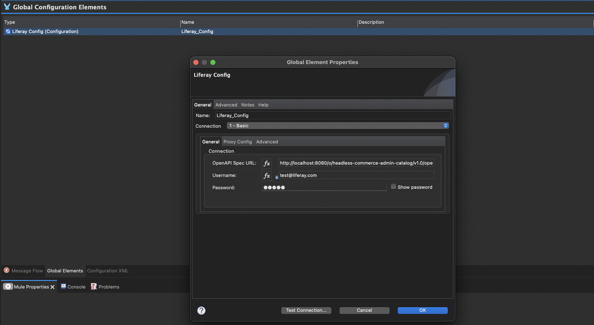
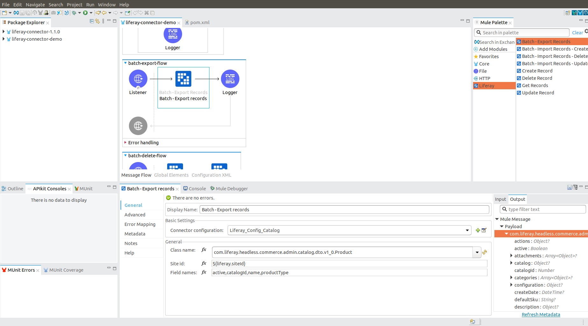
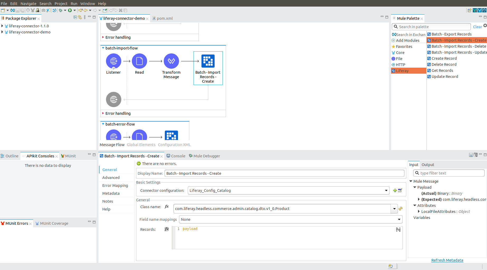

# Liferay Connector to MuleSoft

{bdg-primary}`Subscription`

The Liferay Connector to MuleSoft connects Liferay DXP to other platforms and services in the MuleSoft ecosystem. Learn the basics of the connector's design, as well as how to configure it and set up for a basic flow.
<!-- Comment: As a reader, I'm left wondering where to get the Liferay Connector to MuleSoft and how to install it. Having looked at this material before, I know it's available [here](https://github.com/liferay/liferay-etl-mulesoft#readme), but we should make that information available to users on Liferay Learn, probably in a separate article (due to length). You could have four articles: Liferay Connector to MuleSoft (section intro), Installing the Connector, Configuring the Connector, Designing Mule Flows. -->
## Prerequisites

Before proceeding, you should be familiar with Mule and Anypoint Studio concepts, such as Mule flows and global elements. To learn more, see [MuleSoft's official documentation](https://docs.mulesoft.com/general/) and consider completing an [Anypoint Studio tutorial](https://developer.mulesoft.com/tutorials-and-howtos).

For connector prerequisites, see Liferay's [Release Notes](https://github.com/liferay/liferay-etl-mulesoft/blob/master/docs/release-notes.adoc).

## Liferay Connector Design
<!-- Comment: Previously, BChan instructed us to direct users to http://[host]:[port]/o/api instead of SwaggerHub, since it is guaranteed to be up to date. This would also apply to other mentions of SwaggerHub in the article. -->
The Liferay connector uses OpenAPI 3.0 documents that describe Liferay's APIs and are available in [SwaggerHub](https://app.swaggerhub.com/organizations/liferayinc). Each OpenAPI document is also deployed dynamically in your Liferay instance under the following schema:

```bash
http://[host]:[port]/o/[headless-api-app-name]/[version]/openapi.json
```

These documents are generated based on your deployed RESTful web services, so they are the most current and accurate descriptions of your APIs. You can learn more about Liferay APIs [here](https://learn.liferay.com/dxp/latest/en/headless-delivery/consuming-apis.html).

Once you specify an OpenAPI document endpoint, the connector automatically configures the paths, path/query parameters, and entity metadata defined in the OpenAPI document. The Liferay connector works with any OpenAPI 3.0 document that follows Liferay standards and supports all Liferay APIs.

## Connector Configuration

To configure the connector,

* Select an authentication method and enter the required authentication parameters.

* Specify an OpenAPI document endpoint.

### Authentication
<!-- Comment: In our API tutorials, we say that basic auth is used for demonstration purposes and that users should use OAut2 for authenticating users in production. Would the same "best practice" recommendation apply here? -->
You can choose between *Basic* and *OAuth2* authentication methods. See [Using OAuth2](https://learn.liferay.com/dxp/latest/en/headless-delivery/using-oauth2.html) for more information.

* **Basic Authentication**: Enter a user name and password.

* **OAuth2**: Enter a client key and client secret.

If you're using OAuth2, you must set up OAuth2 authorization in your Liferay instance first by following the instructions [here](https://learn.liferay.com/dxp/latest/en/headless-delivery/using-oauth2/creating-oauth2-applications.html).


Liferay supports the OAuth 2.0 Client Credentials grant type. Select *Headless Server* from the Client Profile dropdown. Liferay generates a client ID (consumer key) and client secret (consumer secret) to use while configuring the connector. Before you can start using endpoints with OAuth2 authorization you must also enable [scopes](https://learn.liferay.com/dxp/latest/en/headless-delivery/using-oauth2/oauth2-scopes.html). Select the desired scope and check the authorization options you need, such as *everything*, *everything.write* or *everything.read*.

### Specify OpenAPI Document

Once authorized, set an OpenAPI document endpoint to specify the Liferay API you want to use. For example, this document is for the Commerce Admin Catalog API:

```bash
http://[host]:[port]/o/headless-commerce-admin-catalog/v1.0/openapi.json
```

To set this value, enter the document endpoint into the *OpenAPI Spec URL* field of the `Liferay_Config` global element.



You can also do this using XML configuration. Navigate to the *Global Elements* section, right click *Liferay Config* and select *Go to XML*.

* Configuration example using Basic authentication

```xml
 <liferay:config name="Liferay_Config_Catalog">
 <liferay:basic-connection username=${username} password=${password} openApiSpecPath="http://localhost:8080/o/headless-commerce-admin-catalog/v1.0/openapi.json" />
 </liferay:config>
```

* Configuration example using OAuth 2.0

```xml
 <liferay:config name="Liferay_Config_Catalog">
 <liferay:oauth2-connection consumerKey="${consumerKey}" consumerSecret=${consumerSecret} openApiSpecPath="http://localhost:8080/o/headless-commerce-admin-catalog/v1.0/openapi.json" />
 </liferay:config>
```

Click *Test Connection*. If it is successful, you can start building flows using the Liferay Connector.

## Operations
<!--Q: Where did the article previously explain how to 'import' the connector? -->
Now that you've created your Mule project and imported and configured the Liferay MuleSoft Connector, you can start building Mule flows. Four operations are available after defining the OpenAPI endpoint.

* Create Records
* Delete Records
* Get Records
* Update Records

Each operation implements and exposes different parts of the specified OpenAPI document.

If you're working with large data sets, you probably don't want to handle records one at a time. To process these quickly, you can use Liferay's batch operations. They enable you to submit large amounts of data in batches that results in faster execution.

### Create Records Operation

This operation exposes all endpoints handled by the HTTP POST method for the chosen OpenAPI 3.0 document. The SwaggerHub UI shows all available path parameters, request body structures, and possible responses.


After selecting the desired endpoint from the *Endpoint* selector, the connector automatically generates related metadata.

Next, you must specify the input parameters. Input parameters support all Liferay RESTful web services and need not be used with every endpoint:

| Parameter name | Type   | Description                                                         | Required                      |
| :------------- | :----- | :------------------------------------------------------------------ | :---------------------------- |
| Endpoint       | String | Drop-down list of available endpoints that support create operation | Yes                           |
| Records        | Object | Object to be created                                                | Yes                           |
| Path Params    | Object | Map with path parameter values                                      | Yes (if required by endpoint) |
| Query Params   | Object | Map with query parameter values                                     | No                            |

Use [Liferay's SwaggerHub](https://app.swaggerhub.com/organizations/liferayinc) as a reference for the different operations supported by the Liferay MuleSoft connector. You can also use the OpenAPI document from the endpoint you defined in the connector configuration, but you lose the intuitive UI offered by SwaggerHub.


You can follow the same steps as above to configure and use the other operations in your flow.

### Batch Export Operation

The Batch Export operation allows you to get all records of a specified entity with a single request. This is useful when the number of records are very high. In case the number of records are low, you can use the *Get Records* operation.



To configure a batch export operation, first select the entity you want to export using the *Class name* drop-down. Once selected, the connector dynamically generates related output metadata. If desired, you can use the *Field names* input to specify which fields are included in the exported entity. Field names must be separated using commas. You can also specify a *Site ID* parameter if it is required by the batch processing logic.

| Parameter name | Type   | Description                                                                                                                                                                                          | Required |
| :------------- | :----- | :--------------------------------------------------------------------------------------------------------------------------------------------------------------------------------------------------- | :------- |
| Class name     | String | The classname of the exported entity                                                                                                                                                                 | Yes      |
| Site id        | String | The siteId query parameter. Find your site's id [here](https://learn.liferay.com/dxp/latest/en/headless-delivery/consuming-apis/consuming-rest-services.html#identify-the-site-containing-the-data). | No       |
| Field names    | String | Comma separated list of entity fields that will be exported                                                                                                                                          | No       |

Running this flow will result in a JSON array of products ready to be transformed and loaded into another system.

### Batch Import Operations

There are three batch import operations available.

* Create
* Delete
* Update

Each operation imports a set of entities but they're processed differently by the Liferay instance batch engine. The following example shows a Batch Import Create operation.



Similar to configuring batch exports, first use the *Class name* drop-down to select the entity you want to import. Once selected, the connector dynamically generates related input metadata. Then, use the *Record* field to submit a JSON array of entity objects. If desired, use the *Field name mappings* drop-down to map field names between related entities from different systems.

```{note}
If you've used the *Transform Message* module to map entity fields between source and destination systems, you can leave the *Field name mappings* field empty.
```

| Parameter name      | Type   | Description                                    | Required |
| :------------------ | :----- | :--------------------------------------------- | :------- |
| Class name          | String | The class name of the imported entity.         | Yes      |
| Field name mappings | Object | Populated with field name mapping definitions. | No       |
| Records             | Object | JSON array of entity objects.                  | Yes      |

To view all available operations and related input parameters, check out [Liferay MuleSoft Connector Technical Reference](https://github.com/liferay/liferay-etl-mulesoft/blob/master/docs/liferay-connector-tech-ref.adoc).
