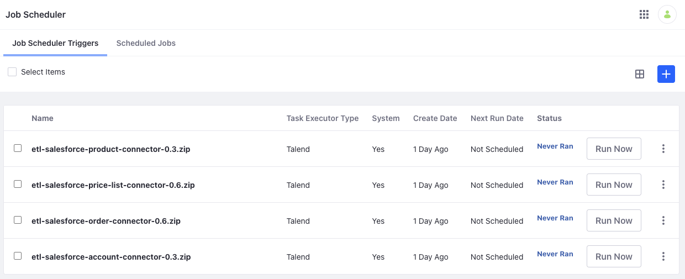

# Liferay Connector to Salesforce

{bdg-primary}`Subscription`

{bdg-secondary}`Liferay DXP 7.4 U35+`

The Liferay Connector to Salesforce uses [Talend](https://help.talend.com/home) job designs and Liferay's [Job Scheduler](https://learn.liferay.com/w/dxp/building-applications/core-frameworks/job-scheduler-framework/using-job-scheduler) to import data from Salesforce to Liferay DXP. You can [download](https://marketplace.liferay.com/p/liferay-connector-to-salesforce) the connector and deploy it to your Liferay instance as an `.lpkg` file. This file contains Talend jobs that map Salesforce data fields to Liferay data fields.

Once deployed, Liferay automatically creates job scheduler tasks for each Talend job. You can then configure and run each task manually or schedule them to run at specific intervals via Job Scheduler.

## Supported Entities

The following chart shows supported Salesforce entities with their Liferay counterparts. Currently, you can only import Salesforce data to Liferay.

| Salesforce       | Liferay     |
| :--------------- | :---------- |
| Account          | Account     |
| Account Address  | Account     |
| Account Contact  | User        |
| Price Book       | Price List  |
| Price Book Entry | Price Entry |
| Product          | Product     |
| Order            | Order       |
| OrderItem        | Order Item  |

```{note}
There is no equivalent entity for Liferay's product catalogs in Salesforce. Importing Salesforce products to Liferay requires a catalog with its externalReferenceCode set to `SALESFORCE`. If one does not exist, Liferay creates the catalog automatically and uses it to store imported products.
```

## Deploying the Connector to Liferay DXP

1. Download the connector from the [Liferay Marketplace](https://marketplace.liferay.com/p/liferay-connector-to-salesforce).

1. Copy the `.lpkg` file to the DXP instance's [`${liferay.home}/deploy`](https://learn.liferay.com/dxp/latest/en/installation-and-upgrades/reference/liferay-home.html) folder.

1. Verify these messages appear in the application server console:

   ```log
   Processing Liferay Connector to Salesforce 1.0.0.lpkg
   The portal instance needs to be restarted to complete the installation of file:/Users/able/bundles/osgi/marketplace/Liferay%20Connector%20to%20Salesforce%20-%20Impl.lpkg
   ```

1. Restart your Liferay DXP instance.

1. After restarting, confirm the deployment was successful by opening the *Global Menu* () and navigating to *Control Panel* &rarr; *Job Scheduler*.

   If successful, you should see four new job scheduler tasks.

   

   Before running these tasks, you must configure their context parameters.

## Configuring the Job Scheduler Tasks

Upon creation, the settings editor for each Talend job scheduler task is populated with default context parameters automatically. You can use these parameters to provide necessary credentials and to modify each task's behavior at run time.

```{warning}
Be careful when removing parameters from the settings editor. If a key's value is blank, it disappears when saving the settings. If you lose the key-value pairs, they can't be restored, and you'll have to recreate the task.
```

### Credentials Reference

Each task includes these fields for entering Liferay and Salesforce credentials.

| Context Parameter    | Description                 |
| :------------------- | :-------------------------- |
| `LiferayServerURL`   | URL for the Liferay server  |
| `LiferayUser`        | Liferay account username    |
| `LiferayPassword`    | Liferay account password    |
| `SalesForceURL`      | Salesforce SOAP API Url     |
| `SalesForceUser`     | Salesforce account username |
| `SalesForcePassword` | Salesforce account password |
| `SalesForceToken`    | Salesforce OAuth API token  |

```{note}
You can filter data from Salesforce so that only the newly modified or created records are imported. To do this, you must set the `deltamins` parameter in your job configuration. This parameter specifies the minutes between checks for new or modified records.

For instance, if `deltamins = 20` and `lastRunDate = 01/12/2022 12:00:00`, only records created or modified after `01/12/2022 11:40:00` are retrieved from Salesforce. If records already exist, Liferay’s import strategy updates them if needed and only inserts new records. 
```

### Products Reference

| Context Parameter              | Description                                                                                      | Default Value               |
| :----------------------------- | :----------------------------------------------------------------------------------------------- | :-------------------------- |
| `catalogName`                  | Name of the catalog for storing Salesforce data                                                  | `Salesforce`                |
| `catalogExternalReferenceCode` | External reference code for creating or fetching the catalog; must be `SALESFORCE`               | `SALESFORCE`                |
| `catalogDefaultCurrency`       | Default currency for the catalog                                                                 | `USD`                       |
| `catalogDefaultLanguage`       | Default language for the catalog                                                                 | `en_US`                     |
| `catalogId`                    | ID of the catalog for storing Salesforce data                                                    | Determined during execution |
| `allowBackOrder`               | Boolean value defining whether a product supports back orders when stock runs out              | `true`                      |
| `displayAvailability`          | Boolean value defining whether a product displays its availability on the product details page | `false`                     |
| `productType`                  | Product type used when creating all products                                                     | `simple`                    |
| `freeShipping`                 | Boolean value defining whether a product supports free shipping                              | `false`                     |
| `shippable`                    | Boolean value defining whether a product can be shipped                                          | `true`                      |
| `shippingSeparately`           | Boolean value defining whether a product supports separate shipping                            | `true`                      |

### Price List Reference

| Context Parameter | Description                                                                              | Default Value |
| :---------------- | :--------------------------------------------------------------------------------------- | :------------ |
| `catalogId`       | ID of the catalog to associate with the price list                                       | `0`           |
| `currencyCode`    | Default currency code for the price list                                                 | `USD`         |
| `neverExpire`     | Boolean defining whether the price list expires                                          | `true`        |
| `priority`        | Determines the priority of the price list when there are multiple applicable price lists | `0`           |
| `hasTierPrice`    | Boolean defining whether the price list contains tiered prices                            | `false`       |
| `standardPrice`   | Boolean defining whether the price list contains standard prices                          | `false`       |

### Accounts Reference

| Context Parameter     | Description                                                                                                                                   | Default Value |
| :-------------------- | :-------------------------------------------------------------------------------------------------------------------------------------------- | :------------ |
| `accountType`         | The account type used when creating all accounts: 1 (personal) or 2 (business)                                                                | `2`           |
| `countryMapping_null` | The country mapping for account addresses. It must use this syntax `countryMapping_NAME=COUNTRY_ISO_CODE` (e.g., `countryMapping_Croatia=HR`) |               |
| `regionMapping_null`  | The region mapping for account addresses. It must use this syntax `regionMapping_NAME=REGION_ISO_CODE` (e.g., `regionMapping_Milan=MI`)       |               |

### Orders Reference

| Context Parameter           | Description                                                                                                                                                                | Default Value                                                                                                                                                                                                                  |
| :-------------------------- | :------------------------------------------------------------------------------------------------------------------------------------------------------------------------- | :----------------------------------------------------------------------------------------------------------------------------------------------------------------------------------------------------------------------------- |
| `channelId`                 | ID channel where orders are imported                                                                                                                                      | Copy the channel ID from the UI. Open the *Global Menu* () and go to *Commerce* &rarr; *Channels*. Select a channel and copy the ID present next to the name. |
| `defaultCurrency`           | Default currency for orders                                                                                                                                                | `USD`                                                                                                                                                                                                                          |
| `statusMapping_null`        | The status mapping for order statuses. It must use this syntax: `statusMapping_SalesforceStatusName=LiferayStatusCode (e.g., statusMapping_Activated=5)`                   | `5`                                                                                                                                                                                                                            |
| `paymentStatusMapping_null` | The status mapping for order payment statuses. It must use this syntax: `paymentStatusMapping_SalesforceStatusName=LiferayStatusCode (e.g., paymentStatusMapping_Payed=2)` | `2`                                                                                                                                                                                                                            |

```{warning}
Some default values are only placeholders. Running a job with these values may lead to failure. Please review all values to ensure successful imports.
```

## Running the Job Scheduler Tasks

Once configured, you can run each task manually by clicking *Run Now*, or schedule them to run automatically. See [Using Job Scheduler](https://learn.liferay.com/w/dxp/building-applications/core-frameworks/job-scheduler-framework/using-job-scheduler) for more information.

```{important}
Running these tasks can be resource intensive and degrade platform performance. To reduce performance impact, avoid running them during peak use hours.
```

## Related Topics

* [Liferay Marketplace](https://marketplace.liferay.com/p/liferay-connector-to-salesforce)
* [Using Job Scheduler](https://learn.liferay.com/w/dxp/building-applications/core-frameworks/job-scheduler-framework/using-job-scheduler)
