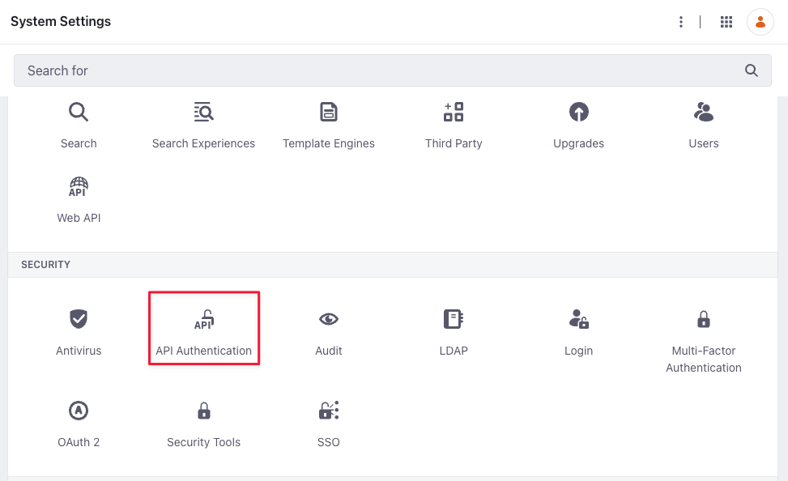
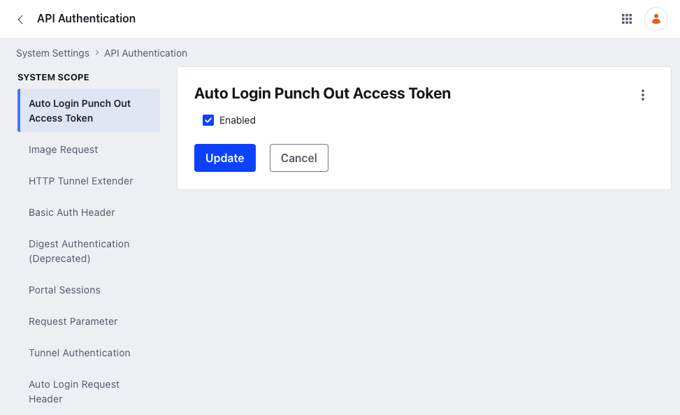
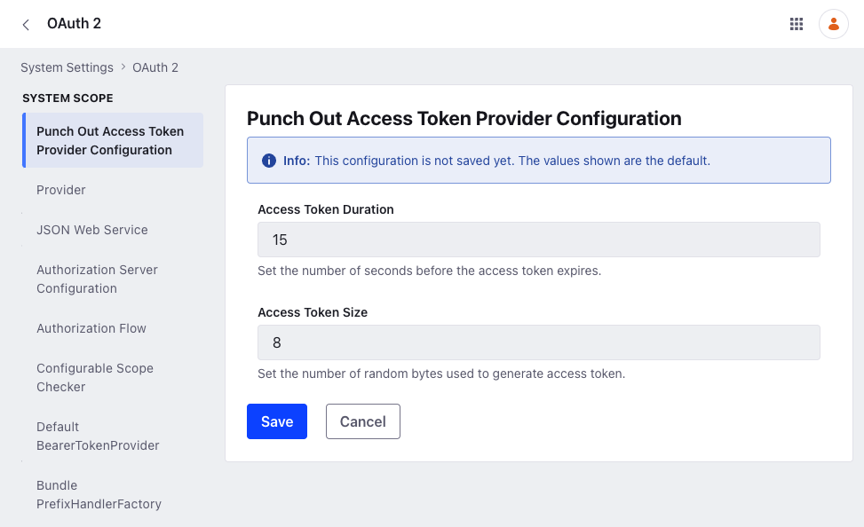
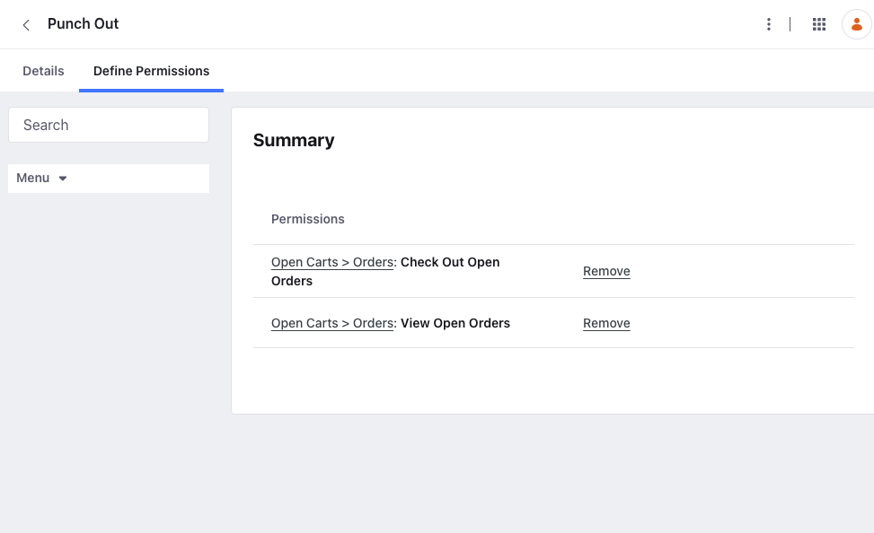

# Liferay Connector to TradeCentric (formerly PunchOut2Go)

{bdg-primary}`Subscription`

Liferay provides a TradeCentric (formerly PunchOut2Go) connector that integrates Liferay with a user's existing TradeCentric infrastructure. You can download this connector from the [Liferay Marketplace](https://marketplace.liferay.com).

## Deploy the TradeCentric Connector

1. After downloading the connector, copy the `LPKG` into the [`${liferay.home}/deploy`](https://learn.liferay.com/dxp/latest/en/installation-and-upgrades/reference/liferay-home.html) folder.

1. Verify that the following messages appear in the application server console:

   ```bash
   2024-05-29 12:33:04.573 INFO  [com.liferay.portal.kernel.deploy.auto.AutoDeployScanner][AutoDeployDir:212] Processing Liferay Commerce Connector to PunchOut2Go.lpkg
   2024-05-29 12:33:13.767 INFO  [fileinstall-directory-watcher][BundleStartStopLogger:68] STARTED com.liferay.headless.commerce.punchout.api_13.1.6 [1456]
   2024-05-29 12:33:13.768 INFO  [fileinstall-directory-watcher][BundleStartStopLogger:68] STARTED com.liferay.commerce.punchout.oauth2.provider.api_5.0.8 [1455]
   2024-05-29 12:33:13.772 INFO  [fileinstall-directory-watcher][BundleStartStopLogger:68] STARTED com.liferay.commerce.punchout.api_5.0.12 [1454]
   2024-05-29 12:33:13.856 INFO  [fileinstall-directory-watcher][BundleStartStopLogger:68] STARTED Liferay Commerce Connector to PunchOut2Go - API_4.0.1 [1453]
   2024-05-29 12:33:13.962 INFO  [fileinstall-directory-watcher][BundleStartStopLogger:68] STARTED Liferay Commerce Connector to PunchOut2Go - Impl_4.0.1 [1457]
   2024-05-29 12:33:13.969 INFO  [Start Level: Equinox Container: df30fc55-e8a2-4942-ae22-c6b3b5e81c12][BundleStartStopLogger:68] STARTED com.liferay.commerce.punchout.portal.security.auto.login_4.0.28 [1459]
   2024-05-29 12:33:13.970 INFO  [fileinstall-directory-watcher][BundleStartStopLogger:68] STARTED com.liferay.commerce.punchout.service_4.0.20 [1460]
   2024-05-29 12:33:13.985 INFO  [fileinstall-directory-watcher][BundleStartStopLogger:68] STARTED com.liferay.commerce.punchout.oauth2.provider.rest_4.0.15 [1458]
   2024-05-29 12:33:13.986 INFO  [Start Level: Equinox Container: df30fc55-e8a2-4942-ae22-c6b3b5e81c12][BundleStartStopLogger:68] STARTED com.liferay.commerce.punchout.web_4.0.25 [1461]
   2024-05-29 12:33:14.050 INFO  [fileinstall-directory-watcher][BundleStartStopLogger:68] STARTED com.liferay.headless.commerce.punchout.impl_4.0.51 [1462]
   ```

The connector is now active and ready for configuration.

## Configure the Connector

You can configure the TradeCentric connector for each [channel](../../store-management/channels.md). During configuration, you must have the URL of the store's catalog page.

1. Open the *Global Menu* () and navigate to *Commerce* &rarr; *Channels*.

1. Select a channel and go to *Punch Out*.

1. Switch the toggle to *Enabled*.

1. Enter the *Punch Out Start URL*.

1. Click *Save* when finished.

### Enable Auto Login Punch Out Access Token

Users must enable the punch out access token for the buyer's procurement system to enable access to the Liferay instance.

1. Open the *Global Menu* () and navigate to *Control Panel* &rarr; *System Settings*.

1. Click *API Authentication* under *Security*.

   

1. Click *Auto Login Punch Out Access Token* in the left menu.

1. Check the *Enabled* checkbox.

   

1. Click *Update*.

### Punch Out Access Token Provider Configuration

After enabling the punch out access token, users can configure the punch out access token provider.

1. Open the *Global Menu* () and navigate to *Control Panel* &rarr; *System Settings*.

1. Click *OAuth2* under *Security*. The *Punch Out Access Token Provider Configuration* is open by default.

   * **Access Token Duration**:

   * **Access Token Size**:

   

1. Click *Save*.

## Create a Punch Out Buyer Role

It is best practice to have a role for vendors using punch out. To learn more about Commerce roles, see [Commerce Roles](../../users-and-accounts/roles-and-permissions/commerce-roles-reference.md). For more information about roles and permissions in Liferay DXP, see [Understanding Roles and Permissions](https://learn.liferay.com/w/dxp/users-and-permissions/roles-and-permissions/understanding-roles-and-permissions)

1. Navigate to the *Control Panel* &rarr; *Users* &rarr; *Roles*.

1. Click the *Site Roles* tab.

1. Click the *Add Site Role* button.

1. Enter the following:

   * **Name**: Punch Out Vendor.

1. Click *Save*.

1. Click *Define Permissions*.

1. Expand the *Site Administration* in the left menu.

1. Navigate to *Applications* &rarr; *Open Carts*.

1. Check the following boxes (at the minimum):

   * **Check Out Open Orders**

   * **View Open Orders**

   

1. Click *Save*

This creates the new punch out role with the required bare minimum permissions. Assign this role to buyers that punch out.

!!! note
    If you're using an accelerator like Minium or Speedwell, a *Punch Out* site role is automatically created.

## Verify Redirect to Buyer's Procurement System

After deploying and configuring the connector, users are redirected to the appropriate procurement system when they click *Submit*.


## Related Topics

* [Deploying Liferay Commerce to an Existing Liferay Installation](../../installation-and-upgrades/installing-commerce-2-1-and-below/deploying-liferay-commerce-to-an-existing-liferay-installation.md)
* [Activating Liferay Commerce Enterprise](../../installation-and-upgrades/activating-liferay-commerce-enterprise.md)
* [Liferay Commerce Connector to TradeCentric Reference Guide](./liferay-commerce-connector-to-tradecentric-reference-guide.md)
