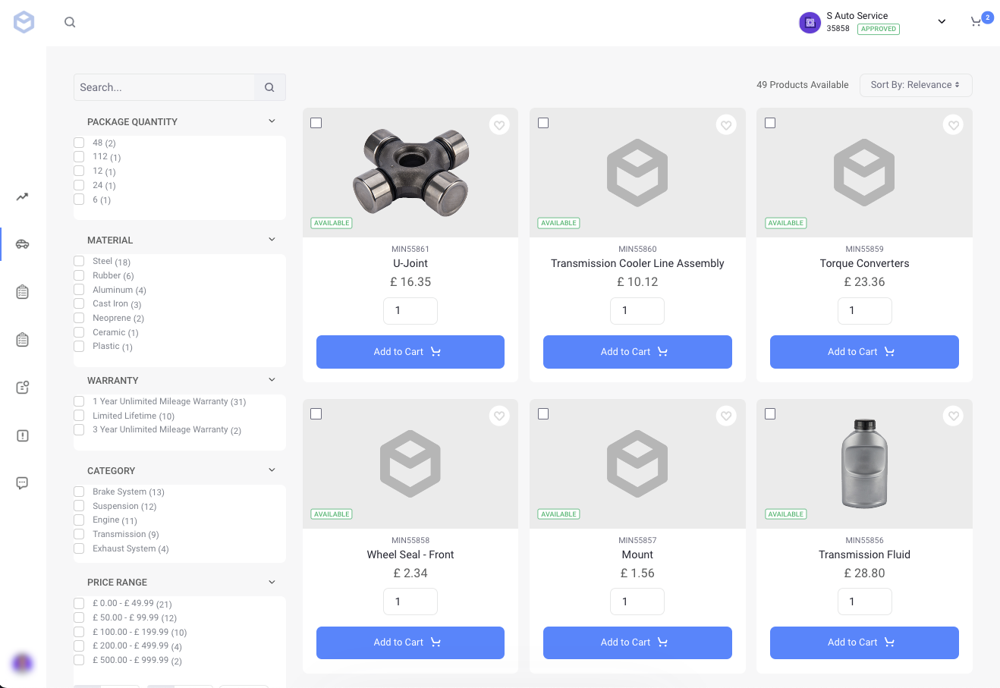

# Catalog

The catalog page is the primary way for users to browse, search, and select products. Both the Minium and Speedwell accelerators include the following widgets in their catalog pages:

* Search Bar
* Options Facets
* Specification Facet
* Category Facet
* Sort
* Search Results

To learn more about these widgets, see [Widget Reference](../liferay-commerce-widgets/widget-reference.md).

!!! note
    Apart from the search bar on the catalog page, there's also a global search bar at the top of every page in accelerators like Minium and Speedwell. You can use it to search for products, orders, accounts, and even retrieve orders by the order creator's email address.

## Related Topics

* [Creating a Catalog Page](../creating-a-catalog-page.md)
* [Widget Reference](../liferay-commerce-widgets/widget-reference.md)
