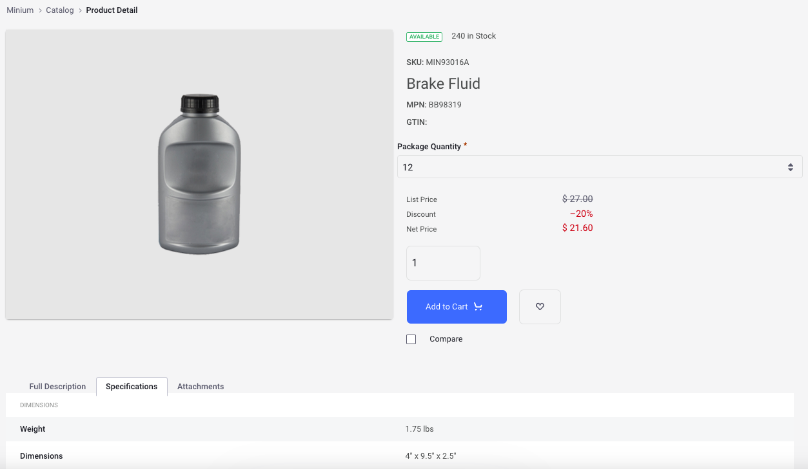
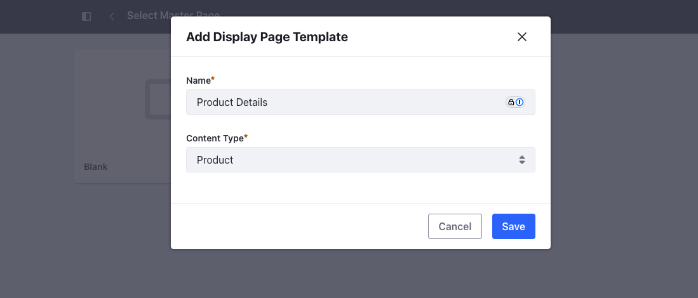
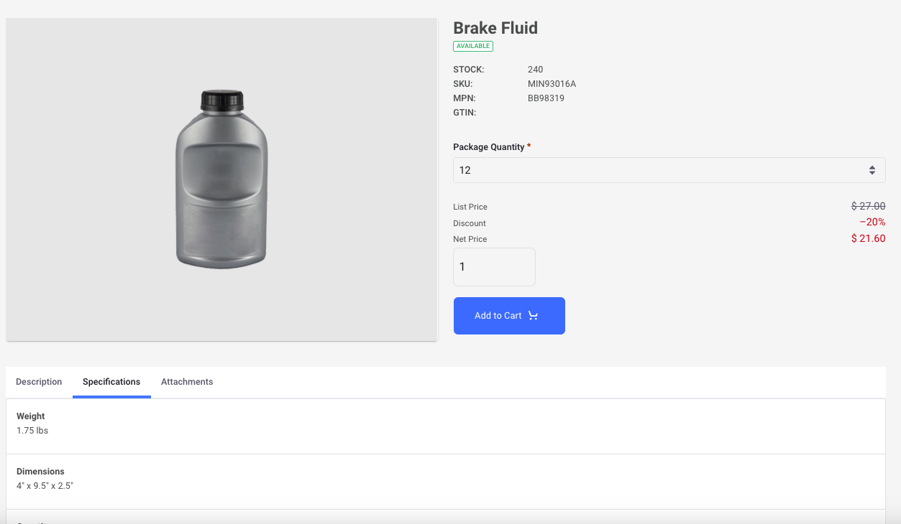

# Product Details - Using Display Page Template

Accelerators like Minium and Speedwell have a product details page that uses the product details widget. Instead of using the product details widget on a widget page, you can use a display page template to create the same page. This gives you more flexibility to customize individual elements as well as improve maintainability.



## Creating a Display Page Template for Products

1. Open the *Product Menu* () and navigate to *Design* &rarr; *Page Templates*.

1. Go to *Display Page Templates* and click *New*.

1. Select *Blank*.

1. Enter the name as *Product Details* and set Content Type as *Product*.

   

1. Click *Save*.

This creates the new display page template for products and opens it in edit mode.

## Adding the Product Image and Name

1. Drag and drop a container into the drop area.

1. Drag and drop a grid into the container.

1. In the General tab on your right, set the Number of Modules to `2` for the grid.

1. In the Styles tab on your right, set the Margin Bottom to `3` tokens or `16px`.

1. Search for the Image Gallery fragment and drag and drop it into the first module.

1. Search for the Heading fragment and drag and drop it in the second module.

1. In the Browser tab on your left, find the Heading fragment and rename it to *Product Name*.

1. Select *element-text* from the Browser and select Source as *Product* and Field as *Name*.

## Adding Product Metadata

1. Search for the Availability fragment and drag and drop it below the product name.

1. In the Styles tab on your right, set the Margin Bottom to `3` tokens or `16px`.

1. Drag and drop a grid fragment below the availability fragment.

1. In the General tab on your right, set the Number of Modules to `2` for the grid.

1. In the Styles tab on your right, set the Margin Bottom to `3` tokens or `16px`.

1. Resize the grid so that the first module has two columns and the second has the remaining.

1. Drag and drop a paragraph fragment inside the first module.

1. In the Browser tab on your left, find the Paragraph fragment and rename it to *Product Fields*.

1. Edit the paragraph fragment and enter the following:

   ```
   STOCK:
   SKU:
   MPN:
   GTIN:
   ```

1. Select the content and click *Bold* in the toolbar that pops up.

1. In the second module, drag and drop four Dynamic Field fragments one below the other.

1. Set the first one's Field as *Inventory*, the second as *SKU*, the third as *Manufacturer Part Number*, and the last as *GTIN*.

1. Below the grid, drag and drop the *Option Selector* fragment, *Price* fragment, and the *Add to Cart* fragment.

## Adding the Product Description and Specifications

1. Below the initial grid, drag and drop a Tabs fragment.

1. In the General tab on your right, set the Number of Tabs to `3` for the grid.

1. Rename the first tab to *Description*, the second tab to *Specifications*, and the third to *Attachments*.

1. Drag and drop a paragraph fragment inside the first tab.

1. In the Browser tab on your left, find the Paragraph fragment and rename it to *Product Description*.

1. Select *element-text* from the Browser and select Source as *Product* and Field as *Description*.

1. Drag and drop a Collection Display fragment inside the second tab.

1. Set the Collection field to *Product Specifications* from the Related Items Collection Provider tab.

1. Set the Style Display to *Bordered List*.

1. Drag and drop a Collection Display fragment inside the third tab.

1. Set the Collection field to *Product Attachments* from the Related Items Collection Provider tab.

1. Set the Style Display to *Bordered List*.

1. Click *Publish*.

Go back to the Display Page Templates page, click *Actions* (), and choose *Mark as Default*. You now have a product details page using a display page template that is almost identical to the one present in Minium.


