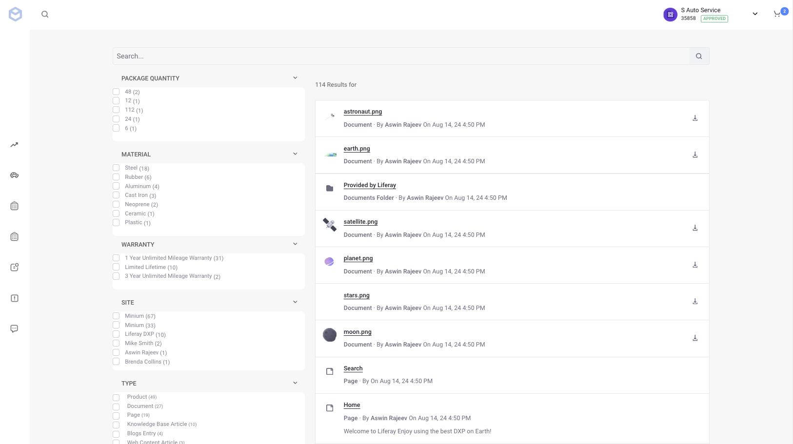

# Search

You can use the search page to find content available on a Liferay site. This can be web content, knowledge base articles, documents, images, products, etc. The search page contains a search bar and several facets that you can use to refine your searches.

If you're using the [Minium Accelerator](../../starting-a-store/using-the-minium-accelerator-to-jump-start-your-b2b-store.md), you can find the search page at `/web/minium/search`. It contains these widgets:

* Search Bar
* Search Options
* Search Results
* Type Facet
* Tag Facet
* Category Facet
* Site Facet
* Folder Facet
* User Facet
* Modified Facet

The Search Results widget supports Liferay's adaptive media out-of-the-box. See [Serving Device and Screen Optimized Media](https://learn.liferay.com/w/dxp/content-authoring-and-management/documents-and-media/publishing-and-sharing/serving-device-and-screen-optimized-media) for more information. The Search Bar widget is scoped to include _Everything_. This is necessary for displaying products as they're created in catalogs at the global level and are not site-scoped. 

The Search Options widget is set to _Allow Empty Searches_. This allows customers to browse and filter all content visible to the channel.

## Related Topics

* [Widget Reference Guide](../liferay-commerce-widgets/widget-reference.md)
* [Creating Pages](https://help.liferay.com/hc/en-us/articles/360018171291-Creating-Pages)
