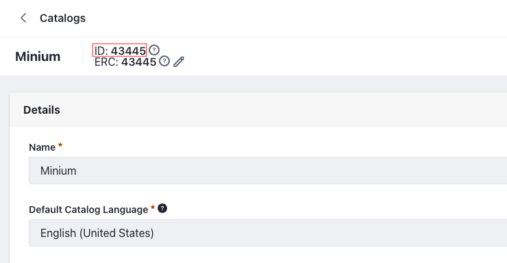
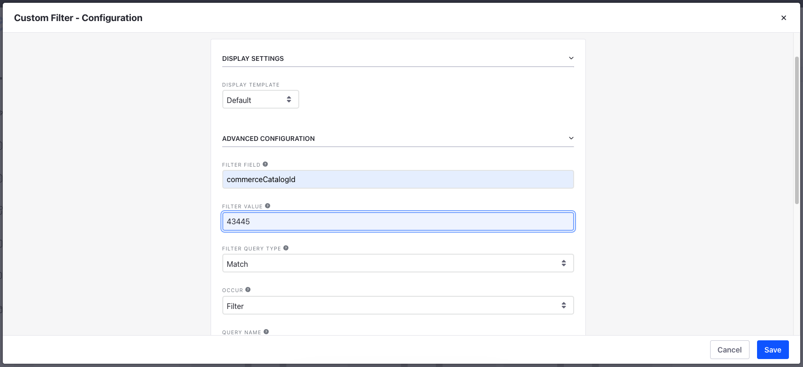

# Creating Separate Catalog Pages for Individual Product Catalogs

Your storefront can contain products from multiple catalogs. Liferay stores Products in Catalogs and displays them in your storefront using a *Catalog Page*. See [Creating a Catalog Page](./creating-a-catalog-page.md) for more information. Since different catalogs can contain different kinds of products, you can differentiate them using multiple Catalog Pages.

To do this, you must first have two or more Catalogs, and at least one Catalog page. Then, duplicate the existing Catalog Page and add the [Custom Filter](https://learn.liferay.com/w/dxp/using-search/search-pages-and-widgets/search-results/custom-filter-examples) widget on both pages to filter products by the catalog ID.

## Copying an Existing Catalog Page

In Liferay DXP 7.4 U22+ and GA22+, to copy a Catalog Page in the Minium site, you must first [enable Private Pages](../../../../dxp/latest/en/site-building/creating-pages/understanding-pages.md#enabling-private-pages) for your instance. If you are on an earlier version, this step isn't necessary. 

1. Once the Private Pages are active, open the *Site Menu* () and go to *Site Builder* &rarr; *Pages*.

1. Click *Private Pages*.

1. Click the *3-dot icon* () next to the Catalog Page and select *Copy Page*.

1. Enter a name for the new Catalog Page and click *Add*.

The new page appears in your storefront displaying the same contents as in the existing Catalog Page.

## Adding the Custom Filter

Before adding the custom filter, you must first retrieve the IDs of the catalogs you want to filter. To do this, open the *Global Menu* () and go to *Commerce* &rarr; *Catalogs*. Click on the catalog and copy the ID present next to its name.



Go back to the Catalog Page: 

1. Click the *Add* button from the top menu.

1. In the *Widgets* section, search for the *Custom Filter* widget.

   ```{important}
   If you are using a Content Page, there are two ways to add a widget.
   1. Click the *Edit* button () from the top menu and click *Add* () on the right side. The rest of the steps are the same as above.

   2. Open the *Site Menu* () and select *Site Builder* &rarr; *Pages*. Navigate to the desired page and click the *3-dot icon* () &rarr; *Edit*. The rest of the steps are the same as above.
   ```

1. Drag and drop the widget to the desired area in your storefront.

1. Hover over the widget and click the *3-dot icon* () and select *Configuration*.

1. Enter the following information and click *Save*.

   **Filter Field:** `commerceCatalogId`

   **Filter Value:** `43445` (Type the catalog ID you copied)

   **Filter Type:** Match

   **Occur:** Filter

   

1. Click *Apply* on the Custom Filter to apply the changes.

You should see products from only one catalog on the page. Repeat the above steps with a different catalog on the other catalog page.

```{note}
You can also disable the Custom Filter and make it immutable and invisible using the checkboxes inside the *Configuration* menu. You can use the Custom Filter for a wide range of use cases. See [Custom Filter Examples](https://learn.liferay.com/w/dxp/using-search/search-pages-and-widgets/search-results/custom-filter-examples) for more information.
```

## Related Topics

* [Creating a Catalog Page](./creating-a-catalog-page.md)
* [Custom Filter Examples](https://learn.liferay.com/w/dxp/using-search/search-pages-and-widgets/search-results/custom-filter-examples)
