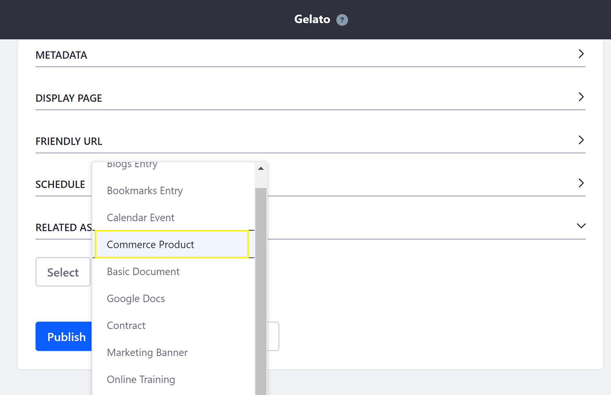
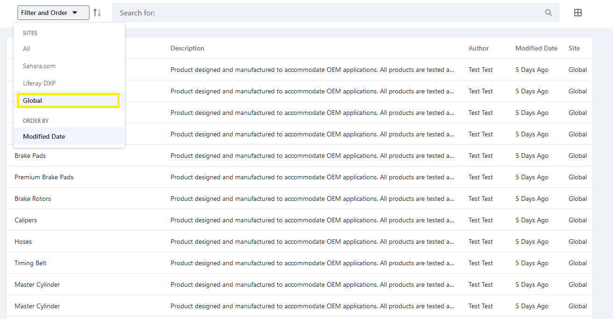

# Enabling Commerce Products as Related Assets

You can connect products to other assets in Liferay by using the [related assets](https://help.liferay.com/hc/articles/360028820532-Defining-Content-Relationships) relationship.

!!! note
    Liferay DXP 7.4+ does not support products as related assets. 

## Configure the Asset Browser to Search the Database

1. Navigate to `[Liferay Home]\osgi\marketplace\`. For more information about `Liferay Home` folder, see [Liferay Home](https://learn.liferay.com/dxp/latest/en/installation-and-upgrades/reference/liferay-home.html).

1. Find the `Liferay Web Experience - Liferay Asset - Impl.lpkg` then open it with an archive manager.

1. In the archive manager window, open the `com.liferay.asset.browser.web.jar`.

1. Using a text editor, open the `portlet.properties` file.

1. Set `search.with.database=true` and update the jar.

1. Restart the application server.

!!! note
    Performing a search reindex may be necessary for products to appear as a related asset option when editing content.

## Execute a Reindex

Execute a reindex to populate the related assets in the filter.

1. Open the _Global Menu_ () and navigate to _Control Panel_ &rarr; _Search_.

1. Click _Reindex_ next to All Search Indexes.

## Verify the Availability of Products

Products are available on all Liferay sites by default, so you must change the Filter to _Global_.

1. Open the _Site Menu_ () and go to _Content_ &rarr; _Web Content_.

1. Click () icon &rarr; _Basic Web Content_.

1. Scroll down to the _Related Assets_ section.

1. Click _Select_.

1. Click _Commerce Product_.

     

1. Click _Filter and Order_ then _Global_.

     

1. Click the product.

Products are now available as related assets.

## Related Topics

* [Defining Content Relationships](https://learn.liferay.com/web/guest/w/dxp/site-building/displaying-content/defining-content-relationships)
* [Creating Web Content Articles](https://learn.liferay.com/w/dxp/content-authoring-and-management/web-content/web-content-articles/creating-web-content-articles)
