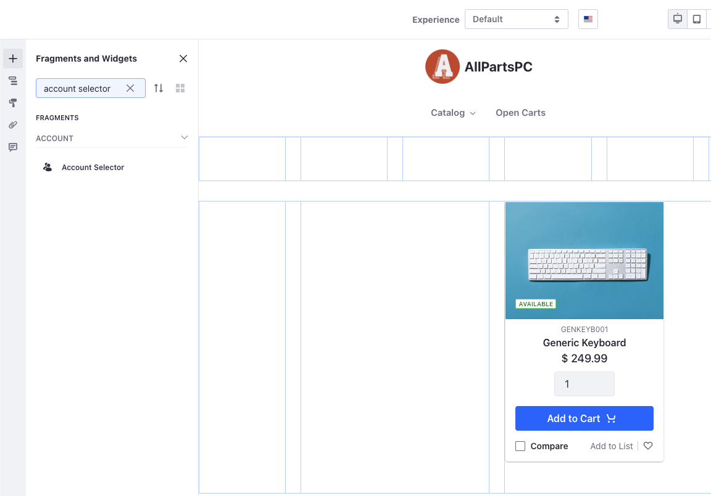
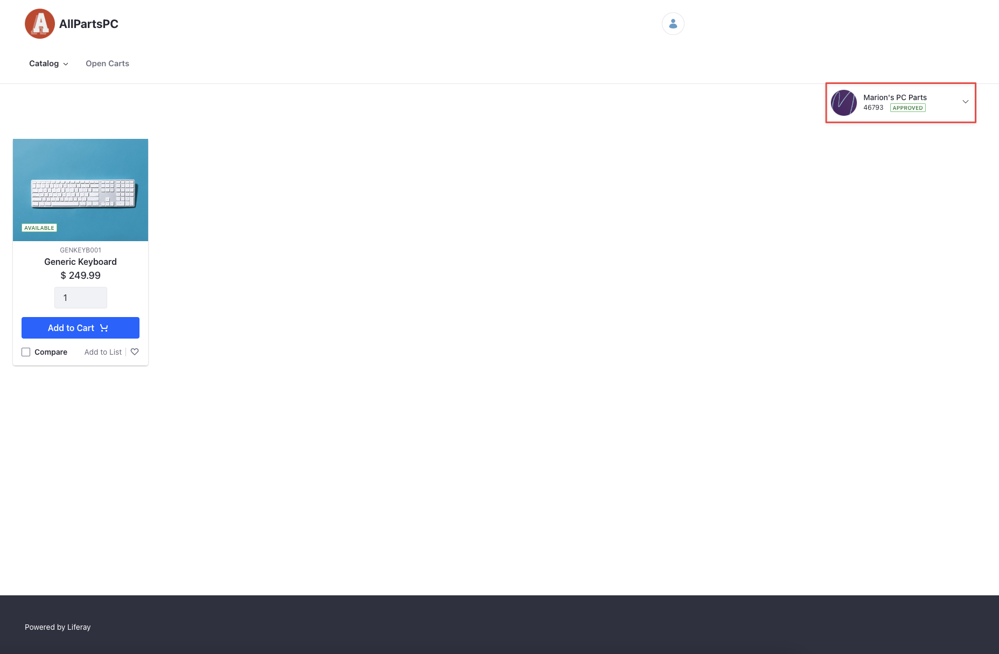

# Using the Account Selector Fragment

{bdg-secondary}`Liferay DXP 7.4 U72+/GA72+`

The Account Selector fragment provides an easy way for users to switch between their accounts when browsing products and creating orders.

```{tip}
The fragment works best when you have the [catalog](../commerce-storefront-pages/catalog.md), [open cart](../commerce-storefront-pages/pending-orders.md), and [checkout](../commerce-storefront-pages/checkout.md) pages.
```

## Adding the Account Selector Fragment to a Page

1. Go to the desired content page or template and click _Edit_ ().

1. In the Fragments and Widgets sidebar (), search _account selector_.

   

1. Drag and drop the fragment onto the page. Do not mistake this fragment with the [Account Management widget](https://learn.liferay.com/w/dxp/users-and-permissions/accounts/account-management-widget).

1. Click _Publish_.

   

The account selector immediately shows the user's selected account, if any exists.

## Account Selector Details

After adding the account selector fragment to a page, you can click the account icon to open it. Here you can access the accounts you have permission to manage. You can also create a new order from the account selector by clicking the _Create New Order_ button. For this to work correctly, you must have an [Open Carts page](../commerce-storefront-pages/pending-orders.md).

When you have an active order, the account selector fragment displays the order number and its status right below the account name. If there's an active workflow, the order is created with the _Draft_ status.


## Related Topics

[Catalog](../commerce-storefront-pages/catalog.md)

[Pending Orders](../commerce-storefront-pages/pending-orders.md)

[Checkout](../commerce-storefront-pages/checkout.md)
