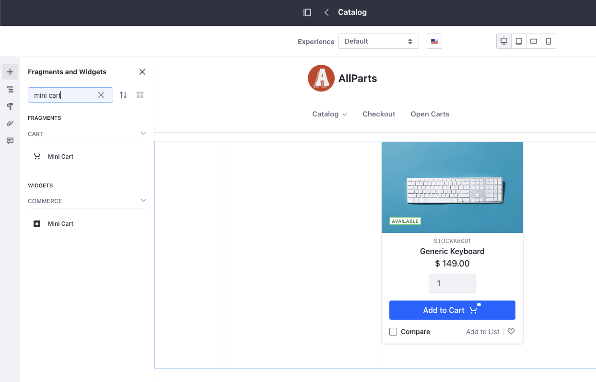
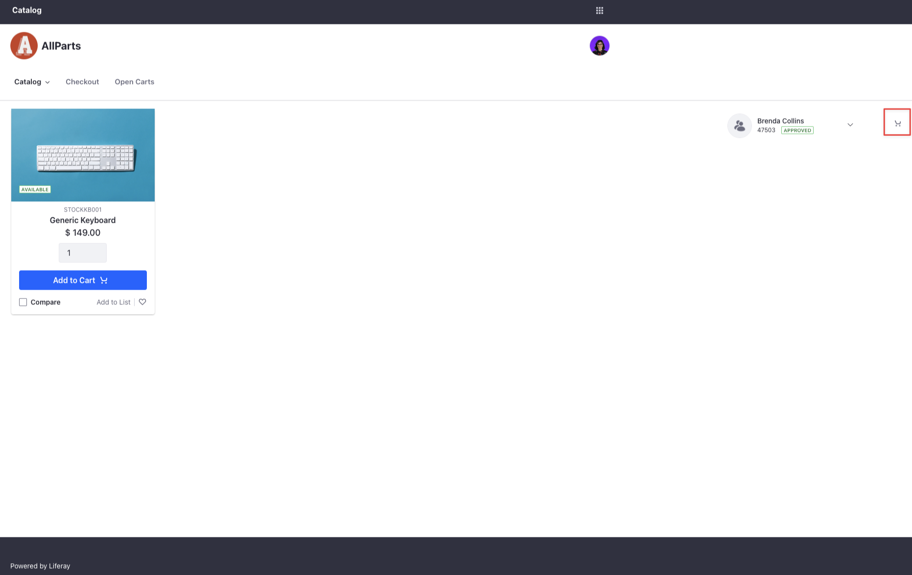
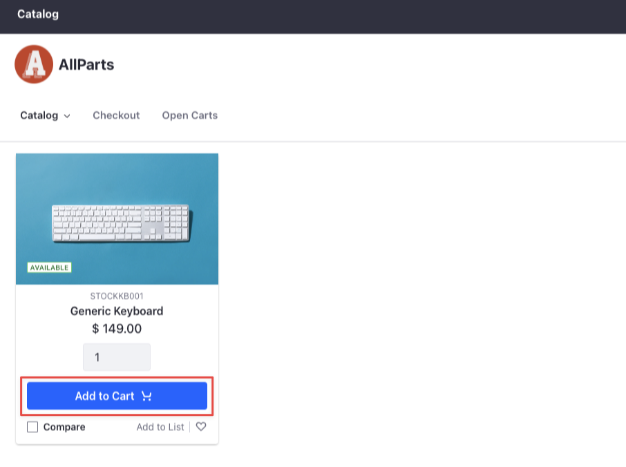
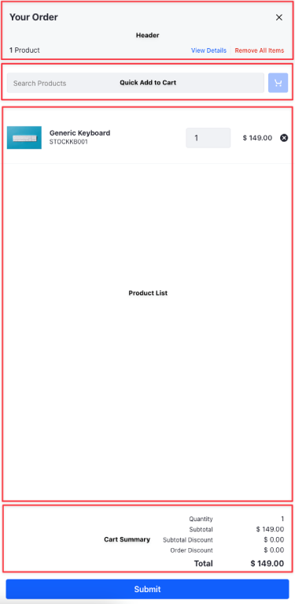
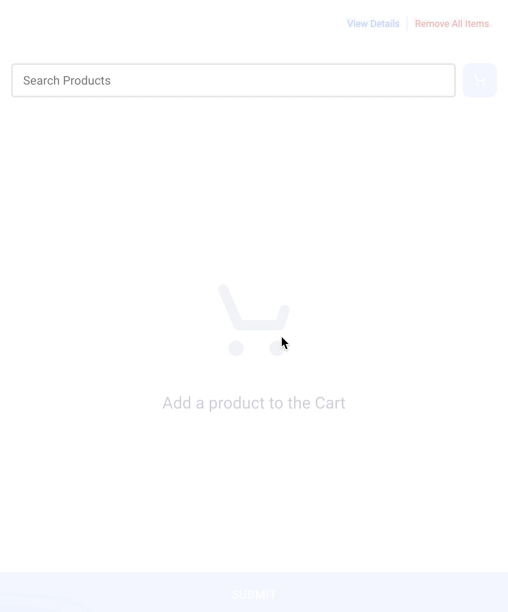

# Using the Mini Cart Fragment

{bdg-secondary}`Liferay DXP 7.4 U69+/GA69+`

The Mini Cart fragment provides a detailed overview of your cart. You can use it to increase or decrease product quantity, delete products, submit the cart for checkout, or search and quickly add products to the cart.

For the fragment to work correctly, your site must have [catalog](../commerce-storefront-pages/catalog.md), [open cart](../commerce-storefront-pages/pending-orders.md), and [checkout](../commerce-storefront-pages/checkout.md) pages.

## Adding the Mini Cart Fragment to a Page

1. Go to the desired content page or template and click _Edit_ ().

1. In the Fragments and Widgets sidebar (), search _Mini Cart_.

   

1. Drag and drop the fragment onto the page. Do not mistake this fragment with the [Mini Cart](../liferay-commerce-widgets/using-the-mini-cart-widget.md) widget.

1. Click _Publish_.

   

## Mini Cart Details

After adding the Mini Cart fragment to a page,

1. Click _Add to Cart_ for a product.

   

1. Click the Mini Cart icon () to view these details:

   * Product Name
   * SKU
   * Quantity
   * Price
   * Subtotal
   * Subtotal Discount
   * Order Discount
   * Total

   

The header area contains two buttons:

**View Details:** Go to the Open Carts page to view more details about the open order.

**Remove All Items:** Clear your cart of products.

The product list area displays all products in the cart along with their quantity and price. Here you can remove () or adjust the quantity of individual products. As you make changes, the cart summary section updates automatically. Click _Submit_ to continue checking out.

## Quickly Adding Products to the Cart

You can use the search bar in the fragment to add items to the cart quickly. Search by a product name or known SKU. This can reduce the time to create orders by removing the burden of searching through the catalog.

After adding the Mini Cart fragment to a page,

1. Create a new order through the [account selector](./using-the-account-selector-fragment.md).

1. Open the Mini Cart, and search for a known SKU or product.

1. Select the SKU and click the Mini Cart () icon.

This adds the SKU to your cart. If desired, you can add multiple SKUs at once.

### Adding Discontinued Products to Cart

{bdg-secondary}`Liferay DXP 2024.Q2+/Portal 7.4 GA120+`

SKUs may reach end-of-life (EOL) and be discontinued. Discontinued SKUs with a valid replacement gets added automatically to the cart when you try adding the discontinued SKU using the quick add-to-cart function.

## Related Topics

[Catalog](../commerce-storefront-pages/catalog.md)

[Pending Orders](../commerce-storefront-pages/pending-orders.md)

[Checkout](../commerce-storefront-pages/checkout.md)