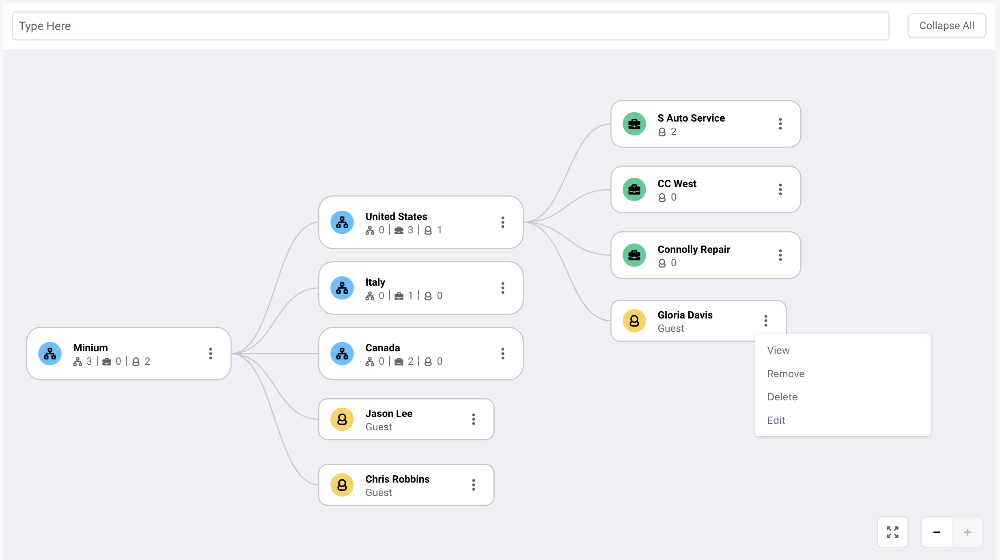
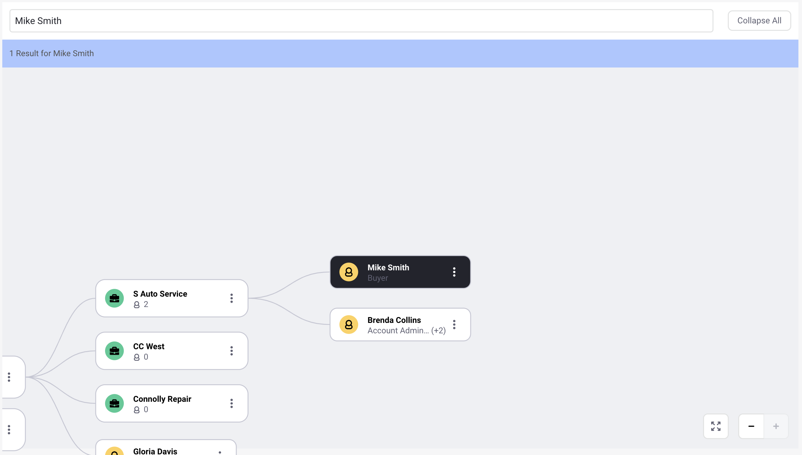
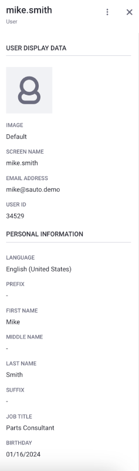
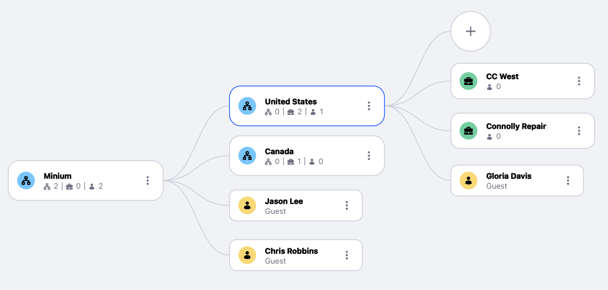

# Using the New Organization Management Chart Widget

{bdg-secondary}`Liferay DXP 2024.Q1+/Portal 7.4 GA112+`

You can use Liferay's organization management chart to view, manage, and search through organizations, associated accounts, and users.

!!! important
    The organization management chart was released behind a [release feature flag](https://learn.liferay.com/web/guest/w/dxp/system-administration/configuring-liferay/feature-flags#release-feature-flags) in Liferay DXP 2024.Q1/Portal 7.4 GA112. It was made Generally Available (GA) in 2024.Q2/GA120.

!!! note
    In earlier versions of Liferay (Liferay DXP 7.4 2023.Q4/Portal 7.4 GA98 and before), the organization management widget did not have these capabilities:

    * The ability to search for organizations, accounts, and users
    * The ability to view and edit details from the side panel.

## Accessing the Organization Management Chart

You can access the organization management chart by going into the Users and Organizations application.

1. Open the *Global Menu* () and navigate to *Control Panel* &rarr; *Users and Organizations*.

1. Go to the *Organization Chart* tab.

This displays the hierarchical structure of organizations.

## Adding the Organization Management Chart Widget to a Page

1. Click *Add* () from the top menu.

1. In the Widgets section, search for the organization management widget.

1. Drag and drop the widget to the desired area in your storefront.

!!! note
    If you are using a content page, first click *Edit* () from the top menu. The Fragments and Widgets menu opens on the left side. The rest of the steps remain the same.

## Using the Search Bar

You can search for organizations, accounts, and users using the search bar at the top of the organization management chart. It auto-completes the entity you're searching for if it exists. Clicking on a result highlights it in the organization management chart. You can clear the search results to remove the highlight. 

Clicking *Collapse All* hides the expanded network and shows only the top-level parent nodes. Click *Expand* () to view the chart in full screen. Note that the search bar and side panel aren't visible in full screen.

## Viewing Entities

1. Select the node to view from the organization management chart.

1. Click *Actions* () and select *View*.

This opens the side panel in view mode. 

If you click an organization with related accounts, organizations, or users or an account with related users, they appear in the organization management chart as child nodes linked to the parent. For instance, the image below shows the United States organization associated to three accounts and one user. You can click *Add* () to create additional nodes linked to the parent node. Nodes in blue represent organizations, nodes in green represent accounts, and nodes in yellow represent users. 

### Display Limit

The organization management chart widget can only display up to 10 organizations at the root level. If you have more than 10 organizations at the root level, the chart displays the following message:

`You have too many organizations to display. Filter your organizations or search for the organization you want to display.`

You can select 10 organizations or search for a specific organization to display on the chart. See [Using the Search Bar](#using-the-search-bar) to learn how to search for an organization.

To select 10 organizations,

1. Click *Select Organizations*.

1. This opens a drop-down with a list of all the organizations available. Click the checkbox next to an organization to select it for display.

   

1. Click *Apply*.

!!! note
    The limit of 10 organizations applies only at the root level. An unlimited number of organizations can appear lower in the hierarchy. 

## Editing Entities

1. Select the node to edit from the organization management chart.

1. Click *Actions* () and select *Edit*. This opens the side panel in edit mode. 

   

   You can edit the following fields for each entity. 

   | Entity       | Editable Fields                                                                                                           |
   | :----------- | :------------------------------------------------------------------------------------------------------------------------ |
   | Account      | Account Image, Account Name, Tax ID, External Reference Code, Description                                                 |
   | Organization | Country, Region                                                                                                           |
   | User         | User Image, Screen Name, Email Address, Language, Prefix, First Name, Middle Name, Last Name, Suffix, Job Title, Birthday |

1. Click *Save* to persist the changes. If you don't wish to continue, click *Cancel*.

## Removing Entities

1. Select the node to remove from the organization management chart.

1. Click *Actions* () &rarr; *Remove*.

Removing a node only removes it from the network of nodes in the chart but doesn't delete it. The organization, account or user still exists. 

## Deleting Entities

1. Select the node to delete from the organization management chart.

1. Click *Actions* () and select *Delete*.

You cannot delete an organization with sub-organizations or users. They must be deleted first before deleting the parent organization. 

Deleting an account containing users only deletes the account but not the users.

## Related Topics

* [Creating and Managing Organizations](https://learn.liferay.com/w/dxp/users-and-permissions/organizations/creating-and-managing-organizations)
