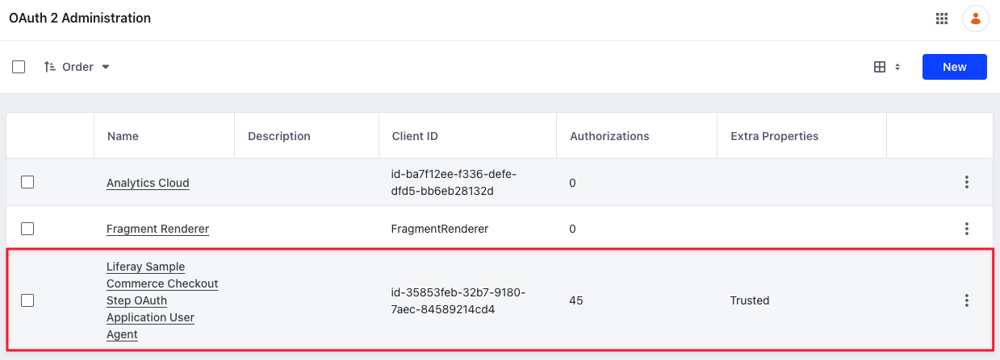
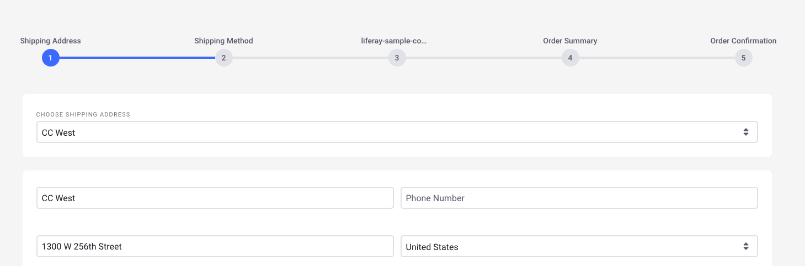
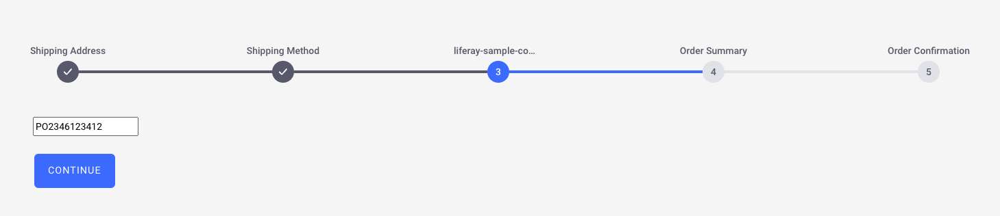
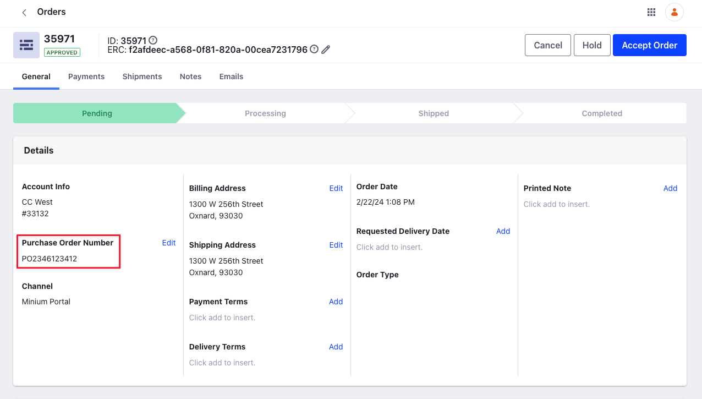

# Using the Checkout Step Client Extension

{bdg-secondary}`Liferay DXP 2024.Q1+/Portal 7.4 GA112+`

You can use a client extension to create a new checkout step. This tutorial uses an example client extension from the [sample workspace](https://github.com/liferay/liferay-portal/tree/master/workspaces/liferay-sample-workspace) and it consists of a standalone [Spring Boot application](https://docs.spring.io/spring-boot/docs/current/reference/html/getting-started.html#getting-started) that communicates with Liferay using [OAuth 2](https://learn.liferay.com/w/dxp/headless-delivery/using-oauth2) and a UI element that takes an input from the user during checkout. The user input for purchase order number gets added to the order through the Spring Boot application that patches the value to the relevant endpoint.

## Prerequisites

To start developing client extensions,

1. Install Java (JDK 8 or JDK 11).

   !!! note
       Check the [compatibility matrix](https://help.liferay.com/hc/en-us/articles/4411310034829-Liferay-DXP-7-4-Compatibility-Matrix) for supported JDKs, databases, and environments. See [JVM Configuration](https://learn.liferay.com/w/dxp/installation-and-upgrades/reference/jvm-configuration) for recommended JVM settings.

1. Download and unzip the sample workspace:

   ```bash
   curl -o com.liferay.sample.workspace-latest.zip https://repository.liferay.com/nexus/service/local/artifact/maven/content\?r\=liferay-public-releases\&g\=com.liferay.workspace\&a\=com.liferay.sample.workspace\&\v\=LATEST\&p\=zip
   ```

   ```bash
   unzip -d liferay-sample-workspace com.liferay.sample.workspace-latest.zip
   ```

Now you have the tools to start and deploy the client extension(s) to Liferay. 

```{include} /_snippets/run-liferay-portal.md
```

## Examine the Checkout Step Client Extension

The `client-extensions/liferay-sample-commerce-checkout-step/client-extension.yaml` file defines the checkout step client extension in the sample workspace. There are three important blocks in the `.yaml` file that you must understand:

```yaml
assemble:
    - from: assets
      into: static
    - fromTask: bootJar
```

The `assemble` block specifies that everything in the `assets/` folder should be included as a static resource in the built client extension `.zip` file. The JavaScript code in this client extension is used as a static resource in Liferay. The standalone application/microservice is created with the `bootJar` command that is available from the [Spring Boot Gradle Plugin](https://docs.spring.io/spring-boot/docs/current/gradle-plugin/reference/htmlsingle/). The application JAR must be included in the LUFFA for deployment in Liferay SaaS.

```yaml
liferay-sample-commerce-checkout-step:
    active: true
    checkoutStepLabel: liferay-sample-commerce-checkout-step-label
    checkoutStepName: liferay-sample-commerce-checkout-step-name
    checkoutStepOrder: 25
    name: Liferay Sample Commerce Checkout Step
    oAuth2ApplicationExternalReferenceCode: liferay-sample-commerce-checkout-step-oauth-application-user-agent
    order: true
    sennaDisabled: true
    showControls: true
    type: commerceCheckoutStep
    visible: true 
```

The `liferay-sample-commerce-checkout-step` block contains the key configurations required for a checkout step client extension. See [Checkout Step Client Extension YAML Reference](./checkout-step-client-extension-reference.md#checkout-step-client-extension-yaml-reference) for more information on each field.

```yaml
liferay-sample-commerce-checkout-step-oauth-application-user-agent:
    .serviceAddress: localhost:58081
    .serviceScheme: http
    name: Liferay Sample Commerce Checkout Step OAuth Application User Agent
    scopes:
        - Liferay.Headless.Admin.Workflow.everything
    type: oAuthApplicationUserAgent
```

Another important part of the `client-extension.yaml` is in the `liferay-sample-commerce-checkout-step-oauth-application-user-agent` definition. The `serviceAddress` parameter defines where the service runs locally and the `serviceScheme` parameter defines the protocol. The `name` field defines the name of the OAuth application user agent. The `scopes` field defines the access given to the headless API. This section sets up Liferay as the authorization server, so the checkout step you deploy next can invoke the resource server's secure endpoint and send a payload. In the example, the purchase order number entered by the user gets added to the order through Liferay's API. See [OAuth User Agent YAML Configuration Reference](../../../../../dxp/latest/en/liferay-development/configuration-as-code/oauth-user-agent-yaml-configuration-reference.md) for more information.

## Deploy the Checkout Step Client Extension

1. Go to the sample workspace's `client-extensions/liferay-sample-commerce-checkout-step` folder.

1. Run

   ```bash
   ../../gradlew clean createClientExtensionConfig deploy -Ddeploy.docker.container.id=$(docker ps -lq)
   ```

1. In Liferay's log, confirm that the client extension deployed and started:

   ```log
   2024-02-22 10:10:54.599 INFO  [com.liferay.portal.kernel.deploy.auto.AutoDeployScanner][AutoDeployDir:212] Processing liferay-sample-commerce-checkout-step.zip
   2024-02-22 10:11:02.391 INFO  [fileinstall-directory-watcher][BundleStartStopLogger:68] STARTED liferaysamplecommercecheckoutstep_7.4.13 [1496]
   ```

   In addition, messages about the OAuth user agent are logged.

   ```log
   2024-02-22 10:11:02.575 INFO  [CM Event Dispatcher (Fire ConfigurationEvent: pid=com.liferay.oauth2.provider.configuration.OAuth2ProviderApplicationUserAgentConfiguration~liferay-sample-commerce-checkout-step-oauth-application-user-agent)][InterpolationConfigurationPlugin:135] Replaced value of configuration property 'homePageURL' for PID com.liferay.oauth2.provider.configuration.OAuth2ProviderApplicationUserAgentConfiguration~liferay-sample-commerce-checkout-step-oauth-application-user-agent
   2024-02-22 10:11:02.625 INFO  [CM Event Dispatcher (Fire ConfigurationEvent: pid=com.liferay.oauth2.provider.configuration.OAuth2ProviderApplicationUserAgentConfiguration~liferay-sample-commerce-checkout-step-oauth-application-user-agent)][OAuth2ProviderApplicationUserAgentConfigurationFactory:170] OAuth 2 application with external reference code liferay-sample-commerce-checkout-step-oauth-application-user-agent and company ID 44408322414245 has client ID id-54a64b55-d854-5da6-9247-46f665d452dc
   ```

1. Verify that the OAuth Application User Agent was added to Liferay. Go to _Control Panel_ &rarr; _OAuth2 Administration_.



The Liferay Sample Commerce Checkout Step OAuth Application User Agent provides the [OAuth 2 authorization](https://learn.liferay.com/w/dxp/headless-delivery/using-oauth2) needed so that Liferay can access the Spring Boot application's data through its protected endpoint. All that is needed for Liferay to authorize the application in this case is declaring the external reference code in the `application-default.properties`:

```properties
liferay.oauth.application.external.reference.codes=liferay-sample-commerce-checkout-step-oauth-application-user-agent
```

## Start the Microservice

From the `client-extensions/liferay-sample-commerce-checkout-step` folder, run

```bash
../../gradlew bootRun
```

The Spring Boot application starts and prints messages in the log:

```log
...
2024-02-22 10:17:13.165  INFO 4753 --- [           main] o.s.b.w.embedded.tomcat.TomcatWebServer  : Tomcat started on port(s): 58081 (http) with context path ''
2024-02-22 10:17:13.172  INFO 4753 --- [           main] c.l.sample.SampleSpringBootApplication   : Started SampleSpringBootApplication in 2.999 seconds (JVM running for 3.267)
<==========---> 80% EXECUTING [1h 43m 56s]
> :client-extensions:liferay-sample-commerce-checkout-step:bootRun
```

## Verifying the Addition of the Checkout Step

1. Log in as an administrator, open the _Global Menu_ () and go to _Control Panel_ &rarr; _Sites_.

1. Add a new Minium site.

1. Open the site and use the account selector to create a new account.

1. Add a few items to your cart.

1. Open the mini cart and click _Submit_. This starts the checkout flow.

   

1. Continue checking out till you reach the new step. Enter a number in the purchase order number field and click _Continue_.

   

1. Finish placing the order. Now, open the _Global Menu_ () and navigate to _Commerce_ &rarr; _Orders_.

1. Find the order you placed and verify the addition of the purchase order number you entered.

   

## Examining the Code

The provided checkout step contains an input field defined in `assets/index.js` to accept the user's input for the purchase order number. It also has an `ActionRestController` that sends the request containing the purchase order number from the user and updates the current order.

### Examining `index.js`

```javascript
export default function CommerceCheckoutStep() {
   const commerceCheckoutStepContainer = document.getElementById(
      '_com_liferay_commerce_checkout_web_internal_portlet_CommerceCheckoutPortlet_commerceCheckoutStepContainer'
   );

   const newInput = document.createElement('input');

   const inputName =
      '_com_liferay_commerce_checkout_web_internal_portlet_CommerceCheckoutPortlet_pon';

   newInput.setAttribute('id', inputName);
   newInput.setAttribute('name', inputName);

   newInput.setAttribute('placeholder', 'Purchase order number');
   newInput.setAttribute('type', 'text');

   commerceCheckoutStepContainer.appendChild(newInput);
}
```

The `index.js` file contains logic to retrieve the checkout step container from the checkout widget and add a new child element inside it. The child element is an input field that accepts a value of type `text`. This value gets added as the purchase order number for the current order. The attribute that corresponds to the purchase order number is `pon`.

### Examining the `ActionRestController`

```java
@PostMapping
public ResponseEntity<String> post(
   @AuthenticationPrincipal Jwt jwt, @RequestBody String json) {

   JSONObject jsonObject = new JSONObject(json);

   return new ResponseEntity<>(
      WebClient.create(
         StringBundler.concat(
            lxcDXPServerProtocol, "://", lxcDXPMainDomain,
            "/o/headless-commerce-delivery-cart/v1.0/carts/",
            jsonObject.getLong("commerceOrderId"))
      ).patch(
      ).accept(
         MediaType.APPLICATION_JSON
      ).contentType(
         MediaType.APPLICATION_JSON
      ).bodyValue(
         new JSONObject(
         ).put(
            "purchaseOrderNumber", jsonObject.getString("pon")
         ).toString()
      ).header(
         HttpHeaders.AUTHORIZATION, "Bearer " + jwt.getTokenValue()
      ).retrieve(
      ).bodyToMono(
         String.class
      ).block(),
      HttpStatus.OK);
}
```

The `ActionRestController` contains a single post method that has two parameters: the JSON Web Token (JWT) and the request body. The token authenticates HTTP calls, and the request body contains data as a string in JSON format. It uses a `JSONObject()` constructor to retrieve the value in the function parameter as a JSON object.

After retrieving the request body as a JSON object, the code proceeds to make an asynchronous HTTP POST request. First, it initializes and configures the `WebClient` by setting the server protocol, base URL, and the relevant URL to update the order. The JSON object contains the order ID used for updating the order.

Then, it calls the `patch()` method on the `WebClient`, setting the `MediaType` and `contentType` values to JSON. After this, it retrieves the purchase order number field (`pon`) from the JSON object and puts it inside the request body. Finally, it sets the required headers and makes the request.

## Related Topics

* [Using the Shipping Engine Client Extension](./using-the-shipping-engine-client-extension.md)
* [Using a Microservice Client Extension](../../../../../dxp/latest/en/liferay-development/integrating-microservices/using-a-microservice-client-extension.md)
* [OAuth User Agent YAML Configuration Reference](../../../../../dxp/latest/en/liferay-development/configuration-as-code/oauth-user-agent-yaml-configuration-reference.md)
