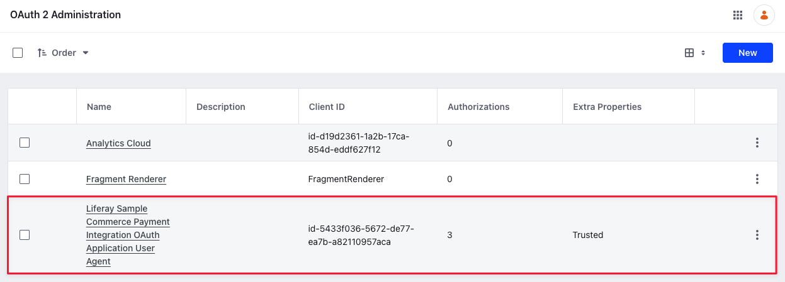
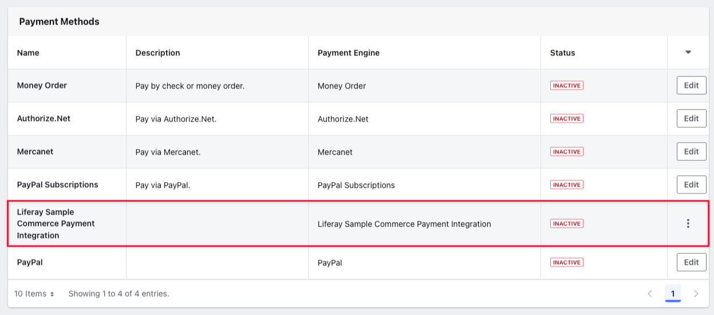
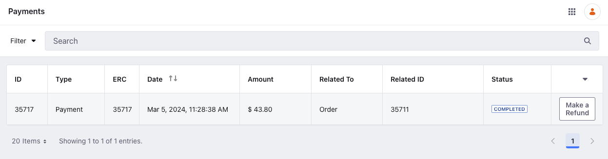

# Using the Payment Integration Client Extension

{bdg-secondary}`Liferay DXP 2024.Q1+/Portal 7.4 GA112+`

You can use a client extension to integrate with a new payment method in Liferay. This client extension from the [sample workspace](https://github.com/liferay/liferay-portal/tree/master/workspaces/liferay-sample-workspace) consists of a standalone Spring Boot application that communicates with Liferay using OAuth 2. See [Configuring Payment Methods](../../store-management/configuring-payment-methods.md) to read more about the payment methods available out-of-the-box with Liferay.

## Prerequisites

1. Install Java (JDK 8 or JDK 11).

   !!! note
       Check the [compatibility matrix](https://help.liferay.com/hc/en-us/articles/4411310034829-Liferay-DXP-7-4-Compatibility-Matrix) for supported JDKs, databases, and environments. See [JVM Configuration](https://learn.liferay.com/w/dxp/installation-and-upgrades/reference/jvm-configuration) for recommended JVM settings.

1. Download and unzip the sample workspace:

   ```bash
   curl -o com.liferay.sample.workspace-latest.zip https://repository.liferay.com/nexus/service/local/artifact/maven/content\?r\=liferay-public-releases\&g\=com.liferay.workspace\&a\=com.liferay.sample.workspace\&\v\=LATEST\&p\=zip
   ```

   ```bash
   unzip -d liferay-sample-workspace com.liferay.sample.workspace-latest.zip
   ```

Now you have the tools to start and deploy the client extension(s) to Liferay. 

```{include} /_snippets/run-liferay-portal.md
```

## Examine the Payment Integration Client Extension

The `client-extensions/liferay-sample-commerce-payment-integration/client-extension.yaml` file defines the payment integration client extension in the sample workspace. There are three important blocks in the `.yaml` file that you must understand:

```yaml
assemble:
    - fromTask: bootJar
```

The `assemble` block specifies that the standalone application/microservice is created with the `bootJar` command. This is available from the [Spring Boot Gradle Plugin](https://docs.spring.io/spring-boot/docs/current/gradle-plugin/reference/htmlsingle/). The application JAR must be included in the LUFFA for deployment in Liferay SaaS.

```yaml
liferay-sample-commerce-payment-integration:
    key: liferay-sample-commerce-payment-integration
    name: Liferay Sample Commerce Payment Integration
    oAuth2ApplicationExternalReferenceCode: liferay-sample-commerce-payment-integration-oauth-application-user-agent
    paymentIntegrationType: 3
    paymentIntegrationTypeSettings:
        key1: value1
        key2: value2
        key3: value3
        key4: value4
        key5: value5
    type: commercePaymentIntegration
```

The `liferay-sample-commerce-payment-integration` block contains the key configurations required for a payment integration client extension. See [Payment Integration Client Extension YAML Reference](./payment-integration-client-extension-reference.md#payment-integration-client-extension-yaml-reference) for more information on each field.

```yaml
liferay-sample-commerce-payment-integration-oauth-application-user-agent:
    .serviceAddress: localhost:58081
    .serviceScheme: http
    name: Liferay Sample Commerce Payment Integration OAuth Application User Agent
    scopes:
        - Liferay.Headless.Admin.Workflow.everything
    type: oAuthApplicationUserAgent
```

Another important part of the `client-extension.yaml` is in the `liferay-sample-commerce-payment-integration-oauth-application-user-agent` definition. The `serviceAddress` parameter defines where the service runs locally and the `serviceScheme` parameter defines the protocol. The `name` field defines the name of the OAuth application user agent. The `scopes` field defines the access given to the headless API. This section sets up Liferay as the authorization server, so that the payment integration you deploy next can invoke the resource server's secure endpoints and send payloads. See [OAuth User Agent YAML Configuration Reference](https://learn.liferay.com/w/dxp/building-applications/client-extensions/configuration-client-extensions/oauth-user-agent-yaml-configuration-reference) for more information.

## Deploy the Payment Integration Client Extension

1. Go to the sample workspace's `client-extensions/liferay-sample-commerce-payment-integration` folder.

1. Run

   ```bash
   ../../gradlew clean createClientExtensionConfig deploy -Ddeploy.docker.container.id=$(docker ps -lq)
   ```

1. In Liferay's log, confirm that the client extension deployed and started:

   ```log
   2024-03-05 11:22:48.192 INFO  [com.liferay.portal.kernel.deploy.auto.AutoDeployScanner][AutoDeployDir:212] Processing liferay-sample-commerce-payment-integration.zip
   2024-03-05 11:22:57.527 INFO  [fileinstall-directory-watcher][BundleStartStopLogger:68] STARTED liferaysamplecommercepaymentintegration_7.4.13 [1499]
   ```

   In addition, messages about the OAuth user agent are logged.

   ```log
   2024-03-05 11:22:57.679 INFO  [CM Event Dispatcher (Fire ConfigurationEvent: pid=com.liferay.oauth2.provider.configuration.OAuth2ProviderApplicationUserAgentConfiguration~liferay-sample-commerce-payment-integration-oauth-application-user-agent)][InterpolationConfigurationPlugin:135] Replaced value of configuration property 'homePageURL' for PID com.liferay.oauth2.provider.configuration.OAuth2ProviderApplicationUserAgentConfiguration~liferay-sample-commerce-payment-integration-oauth-application-user-agent
   2024-03-05 11:22:57.712 INFO  [CM Event Dispatcher (Fire ConfigurationEvent: pid=com.liferay.oauth2.provider.configuration.OAuth2ProviderApplicationUserAgentConfiguration~liferay-sample-commerce-payment-integration-oauth-application-user-agent)][OAuth2ProviderApplicationUserAgentConfigurationFactory:170] OAuth 2 application with external reference code liferay-sample-commerce-payment-integration-oauth-application-user-agent and company ID 93285384307986 has client ID id-5433f036-5672-de77-ea7b-a82110957aca
   ```

1. Verify that the OAuth Application User Agent was added to Liferay. Go to _Control Panel_ &rarr; _OAuth2 Administration_.



The Liferay Sample Commerce Payment Integration OAuth Application User Agent provides the [OAuth 2 authorization](https://learn.liferay.com/w/dxp/headless-delivery/using-oauth2) needed so that Liferay can access the Spring Boot application's data through its protected endpoint. All that is needed for Liferay to authorize the application in this case is declaring the external reference code in the `application-default.properties`:

```properties
liferay.oauth.application.external.reference.codes=liferay-sample-commerce-payment-integration-oauth-application-user-agent
```

## Start the Microservice

From the `client-extensions/liferay-sample-commerce-payment-integration` folder, run

```bash
../../gradlew bootRun
```

The Spring Boot application starts and prints messages in the log:

```log
...
2024-03-05 11:22:58.893  INFO 3534 --- [           main] o.s.b.w.embedded.tomcat.TomcatWebServer  : Tomcat started on port(s): 58081 (http) with context path ''
2024-03-05 11:22:58.900  INFO 3534 --- [           main] c.l.sample.SampleSpringBootApplication   : Started SampleSpringBootApplication in 21.133 seconds (JVM running for 21.397)
<==========---> 80% EXECUTING [7m 43s]
> :client-extensions:liferay-sample-commerce-payment-integration:bootRun
```

## Verifying the Addition of the Payment Integration

1. Log in as an administrator, open the _Global Menu_ (), and go to _Control Panel_ &rarr; _Sites_.

1. Add a new Minium site.

1. Open the _Global Menu_ () and go to _Commerce_ &rarr; _Channels_.

1. Select _Minium Portal_ and scroll down to the Payment Methods section. Verify the addition of the new payment integration here. It is inactive by default.

   

1. Select the new payment integration and activate it using the _Active_ toggle.

1. Click _Save_. Two new tabs, _Eligibility_ and _Configuration_, appear for the payment integration.

   The configuration tab contains an input field. You can enter information required by the client extension here instead of hard coding values in the client extension itself. The example contains sample key-value pairs.

   You can go to the Eligibility tab to select specific order types or payment terms to be eligible for the payment integration. By default, it is eligible for all order types and payment terms.

1. Click _Save_.

1. Open the site and use the account selector to create a new account.

1. Add a few items to your cart.

1. Open the mini cart and click _Submit_. This starts the checkout flow.

1. Continue checking out until you finish placing the order. Open the _Global Menu_ () and go to _Commerce_ &rarr; _Payments_ to verify the payment’s completion.



## Examining the Code

To create a payment integration in Liferay, you must implement controllers for the following payment statuses.

* Set up Payment
* Authorize
* Capture
* Cancel
* Refund

The provided sample client extension contains these controllers invoked by the Spring Boot application to create a new payment integration in Liferay. The `key` and `name` fields in the `client-extension.yaml` file specifies the key and name for the payment integration. It is recommended to use a unique key that doesn't conflict with any of the existing payment methods.

### Examining `SetUpPaymentRestController.java`

```java
@PostMapping
public ResponseEntity<String> post(
   @AuthenticationPrincipal Jwt jwt, @RequestBody String json) {

   log(jwt, _log, json);

   return new ResponseEntity<>(
      new JSONObject(
      ).put(
         "paymentStatus", 18
      ).toString(),
      HttpStatus.OK);
}
```

The `SetUpPaymentRestController` contains a single post method that has two parameters: the JSON Web Token (JWT) and the request body. The token authenticates HTTP calls, and the request body contains data as a string in JSON format. After logging the request body, it uses a `JSONObject()` constructor to set the payment status to `18` and returns it as a response entity along with the HTTP status.

### Examining `AuthorizeRestController.java`

```java
@PostMapping
public ResponseEntity<String> post(
   @AuthenticationPrincipal Jwt jwt, @RequestBody String json) {

   log(jwt, _log, json);

   return new ResponseEntity<>(
      new JSONObject(
      ).put(
         "paymentStatus", 2
      ).put(
         "transactionCode", UUID.randomUUID()
      ).toString(),
      HttpStatus.OK);
}
```

The `AuthorizeRestController` contains a single post method that has two parameters: the JSON Web Token (JWT) and the request body. The token authenticates HTTP calls, and the request body contains data as a string in JSON format. After logging the request body, it uses a `JSONObject()` constructor to set the payment status to `2` and returns it as a response entity along with the HTTP status.

### Examining `CaptureRestController.java`

```java
@PostMapping
public ResponseEntity<String> post(
   @AuthenticationPrincipal Jwt jwt, @RequestBody String json) {

   log(jwt, _log, json);

   return new ResponseEntity<>(
      new JSONObject(
      ).put(
         "paymentStatus", 0
      ).toString(),
      HttpStatus.OK);
}
```

The `CaptureRestController` contains a single post method that has two parameters: the JSON Web Token (JWT) and the request body. The token authenticates HTTP calls, and the request body contains data as a string in JSON format. After logging the request body, it uses a `JSONObject()` constructor to set the payment status to `0` and returns it as a response entity along with the HTTP status.

### Examining `CancelRestController.java`

```java
@PostMapping
public ResponseEntity<String> post(
   @AuthenticationPrincipal Jwt jwt, @RequestBody String json) {

   log(jwt, _log, json);

   return new ResponseEntity<>(
      new JSONObject(
      ).put(
         "paymentStatus", 8
      ).toString(),
      HttpStatus.OK);
}
```

The `CancelRestController` contains a single post method that has two parameters: the JSON Web Token (JWT) and the request body. The token authenticates HTTP calls, and the request body contains data as a string in JSON format. After logging the request body, it uses a `JSONObject()` constructor to set the payment status to `8` and returns it as a response entity along with the HTTP status.

### Examining `RefundRestController.java`

```java
@PostMapping
public ResponseEntity<String> post(
   @AuthenticationPrincipal Jwt jwt, @RequestBody String json) {

   log(jwt, _log, json);

   return new ResponseEntity<>(
      new JSONObject(
      ).put(
         "paymentStatus", 17
      ).toString(),
      HttpStatus.OK);
}
```

The `RefundRestController` contains a single post method that has two parameters: the JSON Web Token (JWT) and the request body. The token authenticates HTTP calls, and the request body contains data as a string in JSON format. After logging the request body, it uses a `JSONObject()` constructor to set the payment status to `17` and returns it as a response entity along with the HTTP status.

## Related Topics

* [Using the Checkout Step Client Extension](./using-the-checkout-step-client-extension.md)
* [Using a Microservice Client Extension](https://learn.liferay.com/w/dxp/building-applications/client-extensions/microservice-client-extensions/using-a-microservice-client-extension)
* [OAuth User Agent YAML Configuration Reference](https://learn.liferay.com/w/dxp/building-applications/client-extensions/configuration-client-extensions/oauth-user-agent-yaml-configuration-reference)
