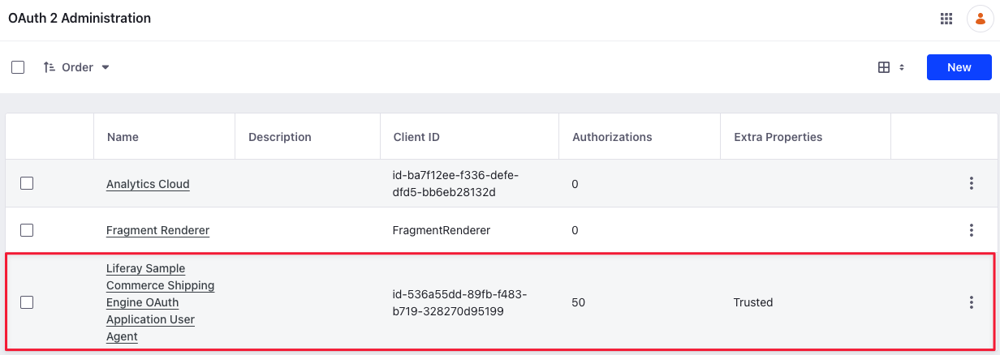
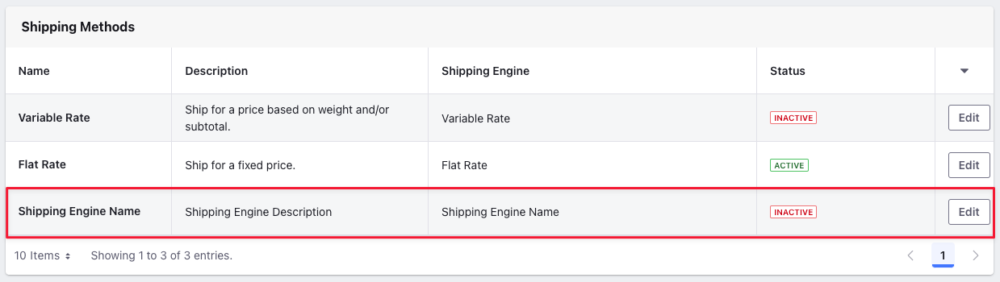
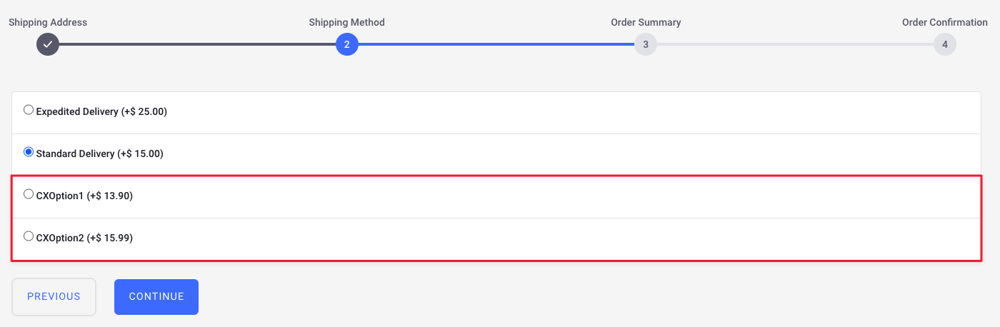

# Using the Shipping Engine Client Extension

{bdg-secondary}`Liferay DXP 2024.Q1+/Portal 7.4 GA112+`

You can use a client extension to add a new shipping engine to Liferay. This client extension from the [sample workspace](https://github.com/liferay/liferay-portal/tree/master/workspaces/liferay-sample-workspace) consists of a standalone Spring Boot application that communicates with Liferay using OAuth 2. See [Configuring Shipping Methods](../../store-management/configuring-shipping-methods.md) to read more about the shipping methods available out-of-the-box with Liferay.

## Prerequisites

1. Install Java (JDK 8 or JDK 11).

   !!! note
       Check the [compatibility matrix](https://help.liferay.com/hc/en-us/articles/4411310034829-Liferay-DXP-7-4-Compatibility-Matrix) for supported JDKs, databases, and environments. See [JVM Configuration](https://learn.liferay.com/w/dxp/installation-and-upgrades/reference/jvm-configuration) for recommended JVM settings.

1. Download and unzip the sample workspace:

   ```bash
   curl -o com.liferay.sample.workspace-latest.zip https://repository.liferay.com/nexus/service/local/artifact/maven/content\?r\=liferay-public-releases\&g\=com.liferay.workspace\&a\=com.liferay.sample.workspace\&\v\=LATEST\&p\=zip
   ```

   ```bash
   unzip -d liferay-sample-workspace com.liferay.sample.workspace-latest.zip
   ```

Now you have the tools to start and deploy the client extension(s) to Liferay. 

```{include} /_snippets/run-liferay-portal.md
```

## Examine the Shipping Engine Client Extension

The `client-extensions/liferay-sample-commerce-shipping-engine/client-extension.yaml` file defines the shipping engine client extension in the sample workspace. There are three important blocks in the `.yaml` file that you must understand:

```yaml
assemble:
    - fromTask: bootJar
```

The `assemble` block specifies that the standalone application/microservice is created with the `bootJar` command. This is available from the [Spring Boot Gradle Plugin](https://docs.spring.io/spring-boot/docs/current/gradle-plugin/reference/htmlsingle/). The application JAR must be included in the LUFFA for deployment in Liferay SaaS.

```yaml
liferay-sample-commerce-shipping-engine:
    key: liferay-sample-commerce-shipping-engine
    name: Liferay Sample Commerce Shipping Engine
    oAuth2ApplicationExternalReferenceCode: liferay-sample-commerce-shipping-engine-oauth-application-user-agent
    shippingEngineTypeSettings:
        key1: value1
        key2: value2
        key3: value3
        key4: value4
        key5: value5
    type: commerceShippingEngine
```

The `liferay-sample-commerce-shipping-engine` block contains the key configurations required for a shipping engine client extension. See [Shipping Engine Client Extension YAML Reference](./shipping-engine-client-extension-reference.md#shipping-engine-client-extension-yaml-reference) for more information on each field.

```yaml
liferay-sample-commerce-shipping-engine-oauth-application-user-agent:
    .serviceAddress: localhost:58081
    .serviceScheme: http
    name: Liferay Sample Commerce Shipping Engine OAuth Application User Agent
    scopes:
        - Liferay.Headless.Admin.Workflow.everything
    type: oAuthApplicationUserAgent
```

Another important part of the `client-extension.yaml` is in the `liferay-sample-commerce-shipping-engine-oauth-application-user-agent` definition. The `serviceAddress` parameter defines where the service runs locally and the `serviceScheme` parameter defines the protocol. The `name` field defines the name of the OAuth application user agent. The `scopes` field defines the access given to the headless API. This section sets up Liferay as the authorization server, so that the shipping engine you deploy next can invoke the resource server's secure endpoints and send payloads. See [OAuth User Agent YAML Configuration Reference](https://learn.liferay.com/w/dxp/liferay-development/configuration-as-code/oauth-user-agent-yaml-configuration-reference) for more information.

## Deploy the Shipping Engine Client Extension

1. Go to the sample workspace.

1. Run

   ```bash
   ./gradlew initBundle
   ```

   This downloads a bundle inside the workspace's `/bundles` folder.

1. Go to the `/bundles/tomcat/bin` folder. Run

   ```bash
   ./catalina run
   ```

1. Go back to the sample workspace's `/client-extensions/liferay-sample-commerce-shipping-engine` folder.

1. Run

   ```bash
   ../../gradlew clean createClientExtensionConfig deploy
   ```

1. In Liferay's log, confirm that the client extension deployed and started:

   ```log
   2024-02-23 11:41:03.277 INFO  [com.liferay.portal.kernel.deploy.auto.AutoDeployScanner][AutoDeployDir:212] Processing liferay-sample-commerce-shipping-engine.zip
   2024-02-23 11:41:13.918 INFO  [fileinstall-directory-watcher][BundleStartStopLogger:68] STARTED liferaysamplecommerceshippingengine_7.4.13 [1504]
   ```

   In addition, messages about the OAuth user agent are logged.

   ```log
   2024-02-23 11:41:14.066 INFO  [CM Event Dispatcher (Fire ConfigurationEvent: pid=com.liferay.oauth2.provider.configuration.OAuth2ProviderApplicationUserAgentConfiguration~liferay-sample-commerce-shipping-engine-oauth-application-user-agent)][InterpolationConfigurationPlugin:135] Replaced value of configuration property 'homePageURL' for PID com.liferay.oauth2.provider.configuration.OAuth2ProviderApplicationUserAgentConfiguration~liferay-sample-commerce-shipping-engine-oauth-application-user-agent
   2024-02-23 11:41:14.099 INFO  [CM Event Dispatcher (Fire ConfigurationEvent: pid=com.liferay.oauth2.provider.configuration.OAuth2ProviderApplicationUserAgentConfiguration~liferay-sample-commerce-shipping-engine-oauth-application-user-agent)][OAuth2ProviderApplicationUserAgentConfigurationFactory:170] OAuth 2 application with external reference code liferay-sample-commerce-shipping-engine-oauth-application-user-agent and company ID 44408322414245 has client ID id-536a55dd-89fb-f483-b719-328270d95199
   ```

1. Verify that the OAuth Application User Agent was added to Liferay. Go to _Control Panel_ &rarr; _OAuth2 Administration_.



The Liferay Sample Commerce Shipping Engine OAuth Application User Agent provides the [OAuth 2 authorization](https://learn.liferay.com/w/dxp/headless-delivery/using-oauth2) needed so that Liferay can access the Spring Boot application's data through its protected endpoint. All that is needed for Liferay to authorize the application in this case is declaring the external reference code in the `application-default.properties`:

```properties
liferay.oauth.application.external.reference.codes=liferay-sample-commerce-shipping-engine-oauth-application-user-agent
```

## Start the Microservice

From the `client-extensions/liferay-sample-commerce-shipping-engine` folder, run

```bash
../../gradlew bootRun
```

The Spring Boot application starts and prints messages in the log:

```log
...
2024-02-28 09:44:17.880  INFO 4363 --- [           main] o.s.b.w.embedded.tomcat.TomcatWebServer  : Tomcat started on port(s): 58081 (http) with context path ''
2024-02-28 09:44:17.887  INFO 4363 --- [           main] c.l.sample.SampleSpringBootApplication   : Started SampleSpringBootApplication in 2.32 seconds (JVM running for 2.62)
<==========---> 80% EXECUTING [56s]
> :client-extensions:liferay-sample-commerce-shipping-engine:bootRun
```

## Verifying the Addition of the Shipping Engine

1. Log in as an administrator, open the _Global Menu_ (), and go to _Control Panel_ &rarr; _Sites_.

1. Add a new Minium site.

1. Open the _Global Menu_ () and go to _Commerce_ &rarr; _Channels_.

1. Select _Minium Portal_ and scroll down to the Shipping Methods section. Verify the addition of the new shipping engine here. It is inactive by default.

   

1. Select the new shipping engine and activate it using the _Active_ toggle.

1. Click _Save_. A new _Configuration_ tab appears for the shipping engine. The configuration tab contains an input field. You can enter information required by the client extension here instead of hard coding values in the client extension itself. The example contains sample key-value pairs.

1. Click _Save_.

1. Open the site and use the account selector to create a new account.

1. Add a few items to your cart.

1. Open the mini cart and click _Submit_. This starts the checkout flow.

1. Continue checking out until you reach the step to select a shipping option.

   

1. Choose one of the two new options from the client extension and finish placing the order.

## Examining the Code

To create a shipping engine in Liferay, you require the following details:

* Key
* Name
* Description
* Shipping Options
* Enabled Shipping Options
* Shipping Option Label

The provided sample shipping engine client extension contains several controllers invoked by the Spring Boot application to create a new shipping engine in Liferay. The `key` field in the `client-extension.yaml` file specifies the key for the shipping engine. You should use a unique key that doesn't conflict with any of the existing shipping methods.

### Examining `NameRestController.java`

```java
@PostMapping
public ResponseEntity<String> post(
   @AuthenticationPrincipal Jwt jwt, @RequestBody String json) {

   log(jwt, _log, json);

   return new ResponseEntity<>(
      new JSONObject(
      ).put(
         "name", "Shipping Engine Name"
      ).toString(),
      HttpStatus.OK);
}
```

The `NameRestController` contains a single post method that has two parameters: the JSON Web Token (JWT) and the request body. The token authenticates HTTP calls, and the request body contains data as a string in JSON format. After logging the request body, it uses a `JSONObject()` constructor to add the name of the shipping engine and returns it as a response entity along with the HTTP status.

### Examining `DescriptionRestController.java`

```java
@PostMapping
public ResponseEntity<String> post(
   @AuthenticationPrincipal Jwt jwt, @RequestBody String json) {

   log(jwt, _log, json);

   return new ResponseEntity<>(
      new JSONObject(
      ).put(
         "description", "Shipping Engine Description"
      ).toString(),
      HttpStatus.OK);
}
```

The `DescriptionRestController` contains a single post method that has two parameters: the JSON Web Token (JWT) and the request body. The token authenticates HTTP calls, and the request body contains data as a string in JSON format. After logging the request body, it uses a `JSONObject()` constructor to add the description of the shipping engine and returns it as a response entity along with the HTTP status.

### Examining `OptionLabelRestController.java`

```java
@PostMapping
public ResponseEntity<String> post(
      @AuthenticationPrincipal Jwt jwt, @RequestBody String json)
   throws Exception {

   log(jwt, _log, json);

   JSONObject jsonObject = new JSONObject(json);

   if (!jsonObject.has("name")) {
      return null;
   }

   return new ResponseEntity<>(
      new JSONObject(
      ).put(
         "name", "Shipping Option Name"
      ).toString(),
      HttpStatus.OK);
}
```

The `OptionLabelRestController` contains a single post method that has two parameters: the JSON Web Token (JWT) and the request body. The token authenticates HTTP calls, and the request body contains data as a string in JSON format. After logging the request body, it uses a `JSONObject()` constructor to create a new JSON object from the JSON string in the request body. If the JSON object doesn't contain the `name` attribute, it returns null. Next, it uses a `JSONObject()` constructor to add the shipping option name and returns it as a response entity along with the HTTP status.

### Examining `OptionsRestController.java`

```java
@PostMapping
public ResponseEntity<String> post(
      @AuthenticationPrincipal Jwt jwt, @RequestBody String json)
   throws Exception {

   log(jwt, _log, json);

   return new ResponseEntity<>(
      new JSONObject(
      ).put(
         "shippingOptions",
         new JSONArray(
         ).put(
            new JSONObject(
            ).put(
               "amount", 13.90
            ).put(
               "key", "CXOption1"
            ).put(
               "name", "CXOption1"
            ).put(
               "priority", 1
            )
         ).put(
            new JSONObject(
            ).put(
               "amount", 15.99
            ).put(
               "key", "CXOption2"
            ).put(
               "name", "CXOption2"
            ).put(
               "priority", 2
            )
         ).put(
            new JSONObject(
            ).put(
               "amount", 17.50
            ).put(
               "key", "CXOption3"
            ).put(
               "name", "CXOption3"
            ).put(
               "priority", 3
            )
         )
      ).toString(),
      HttpStatus.OK);
}
```

The `OptionsRestController` contains a single post method that has two parameters: the JSON Web Token (JWT) and the request body. The token authenticates HTTP calls, and the request body contains data as a string in JSON format. After logging the request body, it uses a `JSONObject()` constructor followed by a `JSONArray()` constructor to add three shipping options to the shipping engine and returns it as a response entity along with the HTTP status. Each shipping options requires a `key`, `name`, `priority`, and `amount`.

### Examining `OptionsEnabledRestController.java`

```java
@PostMapping
public ResponseEntity<String> post(
      @AuthenticationPrincipal Jwt jwt, @RequestBody String json)
   throws Exception {

   log(jwt, _log, json);

   return new ResponseEntity<>(
      new JSONObject(
      ).put(
         "shippingOptions",
         new JSONArray(
         ).put(
            new JSONObject(
            ).put(
               "amount", 13.90
            ).put(
               "key", "CXOption1"
            ).put(
               "name", "CXOption1"
            ).put(
               "priority", 1
            )
         ).put(
            new JSONObject(
            ).put(
               "amount", 15.99
            ).put(
               "key", "CXOption2"
            ).put(
               "name", "CXOption2"
            ).put(
               "priority", 2
            )
         )
      ).toString(),
      HttpStatus.OK);
}
```

The `OptionsEnabledRestController` contains a single post method that has two parameters: the JSON Web Token (JWT) and the request body. The token authenticates HTTP calls, and the request body contains data as a string in JSON format. After logging the request body, it uses a `JSONObject()` constructor followed by a `JSONArray()` constructor to add two shipping options to the shipping engine and returns it as a response entity along with the HTTP status. These shipping options are the active ones available to select during checkout. Each shipping options requires a `key`, `name`, `priority`, and `amount`.

## Related Topics

* [Using the Checkout Step Client Extension](./using-the-checkout-step-client-extension.md)
* [Using a Microservice Client Extension](https://learn.liferay.com/w/dxp/liferay-development/integrating-microservices/using-a-microservice-client-extension)
* [OAuth User Agent YAML Configuration Reference](https://learn.liferay.com/w/dxp/liferay-development/configuration-as-code/oauth-user-agent-yaml-configuration-reference)
