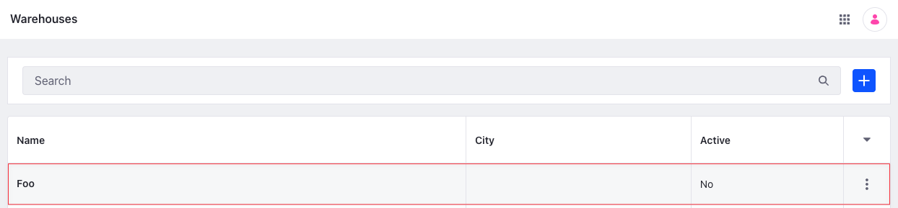

# Warehouse API Basics

You can manage warehouses from the Applications menu or REST APIs. Call the [headless-commerce-admin-inventory](http://localhost:8080/o/api?endpoint=http://localhost:8080/o/headless-commerce-admin-inventory/v1.0/openapi.json) services to create and manage warehouses.

## Adding a Warehouse

```{include} /_snippets/run-liferay-dxp.md
```

Once Liferay is running,

1. Download and unzip [Warehouse API Basics](./liferay-v9s5.zip).

   ```bash
   curl https://resources.learn.liferay.com/commerce/latest/en/inventory-management/developer-guide/liferay-v9s5.zip -O
   ```

   ```bash
   unzip liferay-v9s5.zip
   ```

1. Warehouses are scoped to an instance. Use the cURL script to add a new warehouse. On the command line, navigate to the `curl` folder. Execute the `Warehouse_POST_ToInstance.sh` script.

   ```bash
   ./Warehouse_POST_ToInstance.sh
   ```

   The JSON response shows a new warehouse was added:

   ```bash
   {
      "actions" : {
         "permissions" : {
            "method" : "PATCH",
            "href" : "http://localhost:8080/o/headless-commerce-admin-inventory/v1.0/warehouses/46429"
         },
         "get" : {
            "method" : "GET",
            "href" : "http://localhost:8080/o/headless-commerce-admin-inventory/v1.0/warehouses"
         },
         "update" : {
            "method" : "PATCH",
            "href" : "http://localhost:8080/o/headless-commerce-admin-inventory/v1.0/warehouses/46429"
         },
         "delete" : {
            "method" : "DELETE",
            "href" : "http://localhost:8080/o/headless-commerce-admin-inventory/v1.0/warehouses/46429"
         }
      },
      "active" : false,
      "city" : "",
      "countryISOCode" : "",
      "description" : { },
      "externalReferenceCode" : "c441eb70-dcd4-e040-92e5-eae0727cc958",
      "id" : 46429,
      "latitude" : 0.0,
      "longitude" : 0.0,
      "name" : {
         "en_US" : "Foo"
      },
      "regionISOCode" : "",
      "street1" : "",
      "street2" : "",
      "street3" : "",
      "type" : "",
      "zip" : ""
   }
   ```

1. To verify the warehouse addition, open the *Global Menu* () and navigate to *Commerce* &rarr; *Warehouses*. The new warehouse appears.

   

   ```{note}
   The new warehouse is inactive. Set its `latitude` and `longitude` coordinates before activating it.
   ```

1. Alternatively, call the REST service using the Java client. Navigate into the `java` folder and compile the source files:

   ```bash
   javac -classpath .:* *.java
   ```

1. Run the `Warehouse_POST_ToInstance` class.

   ```bash
   java -classpath .:* Warehouse_POST_ToInstance
   ```

## Examine the cURL Command

The `Warehouse_POST_ToInstance.sh` script calls the REST service with a cURL command.

```{literalinclude} ./warehouse-api-basics/resources/liferay-v9s5.zip/curl/Warehouse_POST_ToInstance.sh
    :language: bash
```

Here are the command's arguments:

| Arguments                                                                     | Description                                              |
| :---------------------------------------------------------------------------- | :------------------------------------------------------- |
| `-H "Content-Type: application/json"`                                         | Set the request body format to JSON.                     |
| `-X POST`                                                                     | Set the HTTP method to invoke at the specified endpoint. |
| `"http://localhost:8080/o/headless-commerce-admin-inventory/v1.0/warehouses"` | Specify the REST service endpoint.                       |
| `-d "{\"active\": false, \"name\": {\"en_US\": \"Foo\"}}"`                    | Enter the data to post.                                  |
| `-u "test@liferay.com:learn"`                                                 | Enter basic authentication credentials.                  |

```{note}
Basic authentication is used here for demonstration purposes. For production, you should authorize users via [OAuth2](https://learn.liferay.com/w/dxp/headless-delivery/using-oauth2). See [Using OAuth2 to Authorize Users](https://learn.liferay.com/w/dxp/headless-delivery/using-oauth2/using-oauth2-to-authorize-users) for a sample React application using OAuth2.
```

The other cURL commands use similar JSON arguments.

## Examine the Java Class

The `Warehouse_POST_ToInstance.java` class adds a warehouse by calling the `WarehouseResource` service.

```{literalinclude} ./warehouse-api-basics/resources/liferay-v9s5.zip/java/Warehouse_POST_ToInstance.java
   :dedent: 1
   :language: java
   :lines: 11-30
```

This class invokes the REST service using only three lines of code:

| Line (abbreviated)                                                           | Description                                                                   |
| :--------------------------------------------------------------------------- | :---------------------------------------------------------------------------- |
| `WarehouseResource.Builder builder = ...`                                    | Get a `Builder` for generating a `WarehouseResource` service instance.        |
| `WarehouseResource warehouseResource = builder.authentication(...).build();` | Use basic authentication and generate a `WarehouseResource` service instance. |
| `warehouseResource.postWarehouse(...);`                                      | Call the `warehouseResource.postWarehouse` method and pass the data to post.  |

The project includes the `com.liferay.headless.commerce.admin.inventory.client.jar` file as a dependency. You can find client JAR dependency information for all REST applications in the API Explorer in your installation at `/o/api` (e.g., <http://localhost:8080/o/api>).

```{note}
The `main` method's comment demonstrates running the class.
```

The remaining example Java classes call different `WarehouseResource` methods.

```{important}
See [WarehouseResource](https://github.com/liferay/liferay-portal/blob/[$LIFERAY_LEARN_PORTAL_GIT_TAG$]/modules/apps/commerce/headless/headless-commerce/headless-commerce-admin-inventory-client/src/main/java/com/liferay/headless/commerce/admin/inventory/client/resource/v1_0/WarehouseResource.java) for service details.
```

Below are examples of calling other `Warehouse` REST services using cURL and Java.

## Get Warehouses from Instance

List all the warehouses in your Liferay instance with a cURL or Java command.

### Warehouses_GET_FromInstance.sh

Command:

```bash
./Warehouses_GET_FromInstance.sh
```

Code:

```{literalinclude} ./warehouse-api-basics/resources/liferay-v9s5.zip/curl/Warehouses_GET_FromInstance.sh
   :language: bash
```

### Warehouses_GET_FromInstance.java

Command:

```bash
java -classpath .:* Warehouses_GET_FromInstance
```

Code:

```{literalinclude} ./warehouse-api-basics/resources/liferay-v9s5.zip/java/Warehouses_GET_FromInstance.java
   :dedent: 1
   :language: java
   :lines: 11-22
```

The instance's `Warehouse` objects are formatted in JSON.

### Filtering, Paginating, and Sorting Warehouses

This API also accepts parameters to filter, paginate, and sort the warehouses. See the [`getWarehousesPage`](https://github.com/liferay/liferay-portal/blob/[$LIFERAY_LEARN_PORTAL_GIT_TAG$]/modules/apps/commerce/headless/headless-commerce/headless-commerce-admin-inventory-client/src/main/java/com/liferay/headless/commerce/admin/inventory/client/resource/v1_0/WarehouseResource.java#L43-#L45) method for more information. You can use the following `Warehouse` fields in your queries to filter and sort the results.

* active
* city
* countryISOCode
* latitude
* longitude
* name
* regionISOCode
* street1

| Filter Query       | Description                            |
| :----------------- | :------------------------------------- |
| `active eq true`   | The warehouse must be active.          |
| `name eq 'Foo'`    | The warehouse name must equal 'Foo'    |
| `latitude eq 12.0` | The warehouse latitude must equal 12.0 |

| Sort Query            | Description                                  |
| :-------------------- | :------------------------------------------- |
| `name:desc`           | Sort by name in descending order             |
| `countryISOCode:desc` | Sort by country ISO code in descending order |

Read [API Query Parameters](https://learn.liferay.com/w/dxp/headless-delivery/consuming-apis/api-query-parameters) for more information.

## Get a Warehouse

Get a specific warehouse with cURL or Java `get` commands. Replace `1234` with the warehouse's ID.

```{tip}
Use `Warehouses_GET_FromInstance.[java|sh]` to get a list of all warehouses and note the `id` of the warehouse you want specifically.
```

### Warehouse_GET_ById.sh

Command:

```bash
./Warehouse_GET_ById.sh 1234
```

Code:

```{literalinclude} ./warehouse-api-basics/resources/liferay-v9s5.zip/curl/Warehouse_GET_ById.sh
   :language: bash
```

### Warehouse_GET_ById.java

Command:

```bash
java -classpath .:* -DwarehouseId=1234 Warehouse_GET_ById
```

Code:

```{literalinclude} ./warehouse-api-basics/resources/liferay-v9s5.zip/java/Warehouse_GET_ById.java
   :dedent: 1
   :language: java
   :lines: 8-18
```

The `Warehouse` fields are listed in JSON.

## Patch a Warehouse

Update an existing warehouse with cURL and Java `patch` commands. Replace `1234` with your warehouse's ID.

### Warehouse_PATCH_ById.sh

Command:

```bash
./Warehouse_PATCH_ById.sh 1234
```

Code:

```{literalinclude} ./warehouse-api-basics/resources/liferay-v9s5.zip/curl/Warehouse_PATCH_ById.sh
   :language: bash
```

### Warehouse_PATCH_ById.java

Command:

```bash
java -classpath .:* -DwarehouseId=1234 Warehouse_PATCH_ById
```

Code:

```{literalinclude} ./warehouse-api-basics/resources/liferay-v9s5.zip/java/Warehouse_PATCH_ById.java
   :dedent: 1
   :language: java
   :lines: 11-29
```

## Delete a Warehouse

Delete an existing warehouse with cURL and Java `delete` commands. Replace `1234` with your warehouse's ID.

### Warehouse_DELETE_ById.sh

Command:

```bash
./Warehouse_DELETE_ById.sh 1234
```

Code:

```{literalinclude} ./warehouse-api-basics/resources/liferay-v9s5.zip/curl/Warehouse_DELETE_ById.sh
   :language: bash
```

### Warehouse_DELETE_ById.java

Command

```bash
java -classpath .:* -DwarehouseId=1234 Warehouse_DELETE_ById
```

Code:

```{literalinclude} ./warehouse-api-basics/resources/liferay-v9s5.zip/java/Warehouse_DELETE_ById.java
   :dedent: 1
   :language: java
   :lines: 8-17
```

The [API Explorer](https://learn.liferay.com/w/dxp/headless-delivery/consuming-apis/consuming-rest-services) shows the `Warehouse` services and schemas and has an interface to test each service.
