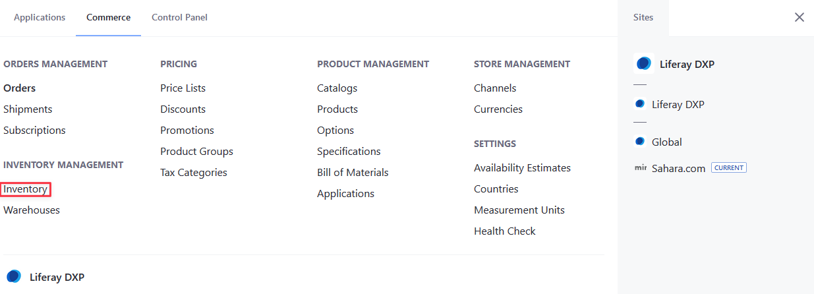
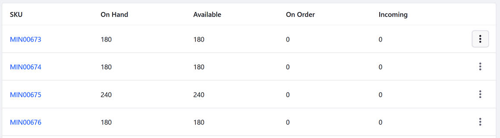

# Inventory Management Reference Guide

To access inventory settings, open the *Global Menu* () and navigate to *Commerce* &rarr; *Inventory*.

The page displays product SKUs, their units, and their availability.

| Field     | Description                                                                                                                                                                                               |
| :-------- | :-------------------------------------------------------------------------------------------------------------------------------------------------------------------------------------------------------- |
| SKU       | Primary identifier for the inventory system.                                                                                                                                                              |
| UOM       | Unit of measure configured for the SKU. {bdg-secondary}`Liferay DXP 2023.Q4+/Portal 7.4 GA98+`                                                                                                                |
| On Hand   | Total number of available units for an SKU from all warehouses.                                                                                                                                           |
| Available | Number of purchaseable units for an SKU. Liferay's calculation: [Quantity Available] = [Quantity on Hand] - [Quantity on Order] - [Safety Stock Quantity].                                                |
| On Order  | Number of units allocated to open orders for an SKU. These quantities are consumed when an order is shipped.                                                                                              |
| Incoming  | Number of units scheduled as replenishment for an SKU, but not yet received. Values are informative only and not based on any calculations. Administrators can use it to keep track of future quantities. |

## SKU Details

When viewing an individual SKU, there are four tabs: Overview, On Order, Incoming, and Changelog.

### Overview

The Overview tab displays a summary of the SKU's inventory across all warehouses.

| Field        | Description                                                |
| :----------- | :--------------------------------------------------------- |
| Warehouse    | List of warehouses with the SKU.                           |
| On Hand      | Number of units in possession, including the safety stock. |
| Safety Stock | Number of units reserved as safety stock.                  |
| Available    | Number of units that are purchaseable.                     |
| Incoming     | Number of incoming units scheduled for a warehouse.        |

Click *Add* () to update inventory or transfer inventory between warehouses.

### On Order

The On Order tab displays a list of accounts that have placed an order for this SKU. The tab also displays the Order ID, the quantities ordered, and the expiration date.

### Incoming

The Incoming tab lists warehouses with scheduled inventory replenishment for the SKU.

Click *Add* () to create an incoming entry for the selected SKU.

| Field                  | Description                                        |
| :--------------------- | :------------------------------------------------- |
| Quantity               | Quantity of items incoming.                    |
| Destination            | Warehouse where the incoming items are stored. |
| Expected Delivery Date | Scheduled date of delivery.                    |

### Changelog

See [Viewing Inventory Changes](./using-the-inventory-management-system.md#viewing-inventory-changes) for details.

## Commerce 2.1 and Below

The inventory settings are located in the Control Panel. To access it, navigate to the *Control Panel* &rarr; *Commerce* &rarr; *Inventory*.

## Related Topics

* [Creating SKUs for Product Variants](../product-management/creating-and-managing-products/products/creating-skus-for-product-variants.md)
* [Low Stock Action](./low-stock-action.md)
* [Setting Up Commerce Warehouses](./setting-up-warehouses.md)
* [Warehouse Reference Guide](./warehouse-reference-guide.md)
