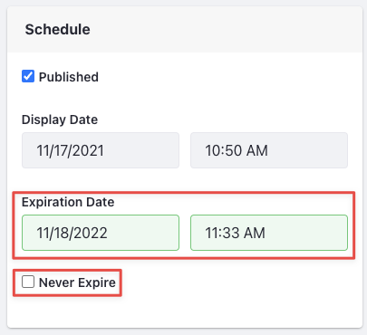
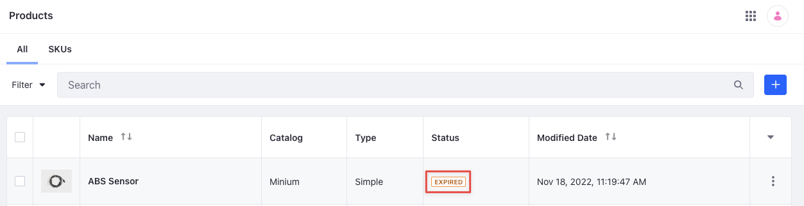
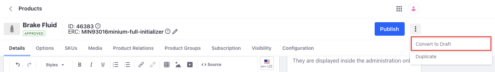
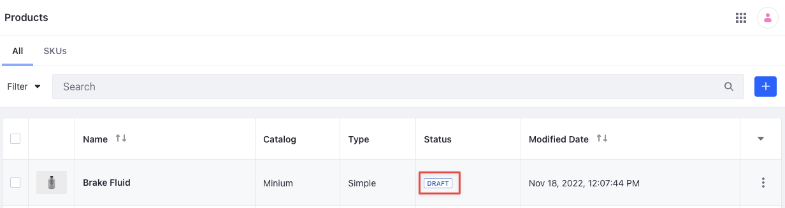
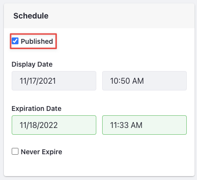
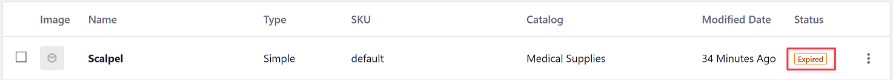

# Managing Product Status

When editing products, you can schedule them to expire or unpublish them manually to remove them from your store catalog.

## Setting Product Expiration Dates

Set expiration dates for products or individual SKUs. While expired, the product SKUs are removed from your store catalog and are no longer available for purchase or visible in search results.

```{note}
Setting an expiration date at the product level applies it to all of the product's SKUs. 
```

Follow these steps:

1. Open the *Global Menu* () menu and navigate to *Commerce* &rarr; *Products*.

1. Click a product.

1. Under Schedule, uncheck *Never Expire*. This configuration affects all of the product's SKUs.

1. Enter an expiration date and time.

   

   ```{tip}
   Expiration dates and times are based on the Liferay instance's time zone.To view or change the time zone, open the *Global Menu* () and go to *Control Panel* &rarr; *Instance Settings*. Then, navigate to *Localization* &rarr; *Time Zone*.
   ```

1. Click *Publish*.

Once a product reaches its expiration date and time, it remains active until Liferay's next check interval. The default interval is 15 minutes, but you can configure this via system settings. Open the *Global Menu* () and navigate to *Control Panel* &rarr; *System Settings*. Once there, navigate to *Catalog* &rarr; *Products*. Change the *Check Interval* value and click *Save*.

After expiring, the product's SKUs no longer appear in the store's catalog and cannot be purchased. To learn how to set expiration dates for individual SKUs along with replacements, see [Replacement Products](../pricing/promoting-products/replacement-products.md).



You can change the product visibility by entering a new expiration date and republishing the product.

## Setting a Product as Draft

If desired, you can unpublish a product manually to set its status to *draft*. While a draft, the product's SKUs no longer appear in the store's catalog and cannot be purchased. This is useful when you want to edit a product without making your changes immediately available to end users. You can also unpublish products based on inventory levels using a low stock action. See [Low Stock Action](./low-stock-action.md) for more information .

Follow these steps to manually unpublish a product:

1. Open the *Global Menu* () and navigate to *Commerce* &rarr; *Products*.

1. Click a product.

1. Click the *Actions* button () next to the Publish button and select *Convert to Draft*.

   

1. Click *OK* to confirm.

This removes the product from your store's catalog page so customers cannot view, purchase, or search for it.



If you have an approval workflow in place to publish products, you must go through it to publish the product again. If you want to remove the product from the storefront and publish it back again without going through the approval workflow, you can uncheck the *Published* checkbox and click *Publish*.



## Commerce 2.1 and Below

### Setting a Product as Expired

To expire a product,

1. Navigate to *Control Panel* &rarr; *Commerce* &rarr; *Products*.

1. Click on a product.

1. Uncheck the *Never Expire* checkbox on the *Products Details* tab. This configuration affects all the SKUs of the product.

1. Enter a future expiration date and time. All times are set using the GMT time zone.

    

1. Click *Publish*.

After making the changes, it may take some time to remove the product from the catalog, because the default check interval is 15 minutes. You change this by opening the *Global Menu* () and navigating to *Control Panel* &rarr; *System Settings*. Once there, go to *Catalog* &rarr; *Products*. Change the *Check Interval* value and click *Save*.



You can change the product visibility by entering a new expiration date and republishing the product.

### Setting a Product as Draft

1. Navigate to *Control Panel* &rarr; *Commerce* &rarr; *Products*.

1. Click a product.

1. Click on *Save as Draft*.

You cannot search for the product or view it in the storefront after setting it to the draft status.


If you have an approval workflow in place to publish products, you must go through it to publish the product again. If you want to remove the product from the storefront and publish it back again without going through the approval workflow, you can uncheck the *Published* checkbox and click *Publish*.


## Related Topics

* [Configuring Product Visibility Using Channels](../store-management/channels/configuring-product-visibility-using-channels.md)
* [Creating a Simple Product](../product-management/creating-and-managing-products/product-types/creating-a-simple-product.md)
* [Creating a Grouped Product](../product-management/creating-and-managing-products/product-types/creating-a-grouped-product.md)
* [Creating a Virtual Product](../product-management/creating-and-managing-products/product-types/creating-a-virtual-product.md)
* [Low Stock Action](./low-stock-action.md)
