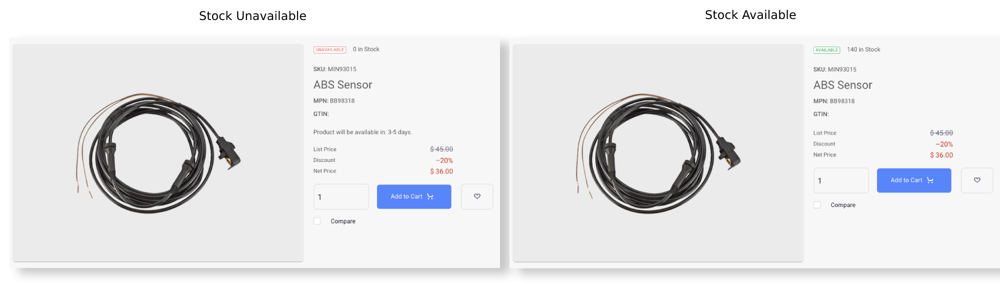
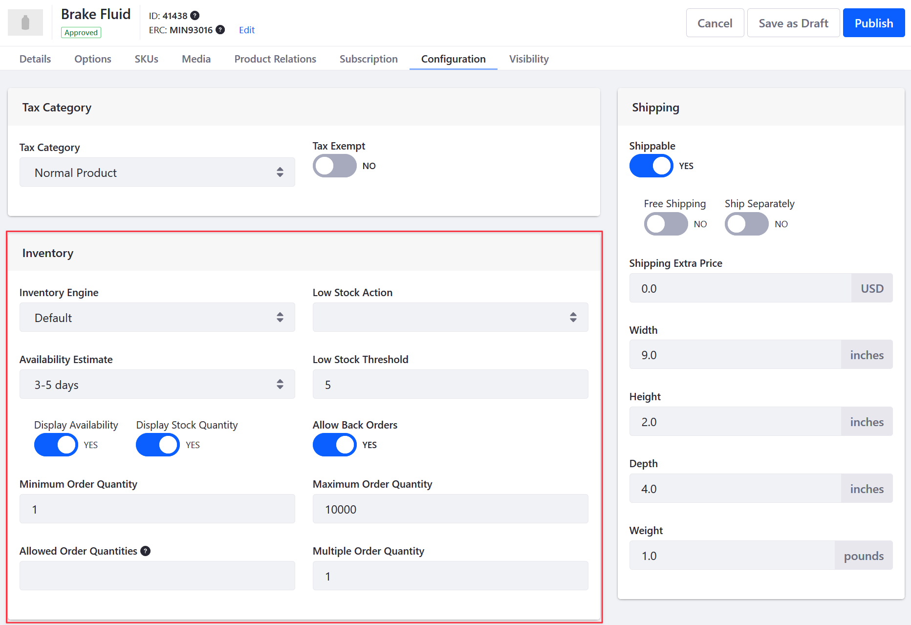

# Product Inventory Configuration Reference Guide

You can configure products in the catalog to display inventory data in the storefront. There are two options available to display inventory data: *Display Availability* and *Display Stock Quantity*. When the stock quantity is above the low stock threshold, it shows *Available* and when the stock quantity is less than the low stock threshold, it shows *Unavailable*. You can also select the inventory engine, availability estimate, enable back-orders, set the maximum number of orders, and more.

To access the inventory configuration options for a product,

1. Open the *Global Menu* (), and navigate to *Commerce* &rarr; *Products*.

1. Select a product.

1. Click the *Configuration* tab.

| Field                    | Description                                                                                                                                                        |
| :----------------------- | :----------------------------------------------------------------------------------------------------------------------------------------------------------------- |
| Inventory Engine         | Select an inventory engine; can be customized using an extension point.                                                                                            |
| Availability Estimate    | Select the duration to replenish the product inventory when stock runs out.                                                                                        |
| Display Availability     | Activate to show that a product is available to buy.                                                                                                               |
| Display Stock Quantity   | Activate to show the number of units available to buy.                                                                                                             |
| Low Stock Threshold      | Set the minimum available stock for continuing to fulfill product orders. This is also the threshold for triggering the low stock action.                          |
| Low Stock Action         | Select an action to perform when the stock reaches the low stock threshold.                                                                                        |
| Allow Back Orders        | Activate to allow the purchase of products unavailable due to low stock.                                                                                           |
| Minimum Order Quantity   | Set the minimum number of items an order must include to be purchaseable.                                                                                          |
| Maximum Order Quantity   | Set the maximum number of items an order can contain to be purchaseable.                                                                                           |
| Allowed Order Quantities | Set the specific product quantity that the order should contain to be purchaseable. For example, entering 2 allows buyers to purchase only 2 units of the product. |
| Multiple Order Quantity  | Enter a number that limits orders to particular quantities of this product.                                                                                        |

## Commerce 2.0 and Below

To access the inventory configuration options for a product, navigate to a its *Configuration* tab and click on *Inventory* from the left menu.

## Additional Information

* [Implementing a Custom Low Stock Activity](../developer-guide/managing-inventory/implementing-a-custom-low-stock-activity.md)
* [Low Stock Action](./low-stock-action.md)