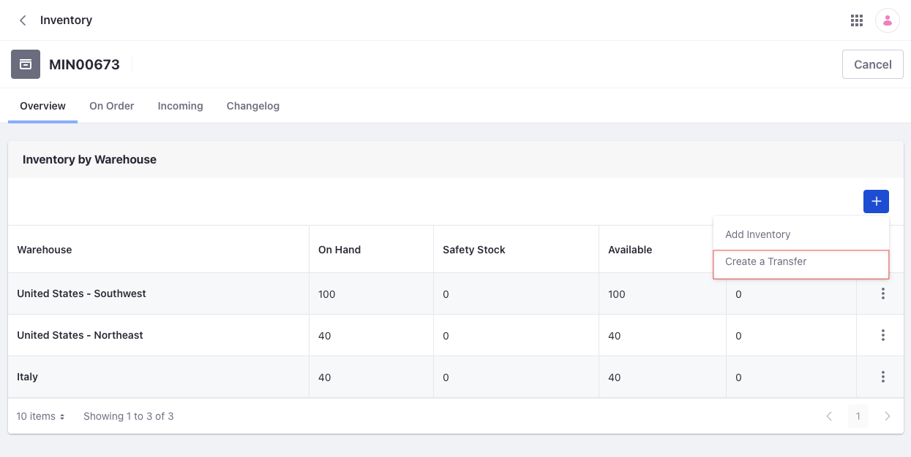

# Setting Inventory by Warehouse

Stores with multiple warehouses can manage product inventory on a per warehouse basis. The *Inventory* menu is where you can manage the number of products available to buy in each warehouse.

To set inventory by warehouse,

1. Open the *Global Menu* () and navigate to *Commerce* &rarr; *Products*.

1. Click a product.

1. Click the *SKUs* tab and select an SKU.

1. Click the *Inventory* tab.

1. Enter a quantity for the available warehouses.

   

1. Click *Save* for each warehouse.

1. Repeat these steps for other SKUs associated with the product.

Each warehouse now has the correct quantity available for sale.

## Transferring Stock Between Warehouses

If your store has multiple warehouses, you can transfer stock from one warehouse to another. Inventory is tracked at the SKU level and reflected on the *Inventory* page.

To transfer stock between warehouses,

1. Open the *Global Menu* () and navigate to *Commerce* &rarr; *Inventory*.

1. Click an SKU.

1. Click the *Add* button (), then select *Create a Transfer*.

   

1. Enter a quanity, source, and destination.

   This example transfers 40 units of the selected SKU from the United States - Southwest warehouse to the United States - Northwest warehouse:

   * **Quantity**: 40
   * **Source**: United States - Southwest
   * **Destination**: United States - Northwest

   

1. Click *Submit*.

Inventory for each warehouse is now updated.

## Commerce 2.1 and Below

To set inventory by warehouse:

1. Navigate to the *Control Panel* &rarr; *Commerce* &rarr; *Products*.

1. Click a product.

1. Click the *SKUs* tab and select an SKU.

1. Click the *Inventory* tab.

1. Enter a quantity for the available warehouse(s).

   

1. Click *Save* for each warehouse.

1. Repeat these steps for all the other product variants (SKUs) associated for a product.

Each warehouse now has the correct quantity available for sale.

### Transferring Stock Between Warehouses

If a store has more than one [warehouse](./setting-up-warehouses.md), users can transfer stock from one warehouse to another. Inventory is tracked at the SKU level and reflected on the *Inventory* page.

To transfer stock between warehouses:

1. Navigate to the *Control Panel* &rarr; *Commerce* &rarr; *Inventory*.

1. Click an SKU.

1. Click the *Add* () button, then *Create a Transfer*.

   

1. Enter the following information to transfer 40 units of the selected SKU from the United States - Southwest warehouse to the United States - Northwest warehouse:

   * **Quantity**: 40
   * **Source**: United States - Southwest
   * **Destination**: United States - Northwest

   

1. Click *Submit*.

You can now view the updated inventory for each warehouse.

## Additional Information

* [Setting Up Commerce Warehouses](./setting-up-warehouses.md)
* [Inventory Management Reference Guide](./inventory-management-reference-guide.md)