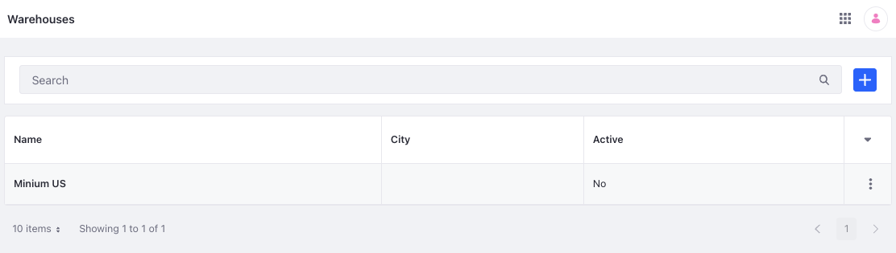
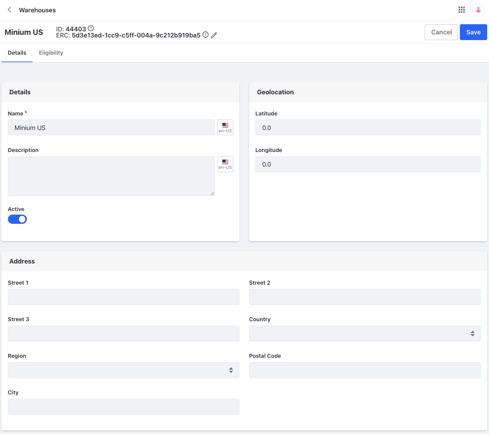
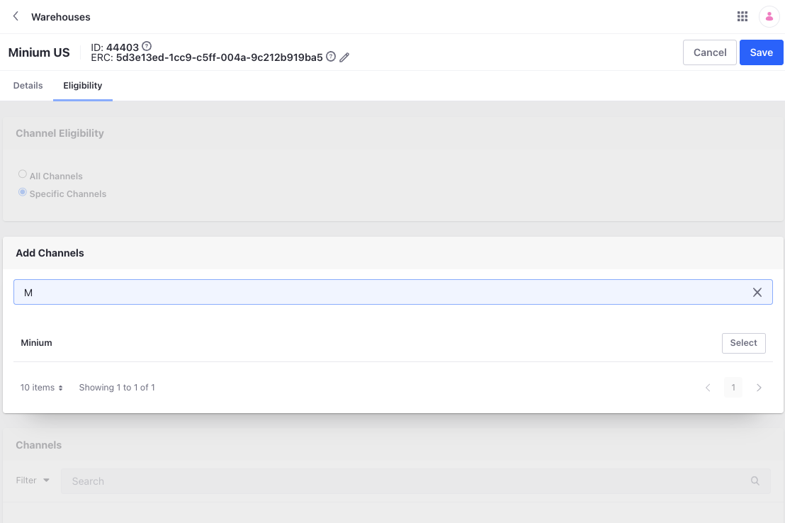
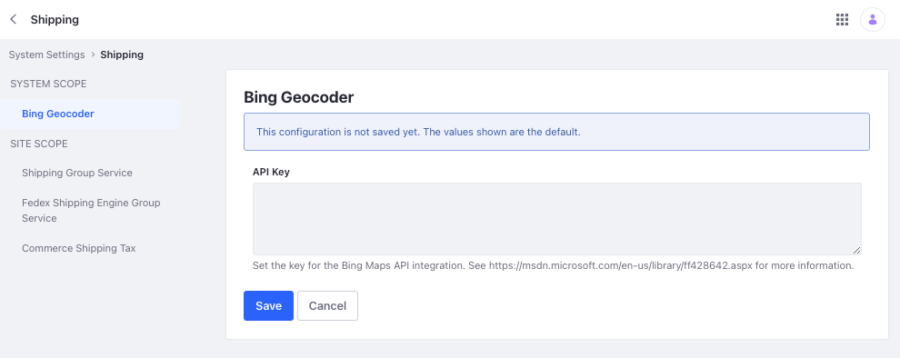
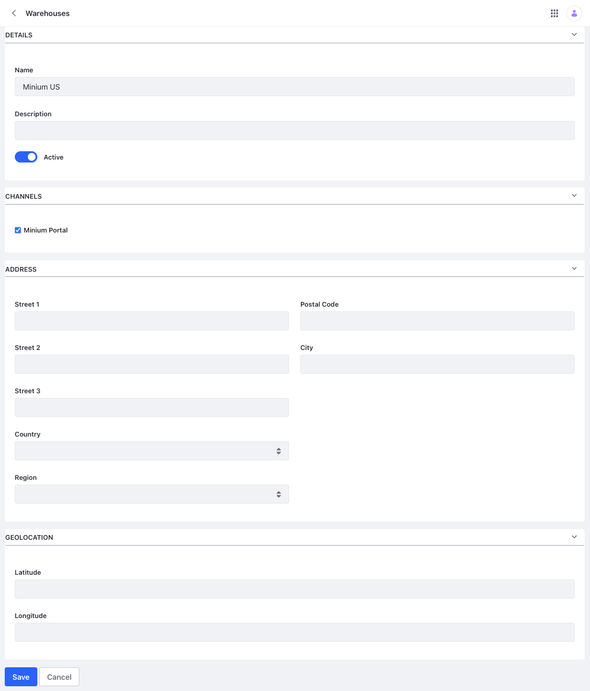
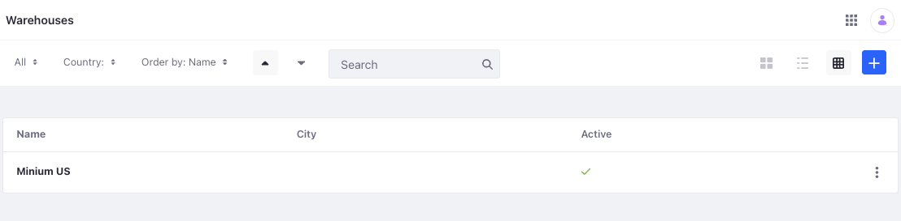

# Setting Up Warehouses

Warehouses represent physical locations where you store product inventory. To activate a warehouse, you must set its geolocation.

You can use a single warehouse to serve multiple channels or serve a single channel with multiple warehouses. When using the *Minium* or *Speedwell* accelerators, three sample warehouses serve one channel.

```{note}
Before creating a warehouse, you must enable the applicable country and region of the warehouse. See [Adding Regions](../store-management/configuring-countries-and-regions.md#adding-regions) for more information.
```

## Adding a Warehouse

1. Open the *Global Menu* () and navigate to *Commerce* &rarr; *Warehouses*.

1. Click *Add* ().

   

1. Enter a name.

1. Click *Submit*.

   This creates a new inactive warehouse and opens its details tab.

   

1. (Optional) Edit or localize the name and description.

1. Enter the latitude and longitude values for the warehouse in the Geolocation section.

   Alternatively, you can configure the [Bing Geocoder](#using-bing-geocoder-to-set-a-warehouses-geolocation) to generate a warehouse's geolocation automatically based on the warehouse's address.

1. Enter an address for the warehouse in the Address section.

1. Switch the toggle to *Active*.

   ```{important}
   You must set the geolocation before you can activate the warehouse.
   ```

1. Link the warehouse to one or more channels. This determines the product inventory for those channels.

   Click the *Eligibility* tab, select *Specific Channels*, enter a channel name and click *Select*.

   

1. Click *Save*.

## Using Bing Geocoder to Set a Warehouse's Geolocation

Liferay integrates with the Bing Maps API to generate geolocations from a warehouse address automatically. To use this feature, you must have a [Bing Maps account](https://docs.microsoft.com/en-us/bingmaps/getting-started/bing-maps-dev-center-help/creating-a-bing-maps-account) and a [Bing Maps Key](https://docs.microsoft.com/en-us/bingmaps/getting-started/bing-maps-dev-center-help/getting-a-bing-maps-key).

Then, follow these steps to configure the Bing Geocoder for your instance:

1. Open the *Global Menu* (), and navigate to *Control Panel* &rarr; *System Settings* &rarr; *Commerce* &rarr; *Shipping* &rarr; *Bing Geocoder*.

1. Enter your *API Key*.

   

1. Click *Save*.

Once the geocoder is configured, you can generate warehouse geolocations for any warehouse with an address. Navigate to the warehouses page, click the *Actions* button () for the desired warehouse, and select *Geolocate*. The geocoder converts the address into latitude and longitude coordinates.



## Liferay 7.4 U46/GA46 and Below

1. Open the *Global Menu* (), and navigate to *Commerce* &rarr; *Warehouses*.

1. Click *Add* ().

   

1. In the Details section, enter a *Name* and *Description* (optional).

   

1. To activate the warehouse, switch the toggle to *Active*. Ensure that you enter its geolocation before activation.

1. In the Channels section, use the checkbox to associate the warehouse to a channel. The associated warehouses determine the product inventory for a channel.

1. Enter an address for the warehouse in the *Address* section.

1. Enter the latitude and longitude values for the warehouse in the *Geolocation* section.

   Alternatively, see [Using Bing Geocoder to Set a Warehouse's Geolocation](#using-bing-geocoder-to-set-a-warehouses-geolocation) to learn how to automatically generate a warehouse's geolocation.

1. Click *Save*.

## Commerce 2.1 and Below

To add a new warehouse,

1. Go to *Control Panel* &rarr; *Commerce* &rarr; *Settings*.

1. Click the *Warehouses* tab.

1. Click *Add* () and enter the following information.

   * **Name:** North Vegas Warehouse
   * **Description:** North Vegas Processing Center

1. Switch the toggle to *Active*.

1. Enter an address.

1. Select a channel. Product inventory for the channel depends on the associated warehouse.

1. Enter the mandatory geolocation data based on your warehouse's location.

   * **Latitude**: 36.282974
   * **Longitude**: -115.136

    

1. Click *Save* when finished.

The new warehouse is now active ready to use.

## Related Topics

* [Adding Regions](../store-management/configuring-countries-and-regions.md#adding-regions)
* [Configuring Countries and Regions](../store-management/configuring-countries-and-regions.md)
* [Channels](../store-management/channels.md)
