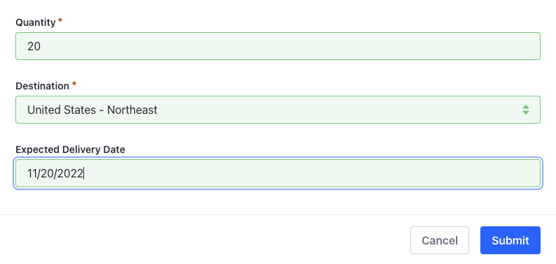
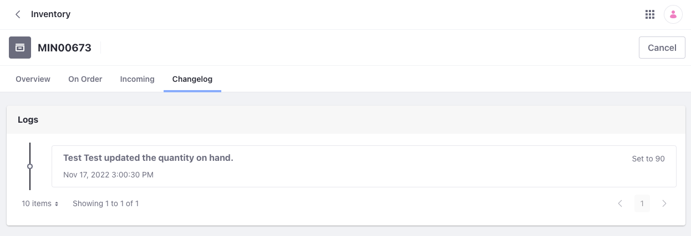

# Using the Inventory Management System

You can use Liferay's inventory management system to manage inventory for product SKUs in your instance. This system provides these features for managing SKUs:

* Add inventory
* View orders
* Add a safety stock
* View historical changes

Before adding inventory for a product SKU, you must create at least one warehouse for storing the inventory. See [Setting Up Warehouses](./setting-up-warehouses.md) for more information.

To access the inventory page, open the *Global Menu* () and navigate to *Commerce* &rarr; *Inventory*.

```{note}
If you're using Commerce 2.0 or 2.1, the Inventory Management option is located in the Control Panel.
```

## Adding Inventory for SKUs

Inventory is tracked at the SKU level. When creating an inventory entry, you must specify an SKU, warehouse, and quantity. Without an SKU, you cannot add inventory to a product.

Follow these steps:

1. Open the *Global Menu* () and navigate to *Commerce* &rarr; *Inventory*.

1. Click *Add* () and enter an SKU, warehouse, and quantity. For example,

   * **SKU**: CHINAWARE-GRAY
   * **Warehouse**: United States - Southwest
   * **Quantity**: 120

   

1. Click *Submit*.

This adds inventory for the SKU in the selected warehouse.

```{tip}
You can add inventory for an SKU while editing the SKU in the Products application. See [Adding SKU Inventory](../product-management/creating-and-managing-products/products/creating-skus-for-product-variants.md#adding-sku-inventory) for more information.
```

## Setting a Safety Stock

Safety stock is product inventory in a warehouse that is set aside and made unavailable for sale. This could be for situations like shipping delays, supply chain interruptions, selling in a different channel, or a number of other reasons. Safety stock quantity reduces the available inventory for the selected warehouse.

To set a safety stock quantity,

1. Open the *Global Menu* () and navigate to *Commerce* &rarr; *Inventory*.

1. Click an *SKU*.

1. Click *Actions* () next to the warehouse and select *Edit*.

1. Enter a value in the *Safety Stock Quantity* field.

   

1. Click *Save* when finished.

The number of available units is reduced by the safety stock quantity. You can verify this in the Available column.


## Viewing a SKU on Order

1. Open the *Global Menu* () and navigate to *Commerce* &rarr; *Inventory*.

1. Click an *SKU*.

1. Click the *On Order* tab.

   

This page lists all orders that include the selected SKU. You can view the account that placed the order, the order ID, quantity, and expiration date.

## Adding Incoming Stock

Incoming stock is SKU inventory scheduled to arrive at a warehouse on a future date. You can add incoming stock quantities and expected delivery dates.

1. Open the *Global Menu* () and navigate to *Commerce* &rarr; *Inventory*.

1. Click an *SKU*.

1. Click the *Incoming* tab.

1. Click *Add* () and enter a quantity, destination warehouse, and expected delivery date. For example,

    * **Quantity**: 20
    * **Destination**: United States - Northeast
    * **Expected Delivery Date**: 11/20/2022 (this is a future date)

   

1. Click *Submit*.

After adding the incoming stock, it appears under the Incoming column on the Overview page.


## Viewing Inventory Changes

You can view changes in inventory for an SKU in the Changelog page.

1. Open the *Global Menu* () and navigate to *Commerce* &rarr; *Inventory*.

1. Click an *SKU*.

1. Click the *Changelog* tab.

You can view this information in the changelog:

* The units of an SKU booked to fulfill an order after placing it.
* The units of an SKU removed from inventory after creating a shipment and committing the amount booked previously.
* The units of an SKU added to the inventory of a warehouse.
* The units of an SKU moved between warehouses.
* The units of an SKU returned after cancelling a shipment.
* Updates to an SKU in the inventory.



## Additional Information

* [Inventory Management Reference Guide](./inventory-management-reference-guide.md)
* [Warehouse Reference Guide](./warehouse-reference-guide.md)
* [Setting Inventory by Warehouse](./setting-inventory-by-warehouse.md)
