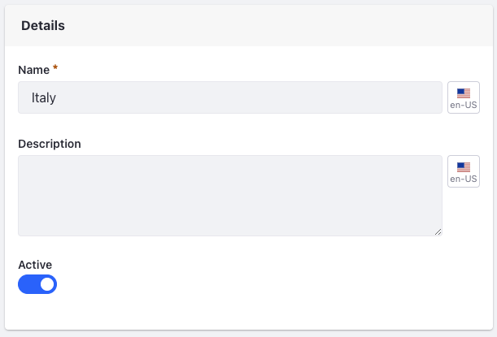
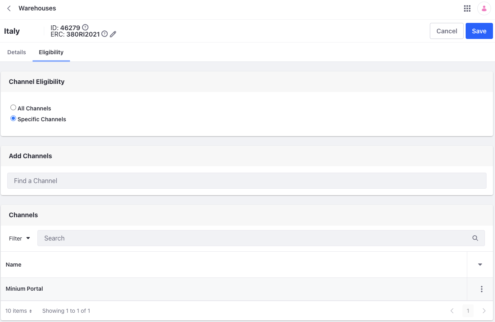
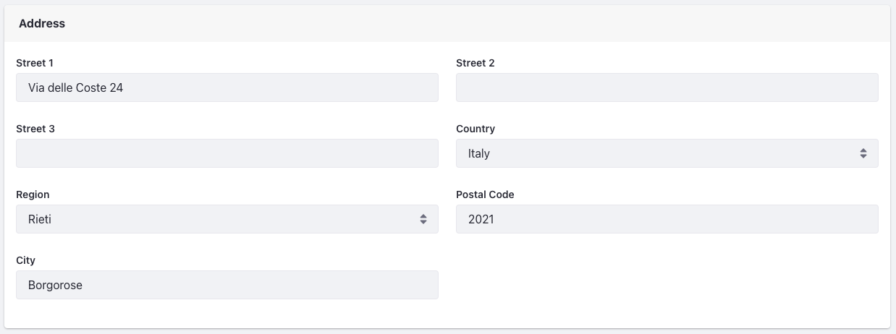

# Warehouse Reference Guide

To manage warehouses, open the *Global Menu* () and navigate to *Commerce* &rarr; *Warehouses*.

```{note}
If you're using Commerce 2.0 or 2.1, the warehouse settings are located in the *Control Panel*.
```

## Details



| Field       | Description                                 |
| :---------- | :------------------------------------------ |
| Name        | Name of the warehouse                       |
| Description | Description of the warehouse                |
| Active      | Toggle to activate/deactivate the warehouse |

## Channels

By default a warehouse doesn't serve any channels. To use a warehouse in a channel, click the *Eligibility* tab and select the *Specific Channels* radio button. Then, search for the channel and click *Select*.



### Liferay DXP 7.4 U46/GA46 and Below

Under *Channels*, you can view the available channels that the warehouse can serve. Use the checkbox to select the desired channels.


| Field    | Description                                             |
| :------- | :------------------------------------------------------ |
| Channels | List of available channels that the warehouse can serve |

## Address



| Field       | Description                                   |
| :---------- | :-------------------------------------------- |
| Street 1    | First line of address                         |
| Street 2    | Second line of address                        |
| Street 3    | Third line of address                         |
| Country     | Dropdown menu to select a country             |
| Region      | Drop-down menu to select the state or province |
| Postal Code | Field for postal code                         |
| City        | Field for city                                |

## Geolocation


| Field     | Description                           |
| :-------- | :------------------------------------ |
| Latitude  | Latitude coordinate of the warehouse  |
| Longitude | Longitude coordinate of the warehouse |

The FedEx shipping method uses the warehouse's geolocation to calculate shipping costs during checkout. When there are multiple warehouses, the Liferay instance chooses the warehouse with the lowest shipping cost.

## Related Topics

* [Introduction to Shipments](../order-management/shipments/introduction-to-shipments.md)
* [Setting Up Commerce Warehouses](./setting-up-warehouses.md)
* [Setting Inventory by Warehouse](./setting-inventory-by-warehouse.md)
