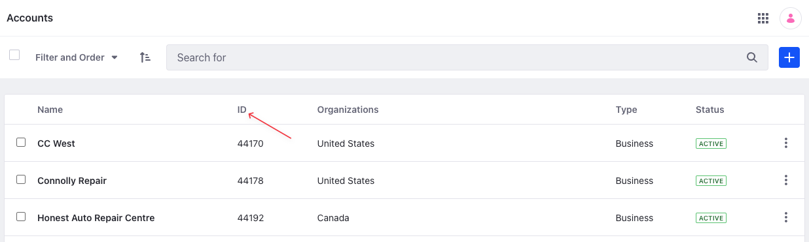
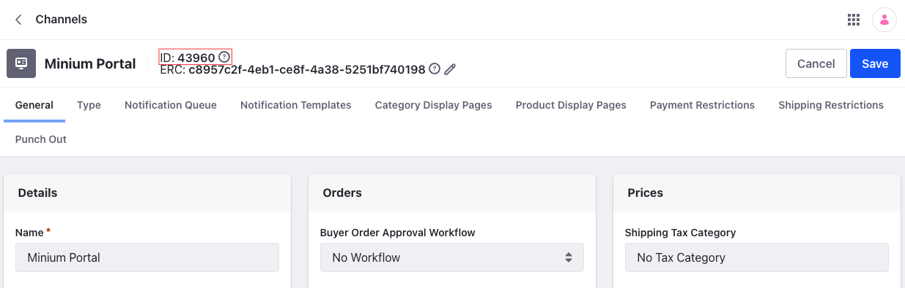
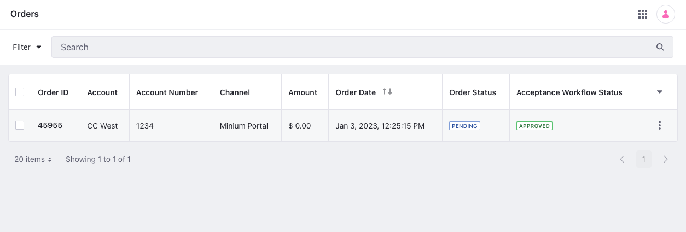

# Order API Basics

You can manage orders from the Applications menu, but you can also use Liferay’s REST APIs. Call these services to create and manage orders.

## Adding an Order

```{include} /_snippets/run-liferay-dxp.md
```

Then follow these steps:

1. Download and unzip [Order API Basics](./liferay-w6c8.zip).

   ```bash
   curl https://learn.liferay.com/commmerce/latest/en/order-management/developer-guide/liferay-w6c8.zip -O
   ```

   ```bash
   unzip liferay-w6c8.zip
   ```

1. To create an order, there are three required parameters. One, is the account that creates the order. Second, is the channel in which you create the order. Third, you must also specify the currency code of the currency used.  

To get the ID of an account, open the *Global Menu* (), and go to *Control Panel* &rarr; *Accounts*. Find the account and copy the ID present next to it. You can also select the account and copy the account ID from the *Account ID* field.

   

To find the ID of a channel, open the *Global Menu* (), and go to *Commerce* &rarr; *Channels*. Select the channel where you'll add orders and note down the ID present next to its name.

   

1. Use the cURL script to add a new order to the channel. On the command line, navigate to the `curl` folder. Execute the `Order_POST_ToChannel.sh` script with the account ID, channel ID and currency code as parameters.

   ```bash
   ./Order_POST_ToChannel.sh 1234 5678 USD
   ```

   The JSON response shows a new order has been added:

   ```bash
   {
      "accountExternalReferenceCode" : "cc-west",
      "accountId" : 1234,
      "actions" : {
         "get" : {
            "method" : "GET",
            "href" : "http://localhost:8080/o/headless-commerce-admin-order/v1.0/orders/{id}"
         },
         "update" : {
            "method" : "PATCH",
            "href" : "http://localhost:8080/o/headless-commerce-admin-order/v1.0/orders/{id}"
         },
         "delete" : {
            "method" : "DELETE",
            "href" : "http://localhost:8080/o/headless-commerce-admin-order/v1.0/orders/{id}"
         }
      },
      "advanceStatus" : "",
      "billingAddressId" : 0,
      "channelExternalReferenceCode" : "c8957c2f-4eb1-ce8f-4a38-5251bf740198",
      "channelId" : 5678,
      "couponCode" : "",
      "createDate" : "2023-01-03T12:25:15Z",
      "currencyCode" : "USD",
      "customFields" : { },
      "deliveryTermDescription" : "",
      "deliveryTermId" : 0,
      "deliveryTermName" : "",
      "externalReferenceCode" : "3ebcbc91-7240-2763-c2ce-f2a592851053",
      "id" : 45955,
      "modifiedDate" : "2023-01-03T12:25:15Z",
      "orderDate" : "2023-01-03T12:25:15Z",
      "orderStatus" : 1,
      "orderStatusInfo" : {
         "code" : 1,
         "label" : "pending",
         "label_i18n" : "Pending"
      },
      "orderTypeId" : 0,
      "paymentMethod" : "",
      "paymentStatus" : 1,
      "paymentStatusInfo" : {
         "code" : 1,
         "label" : "pending",
         "label_i18n" : "Pending"
      },
      "paymentTermDescription" : "",
      "paymentTermId" : 0,
      "paymentTermName" : "",
      "printedNote" : "",
      "purchaseOrderNumber" : "",
      "shippingAddressId" : 0,
      "shippingAmountFormatted" : "$ 0.00",
      "shippingAmountValue" : 0.0,
      "shippingDiscountAmount" : 0,
      "shippingDiscountAmountFormatted" : "$ 0.00",
      "shippingDiscountPercentageLevel1" : 0,
      "shippingDiscountPercentageLevel1WithTaxAmount" : 0,
      "shippingDiscountPercentageLevel2" : 0,
      "shippingDiscountPercentageLevel2WithTaxAmount" : 0,
      "shippingDiscountPercentageLevel3" : 0,
      "shippingDiscountPercentageLevel3WithTaxAmount" : 0,
      "shippingDiscountPercentageLevel4" : 0,
      "shippingDiscountPercentageLevel4WithTaxAmount" : 0,
      "shippingDiscountWithTaxAmount" : 0,
      "shippingDiscountWithTaxAmountFormatted" : "$ 0.00",
      "shippingOption" : "",
      "shippingWithTaxAmountFormatted" : "$ 0.00",
      "shippingWithTaxAmountValue" : 0.0,
      "subtotalAmount" : 0.0,
      "subtotalDiscountAmount" : 0,
      "subtotalDiscountAmountFormatted" : "$ 0.00",
      "subtotalDiscountPercentageLevel1" : 0,
      "subtotalDiscountPercentageLevel1WithTaxAmount" : 0,
      "subtotalDiscountPercentageLevel2" : 0,
      "subtotalDiscountPercentageLevel2WithTaxAmount" : 0,
      "subtotalDiscountPercentageLevel3" : 0,
      "subtotalDiscountPercentageLevel3WithTaxAmount" : 0,
      "subtotalDiscountPercentageLevel4" : 0,
      "subtotalDiscountPercentageLevel4WithTaxAmount" : 0,
      "subtotalDiscountWithTaxAmount" : 0,
      "subtotalDiscountWithTaxAmountFormatted" : "$ 0.00",
      "subtotalFormatted" : "$ 0.00",
      "subtotalWithTaxAmountFormatted" : "$ 0.00",
      "subtotalWithTaxAmountValue" : 0.0,
      "taxAmount" : 0,
      "taxAmountFormatted" : "$ 0.00",
      "taxAmountValue" : 0.0,
      "totalAmount" : 0.0,
      "totalDiscountAmount" : 0,
      "totalDiscountAmountFormatted" : "$ 0.00",
      "totalDiscountPercentageLevel1" : 0,
      "totalDiscountPercentageLevel2" : 0,
      "totalDiscountPercentageLevel3" : 0,
      "totalDiscountPercentageLevel4" : 0,
      "totalDiscountWithTaxAmount" : 0,
      "totalDiscountWithTaxAmountFormatted" : "$ 0.00",
      "totalFormatted" : "$ 0.00",
      "totalWithTaxAmountFormatted" : "$ 0.00",
      "totalWithTaxAmountValue" : 0.0,
      "transactionId" : "",
      "workflowStatusInfo" : {
         "code" : 0,
         "label" : "approved",
         "label_i18n" : "Approved"
      }
   }
   ```

1. Verify this by opening the *Global Menu* (), and navigating to *Commerce* &rarr; *Orders*. See that a new order has been added.

   

1. You can also call the REST service using the Java client. Navigate out of the `curl` folder and into the `java` folder. Compile the source files:

   ```bash
   javac -classpath .:* *.java
   ```

1. Run the `Order_POST_ToChannel` class. Replace the `accountId`, `channelId` and `currenyCode` with the appropriate values.

   ```bash
   java -classpath .:* -DaccountId=1234 -DchannelId=5678 -DcurrencyCode=Foo Order_POST_ToChannel
   ```

## Examine the cURL Command

The `Order_POST_ToChannel.sh` script calls the REST service with a cURL command.

```{literalinclude} ./order-api-basics/resources/liferay-w6c8.zip/curl/Order_POST_ToChannel.sh
    :language: bash
```

Here are the command's arguments:

| Arguments                                                                     | Description                                         |
| :---------------------------------------------------------------------------- | :-------------------------------------------------- |
| `-H "Content-Type: application/json"`                                         | Indicates that the request body format is JSON.     |
| `-X POST`                                                                     | The HTTP method to invoke at the specified endpoint |
| `"http://localhost:8080/o/headless-commerce-admin-order/v1.0/orders"`         | The REST service endpoint                           |
| `-d "{\"accountId\": ${1}, \"channelId\": ${2}, \"currencyCode\": \"${3}\"}"` | The data to post                                    |
| `-u "test@liferay.com:learn"`                                                 | Basic authentication credentials                    |

```{note}
Basic authentication is used here for demonstration purposes. For production, you should authorize users via [OAuth2](https://learn.liferay.com/dxp/latest/en/headless-delivery/using-oauth2.html). See [Using OAuth2 to Authorize Users](https://learn.liferay.com/dxp/latest/en/headless-delivery/using-oauth2/using-oauth2-to-authorize-users.html) for a sample React application that utilizes OAuth2.
```

The other cURL commands use similar JSON arguments.

## Examine the Java Class

The `Order_POST_ToChannel.java` class adds a product by calling the order related service.

```{literalinclude} ./order-api-basics/resources/liferay-w6c8.zip/java/Order_POST_ToChannel.java
   :dedent: 1
   :language: java
   :lines: 9-28
```

This class invokes the REST service using only three lines of code:

| Line (abbreviated)                                                   | Description                                                                      |
| :------------------------------------------------------------------- | :------------------------------------------------------------------------------- |
| `OrderResource.Builder builder = ...`                                | Gets a `Builder` for generating a `OrderResource` service instance.              |
| `OrderResource orderResource = builder.authentication(...).build();` | Specifies basic authentication and generates a `OrderResource` service instance. |
| `orderResource.postOrder(...);`                                      | Calls the `orderResource.postOrder` method and passes the data to post.          |

Note that the project includes the `com.liferay.headless.commerce.admin.order.client.jar` file as a dependency. You can find client JAR dependency information for all REST applications in the API explorer in your installation at `/o/api`.

```{note}
The `main` method's comment demonstrates running the class.
```

The other example Java classes are similar to this one, but call different `OrderResource` methods.

```{important}
See [OrderResource](https://github.com/liferay/liferay-portal/blob/[$LIFERAY_LEARN_PORTAL_GIT_TAG$]/modules/apps/commerce/headless/headless-commerce/headless-commerce-admin-order-client/src/main/java/com/liferay/headless/commerce/admin/order/client/resource/v1_0/OrderResource.java) for service details.
```

Below are examples of calling other `Order` REST services using cURL and Java.

## Get Orders from Instance

You can list all orders from your Liferay instance by executing the following cURL or Java command.

### Orders_GET_FromInstance.sh

Command:

```bash
./Orders_GET_FromInstance.sh
```

Code:

```{literalinclude} ./order-api-basics/resources/liferay-w6c8.zip/curl/Orders_GET_FromInstance.sh
   :language: bash
```

### Orders_GET_FromInstance.java

Command:

```bash
java -classpath .:* Orders_GET_FromInstance
```

Code:

```{literalinclude} ./order-api-basics/resources/liferay-w6c8.zip/java/Orders_GET_FromInstance.java
   :dedent: 1
   :language: java
   :lines: 9-18
```

The `Order` objects of your Liferay instance are listed in JSON.

This API also accepts parameters to filter, paginate, search, and sort the products. See the [`getProductsPage`](https://github.com/liferay/liferay-portal/blob/master/modules/apps/commerce/headless/headless-commerce/headless-commerce-admin-catalog-client/src/main/java/com/liferay/headless/commerce/admin/catalog/client/resource/v1_0/ProductResource.java#L43-L46) method for more information. You can use the following Product fields in your queries to filter, search, and sort the results.

* categoryIds
* channelId
* statusCode
* customFields
* createDate
* modifiedDate
* catalogId
* name
* productType

| Filter Query                       | Description                              |
| :--------------------------------- | :--------------------------------------- |
| productType eq 'simple'            | Product type equals simple               |
| contains(name, 'Bar')              | Product name contains Bar                |
| customFields/sampleSize eq '100.0' | Custom field named sampleSize equals 100 |

| Sort Query                | Description                                                                            |
| :------------------------ | :------------------------------------------------------------------------------------- |
| createDate:desc           | Sort by createDate in the descending order                                             |
| name:asc                  | Sort by name in the ascending order                                                    |
| createDate:desc,name:desc | Sort by createDate in the descending order first, then by name in the descending order |

Read [API Query Parameters](https://learn.liferay.com/dxp/latest/en/headless-delivery/consuming-apis/api-query-parameters.html) for more information.

## Get an Order

Get a specific order with the following cURL or Java command. Replace `1234` with the product's ID.

```{tip}
Use `Orders_GET_FromInstance.[java|sh]` to get a list of all products, and note the `productId` of the product you want specifically.
```

### Order_GET_ById.sh

Command:

```bash
./Order_GET_ById.sh 1234
```

Code:

```{literalinclude} ./order-api-basics/resources/liferay-w6c8.zip/curl/Order_GET_ById.sh
   :language: bash
```

### Order_GET_ById.java

Command:

```bash
java -classpath .:* -DproductId=1234 Order_GET_ById
```

Code:

```{literalinclude} ./order-api-basics/resources/liferay-w6c8.zip/java/Order_GET_ById.java
   :dedent: 1
   :language: java
   :lines: 8-18
```

The `Product` fields are listed in JSON.

## Patch a Product

Update an existing product with the following cURL and Java commands. Replace `1234` with your product's ID.

### Order_PATCH_ById.sh

Command:

```bash
./Order_PATCH_ById.sh 1234
```

Code:

```{literalinclude} ./order-api-basics/resources/liferay-w6c8.zip/curl/Order_PATCH_ById.sh
   :language: bash
```

### Order_PATCH_ById.java

Command:

```bash
java -classpath .:* -DproductId=1234 Order_PATCH_ById
```

Code:

```{literalinclude} ./order-api-basics/resources/liferay-w6c8.zip/java/Order_PATCH_ById.java
   :dedent: 1
   :language: java
   :lines: 11-29
```

## Delete a Product

Delete an existing product with the following cURL and Java commands. Replace `1234` with your product's ID.

### Order_DELETE_ById.sh

Command:

```bash
./Order_DELETE_ById.sh 1234
```

Code:

```{literalinclude} ./order-api-basics/resources/liferay-w6c8.zip/curl/Order_DELETE_ById.sh
   :language: bash
```

### Order_DELETE_ById.java

Command

```bash
java -classpath .:* -DproductId=1234 Order_DELETE_ById
```

Code:

```{literalinclude} ./order-api-basics/resources/liferay-w6c8.zip/java/Order_DELETE_ById.java
   :dedent: 1
   :language: java
   :lines: 8-17
```

The [API Explorer](https://learn.liferay.com/dxp/latest/en/headless-delivery/consuming-apis/consuming-rest-services.html) lists all of the `Product` services and schemas and has an interface to try out each service.