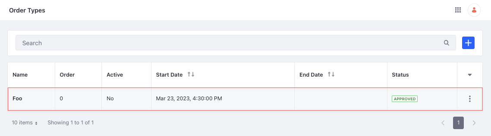

# Order Type API Basics

You can manage order types from the [Applications menu](../order-types/using-order-types.md) or with REST APIs. Use the `/order-types` endpoint from [headless-admin-commerce-order](http://localhost:8080/o/api?endpoint=http://localhost:8080/o/headless-commerce-admin-order/v1.0/openapi.json) to create and manage order types.

## Adding an Order Type

```{include} /_snippets/run-liferay-dxp.md
```

Once Liferay is running,

1. Download and unzip [Order Type API Basics](./liferay-t5n8.zip).

   ```bash
   curl https://resources.learn.liferay.com/commerce/latest/en/order-management/developer-guide/liferay-t5n8.zip -O
   ```

   ```bash
   unzip liferay-t5n8.zip
   ```

1. Order types are scoped to an instance and require a `name` for creation.

   Use the cURL script to add an order type. On the command line, navigate to the `curl` folder. Execute the `OrderType_POST_ToInstance.sh` script.

   ```bash
   ./OrderType_POST_ToInstance.sh
   ```

   The JSON response shows the newly added order type:

   ```json
   {
      "actions" : {
         "permissions" : {
            "method" : "PATCH",
            "href" : "http://localhost:9090/o/headless-commerce-admin-order/v1.0/order-types/48698"
         },
         "get" : {
            "method" : "GET",
            "href" : "http://localhost:9090/o/headless-commerce-admin-order/v1.0/order-types/48698"
         },
         "update" : {
            "method" : "PATCH",
            "href" : "http://localhost:9090/o/headless-commerce-admin-order/v1.0/order-types/48698"
         },
         "delete" : {
            "method" : "DELETE",
            "href" : "http://localhost:9090/o/headless-commerce-admin-order/v1.0/order-types/48698"
         }
      },
      "active" : false,
      "customFields" : { },
      "description" : { },
      "displayDate" : "2023-03-23T16:30:00Z",
      "displayOrder" : 0,
      "externalReferenceCode" : "fd8fbd90-0f19-0d4d-46db-c7807f3660ce",
      "id" : 48698,
      "name" : {
         "en_US" : "Foo"
      },
      "workflowStatusInfo" : {
         "code" : 0,
         "label" : "approved",
         "label_i18n" : "Approved"
      }
   }
   ```

1. Navigate to *Global Menu* () &rarr; *Commerce* &rarr; *Order Types*. The newly added order type appears.

   

1. Alternatively, call the REST service using the Java client. Navigate into the `java` folder and compile the source files:

   ```bash
   javac -classpath .:* *.java
   ```

1. Run the `OrderType_POST_ToInstance` class.

   ```bash
   java -classpath .:* OrderType_POST_ToInstance
   ```

## Examine the cURL Command

The `OrderType_POST_ToInstance.sh` script calls the REST service with a cURL command.

```{literalinclude} ./order-type-api-basics/resources/liferay-t5n8.zip/curl/OrderType_POST_ToInstance.sh
    :language: bash
```

Here are the command's arguments:

| Arguments                                                                  | Description                                              |
| :------------------------------------------------------------------------- | :------------------------------------------------------- |
| `-H "Content-Type: application/json"`                                      | Set the request body format to JSON.                     |
| `-X POST`                                                                  | Set the HTTP method to invoke at the specified endpoint. |
| `"http://localhost:8080/o/headless-commerce-admin-order/v1.0/order-types"` | Specify the REST service endpoint.                       |
| `-d "{\"name\": {\"en_US\": \"Foo\"}}"`                                    | Enter the data to post.                                  |
| `-u "test@liferay.com:learn"`                                              | Enter basic authentication credentials.                  |

```{note}
Basic authentication is used here for demonstration purposes. For production, you should authorize users via [OAuth2](https://learn.liferay.com/en/w/dxp/headless-delivery/using-oauth2). See [Using OAuth2 to Authorize Users](https://learn.liferay.com/en/w/dxp/headless-delivery/using-oauth2/using-oauth2-to-authorize-users) for a sample React application using OAuth2.
```

The other cURL commands use similar JSON arguments.

## Examine the Java Class

The `OrderType_POST_ToInstance.java` class adds an order type by calling the `OrderTypeResource` service.

```{literalinclude} ./order-type-api-basics/resources/liferay-t5n8.zip/java/OrderType_POST_ToInstance.java
   :dedent: 1
   :language: java
   :lines: 11-29
```

This class invokes the REST service using only three lines of code:

| Line (abbreviated)                                                           | Description                                                                    |
| :--------------------------------------------------------------------------- | :----------------------------------------------------------------------------- |
| `OrderTypeResource.Builder builder = ...`                                    | Get a `Builder` for generating an `OrderTypeResource` service instance.        |
| `OrderTypeResource orderTypeResource = builder.authentication(...).build();` | Use basic authentication and generate an `OrderTypeResource` service instance. |
| `orderTypeResource.postOrderType(...);`                                      | Call the `orderTypeResource.postOrderType` method and pass the data to post.   |

The project includes the `com.liferay.headless.commerce.admin.order.client.jar` file as a dependency. You can find client JAR dependency information for all REST applications in the API explorer in your installation at `/o/api` (e.g., <http://localhost:8080/o/api>).

```{note}
The `main` method's comment demonstrates running the class.
```

The remaining example Java classes call different `OrderTypeResource` methods.

```{important}
See [OrderTypeResource](https://github.com/liferay/liferay-portal/blob/[$LIFERAY_LEARN_PORTAL_GIT_TAG$]/modules/apps/commerce/headless/headless-commerce/headless-commerce-admin-order-client/src/main/java/com/liferay/headless/commerce/admin/order/client/resource/v1_0/OrderTypeResource.java) for service details.
```

Below are examples of calling other `OrderType` REST services using cURL and Java.

## Get Order Types from Instance

You can list all the order types from your Liferay instance with a cURL or Java command.

### OrderTypes_GET_FromInstance.sh

Command:

```bash
./OrderTypes_GET_FromInstance.sh
```

Code:

```{literalinclude} ./order-type-api-basics/resources/liferay-t5n8.zip/curl/OrderTypes_GET_FromInstance.sh
   :language: bash
```

### OrderTypes_GET_FromInstance.java

Command:

```bash
java -classpath .:* OrderTypes_GET_FromInstance
```

Code:

```{literalinclude} ./order-type-api-basics/resources/liferay-t5n8.zip/java/OrderTypes_GET_FromInstance.java
   :dedent: 1
   :language: java
   :lines: 9-19
```

The instance's `OrderType` objects appear in JSON.

### Paginating, Searching, and Sorting Order Types

You can paginate, search, and sort the returned order types. See the [`getOrderTypesPage`](https://github.com/liferay/liferay-portal/blob/[$LIFERAY_LEARN_PORTAL_GIT_TAG$]/modules/apps/commerce/headless/headless-commerce/headless-commerce-admin-order-client/src/main/java/com/liferay/headless/commerce/admin/order/client/resource/v1_0/OrderTypeResource.java#L50-L53) method for more information. Use the `name` field to search and sort the results:

| Sort Query  | Description                         |
| :---------- | :---------------------------------- |
| `name:desc` | Sort by `name` in descending order. |

Read [API Query Parameters](https://learn.liferay.com/dxp/latest/en/headless-delivery/consuming-apis/api-query-parameters.html) for more information.

## Get an Order Type

Get a specific order type with cURL and Java `get` commands. Replace `1234` with the ID of the order type.

```{tip}
Use `OrderTypes_GET_FromInstance.[java|sh]` to get a list of all order types, and note the `id` of the order type you want specifically.
```

### OrderType_GET_ById.sh

Command:

```bash
./OrderType_GET_ById.sh 1234
```

Code:

```{literalinclude} ./order-type-api-basics/resources/liferay-t5n8.zip/curl/OrderType_GET_ById.sh
   :language: bash
```

### OrderType_GET_ById.java

Command:

```bash
java -classpath .:* -DorderTypeId=1234 OrderType_GET_ById
```

Code:

```{literalinclude} ./order-type-api-basics/resources/liferay-t5n8.zip/java/OrderType_GET_ById.java
   :dedent: 1
   :language: java
   :lines: 8-18
```

The `OrderType` fields are formatted in JSON.

## Patch an Order Type

Update an existing order type with cURL and Java `patch` commands. Replace `1234` with the ID of the order type.

### OrderType_PATCH_ById.sh

Command:

```bash
./OrderType_PATCH_ById.sh 1234
```

Code:

```{literalinclude} ./order-type-api-basics/resources/liferay-t5n8.zip/curl/OrderType_PATCH_ById.sh
   :language: bash
```

### OrderType_PATCH_ById.java

Command:

```bash
java -classpath .:* -DorderTypeId=1234 OrderType_PATCH_ById
```

Code:

```{literalinclude} ./order-type-api-basics/resources/liferay-t5n8.zip/java/OrderType_PATCH_ById.java
   :dedent: 1
   :language: java
   :lines: 11-29
```

## Delete an Order Type

Delete an existing order type with cURL and Java `delete` commands. Replace `1234` with the ID of the order type.

### OrderType_DELETE_ById.sh

Command:

```bash
./OrderType_DELETE_ById.sh 1234
```

Code:

```{literalinclude} ./order-type-api-basics/resources/liferay-t5n8.zip/curl/OrderType_DELETE_ById.sh
   :language: bash
```

### OrderType_DELETE_ById.java

Command

```bash
java -classpath .:* -DorderTypeId=1234 OrderType_DELETE_ById
```

Code:

```{literalinclude} ./order-type-api-basics/resources/liferay-t5n8.zip/java/OrderType_DELETE_ById.java
   :dedent: 1
   :language: java
   :lines: 8-17
```

The [API Explorer](https://learn.liferay.com/dxp/latest/en/headless-delivery/consuming-apis/consuming-rest-services.html) shows the `OrderType` services and schemas and has an interface to test each service.
