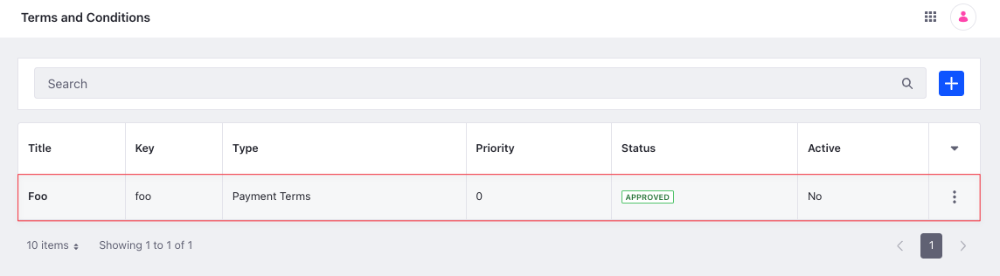

# Term API Basics

You can manage terms and conditions from the Applications menu or with REST APIs. Use the `/terms` endpoint from [headless-admin-commerce-order](http://localhost:8080/o/api?endpoint=http://localhost:8080/o/headless-commerce-admin-order/v1.0/openapi.json) to create and manage terms and conditions.

## Adding a Term

```{include} /_snippets/run-liferay-dxp.md
```

Once Liferay is running,

1. Download and unzip [Term API Basics](./liferay-a9v8.zip).

   ```bash
   curl https://resources.learn.liferay.com/commerce/latest/en/order-management/developer-guide/liferay-a9v8.zip -O
   ```

   ```bash
   unzip liferay-a9v8.zip
   ```

1. Four parameters are required to create terms and conditions: label, name, priority, and type.

   | Parameter | Value Type      | Description/<br />Example                                                                       |
   | :-------- | :-------------- | :---------------------------------------------------------------------------------------------- |
   | Label     | Text            | Enter a comma-separated list of locale/value properties:<br />`{"en_US": "Foo", "es_ES": "Bar"}`|
   | Name      | Text            | Enter a unique name for the terms and conditions item:<br />`"name": "foo"`                     |
   | Priority  | Number (double) | Enter a unique numeric priority:<br />`"priority": 1.2`                                         |
   | Type      | Text            | Specify `"payment-terms"` or `"delivery-terms"`:<br />`"type": "payment-terms"`                 |

   Use the cURL script to add terms and conditions to your instance. On the command line, navigate to the `curl` folder. Execute the `Term_POST_ToInstance.sh` script.

   ```bash
   ./Term_POST_ToInstance.sh
   ```

   The JSON response shows the newly added terms and conditions:

   ```bash
   {
      "actions" : {
         "permissions" : {
            "method" : "PATCH",
            "href" : "http://localhost:8080/o/headless-commerce-admin-order/v1.0/terms/46418"
         },
         "get" : {
            "method" : "GET",
            "href" : "http://localhost:8080/o/headless-commerce-admin-order/v1.0/terms/46418"
         },
         "update" : {
            "method" : "PATCH",
            "href" : "http://localhost:8080/o/headless-commerce-admin-order/v1.0/terms/46418"
         },
         "delete" : {
            "method" : "DELETE",
            "href" : "http://localhost:8080/o/headless-commerce-admin-order/v1.0/terms/46418"
         }
      },
      "active" : false,
      "description" : {
         "en_US" : ""
      },
      "displayDate" : "2023-03-03T13:16:00Z",
      "externalReferenceCode" : "7fa19a0c-4c98-6c36-f1bc-5a2c4257220c",
      "id" : 46418,
      "label" : {
         "en_US" : "Foo"
      },
      "name" : "foo",
      "priority" : 0.0,
      "type" : "payment-terms",
      "typeLocalized" : "Payment Terms",
      "typeSettings" : "",
      "workflowStatusInfo" : {
         "code" : 0,
         "label" : "approved",
         "label_i18n" : "Approved"
      }
   }
   ```

1. Navigate to *Global Menu* () &rarr; *Commerce* &rarr; *Terms and Conditions*. The newly added terms and conditions appear.

   

1. Alternatively, call the REST service using the Java client. Navigate into the `java` folder and compile the source files:

   ```bash
   javac -classpath .:* *.java
   ```

1. Run the `Term_POST_ToInstance` class.

   ```bash
   java -classpath .:* Term_POST_ToInstance
   ```

## Examine the cURL Command

The `Term_POST_ToInstance.sh` script calls the REST service with a cURL command.

```{literalinclude} ./term-api-basics/resources/liferay-a9v8.zip/curl/Term_POST_ToInstance.sh
    :language: bash
```

Here are the command's arguments:

| Arguments                                                                                                 | Description                                              |
| :-------------------------------------------------------------------------------------------------------- | :------------------------------------------------------- |
| `-H "Content-Type: application/json"`                                                                     | Set the request body format to JSON.                     |
| `-X POST`                                                                                                 | Set the HTTP method to invoke at the specified endpoint. |
| `"http://localhost:8080/o/headless-commerce-admin-order/v1.0/terms"`                                      | Specify the REST service endpoint.                       |
| `-d "{\"label\": {\"en_US\": \"Foo\"}, \"name\": \"foo\", \"priority\": 0, \"type\": \"payment-terms\"}"` | Enter the data to post.                                  |
| `-u "test@liferay.com:learn"`                                                                             | Enter basic authentication credentials.                  |

```{note}
Basic authentication is used here for demonstration purposes. For production, you should authorize users via [OAuth2](https://learn.liferay.com/w/dxp/headless-delivery/using-oauth2). See [Using OAuth2 to Authorize Users](https://learn.liferay.com/w/dxp/headless-delivery/using-oauth2/using-oauth2-to-authorize-users) for a sample React application using OAuth2.
```

The other cURL commands use similar JSON arguments.

## Examine the Java Class

The `Term_POST_ToInstance.java` class adds terms and conditions by calling the `TermResource` service.

```{literalinclude} ./term-api-basics/resources/liferay-a9v8.zip/java/Term_POST_ToInstance.java
   :dedent: 1
   :language: java
   :lines: 11-32
```

This class invokes the REST service using only three lines of code:

| Line (abbreviated)                                                 | Description                                                               |
| :----------------------------------------------------------------- | :------------------------------------------------------------------------ |
| `TermResource.Builder builder = ...`                               | Get a `Builder` for generating an `TermResource` service instance.        |
| `TermResource termResource = builder.authentication(...).build();` | Use basic authentication and generate an `TermResource` service instance. |
| `termResource.postTerm(...);`                                      | Call the `termResource.postTerm` method and pass the data to post.        |

Note that the project includes the `com.liferay.headless.commerce.admin.order.client.jar` file as a dependency. You can find client JAR dependency information for all REST applications in the API explorer in your installation at `/o/api` (e.g., <http://localhost:8080/o/api>).

```{note}
The `main` method's comment demonstrates running the class.
```

The remaining example Java classes call different `TermResource` methods.

```{important}
See [TermResource](https://github.com/liferay/liferay-portal/blob/[$LIFERAY_LEARN_PORTAL_GIT_TAG$]/modules/apps/commerce/headless/headless-commerce/headless-commerce-admin-order-client/src/main/java/com/liferay/headless/commerce/admin/order/client/resource/v1_0/TermResource.java) for service details.
```

Below are examples of calling other `Term` REST services using cURL and Java.

## Get Terms from Instance

You can list all the terms and conditions from your Liferay instance with a cURL or Java command.

### Terms_GET_FromInstance.sh

Command:

```bash
./Terms_GET_FromInstance.sh
```

Code:

```{literalinclude} ./term-api-basics/resources/liferay-a9v8.zip/curl/Terms_GET_FromInstance.sh
   :language: bash
```

### Terms_GET_FromInstance.java

Command:

```bash
java -classpath .:* Terms_GET_FromInstance
```

Code:

```{literalinclude} ./term-api-basics/resources/liferay-a9v8.zip/java/Terms_GET_FromInstance.java
   :dedent: 1
   :language: java
   :lines: 9-18
```

The instance's `Term` objects are listed in JSON.

### Filtering, Paginating, Searching, and Sorting Terms

You can filter, paginate, search, and sort the returned terms and conditions. See the [`getTermsPage`](https://github.com/liferay/liferay-portal/blob/[$LIFERAY_LEARN_PORTAL_GIT_TAG$]/modules/apps/commerce/headless/headless-commerce/headless-commerce-admin-order-client/src/main/java/com/liferay/headless/commerce/admin/order/client/resource/v1_0/TermResource.java#L43-L46) method for more information. Use the `priority` and `type` fields to filter, search, and sort the results:

| Filter Query              | Description                                            |
| :------------------------ | :----------------------------------------------------- |
| `type eq 'payment-terms'` | The terms and conditions must be of type payment-terms |
| `priority eq 0`           | The terms and conditions' priority must equal 0        |

| Sort Query                | Description                                                                       |
| :------------------------ | :-------------------------------------------------------------------------------- |
| `priority:desc`           | Sort by `priority` in descending order.                                           |
| `priority:desc,type:desc` | Sort by `priority` in descending order first, then by `type` in descending order. |

Read [API Query Parameters](https://learn.liferay.com/w/dxp/headless-delivery/consuming-apis/api-query-parameters) for more information.

## Get a Term

Get specific terms and conditions with cURL and Java `get` commands. Replace `1234` with the ID of the terms and conditions.

```{tip}
Use `Terms_GET_FromInstance.[java|sh]` to get a list of all terms and conditions, and note the `id` of the terms and conditions you want specifically.
```

### Term_GET_ById.sh

Command:

```bash
./Term_GET_ById.sh 1234
```

Code:

```{literalinclude} ./term-api-basics/resources/liferay-a9v8.zip/curl/Term_GET_ById.sh
   :language: bash
```

### Term_GET_ById.java

Command:

```bash
java -classpath .:* -DtermId=1234 Term_GET_ById
```

Code:

```{literalinclude} ./term-api-basics/resources/liferay-a9v8.zip/java/Term_GET_ById.java
   :dedent: 1
   :language: java
   :lines: 8-17
```

The `Term` fields are formatted in JSON.

## Patch a Term

Update existing terms and conditions with cURL and Java `patch` commands. Replace `1234` with the ID of the terms and conditions.

### Term_PATCH_ById.sh

Command:

```bash
./Term_PATCH_ById.sh 1234
```

Code:

```{literalinclude} ./term-api-basics/resources/liferay-a9v8.zip/curl/Term_PATCH_ById.sh
   :language: bash
```

### Term_PATCH_ById.java

Command:

```bash
java -classpath .:* -DtermId=1234 Term_PATCH_ById
```

Code:

```{literalinclude} ./term-api-basics/resources/liferay-a9v8.zip/java/Term_PATCH_ById.java
   :dedent: 1
   :language: java
   :lines: 11-29
```

## Delete a Term

Delete existing terms and conditions with cURL and Java `delete` commands. Replace `1234` with the ID of the terms and conditions.

### Term_DELETE_ById.sh

Command:

```bash
./Term_DELETE_ById.sh 1234
```

Code:

```{literalinclude} ./term-api-basics/resources/liferay-a9v8.zip/curl/Term_DELETE_ById.sh
   :language: bash
```

### Term_DELETE_ById.java

Command

```bash
java -classpath .:* -DtermId=1234 Term_DELETE_ById
```

Code:

```{literalinclude} ./term-api-basics/resources/liferay-a9v8.zip/java/Term_DELETE_ById.java
   :dedent: 1
   :language: java
   :lines: 8-16
```

The [API Explorer](https://learn.liferay.com/w/dxp/headless-delivery/consuming-apis/consuming-rest-services) shows the `Term` services and schemas and has an interface to test each service.
