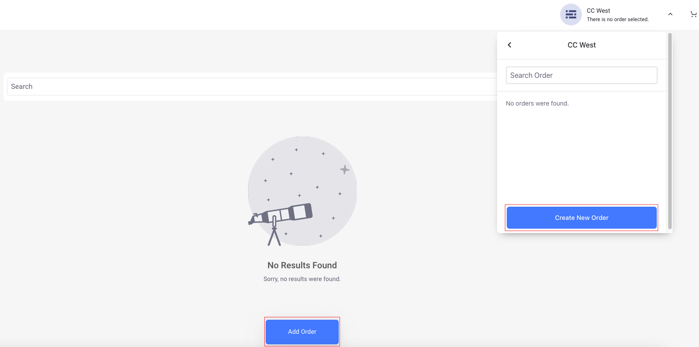
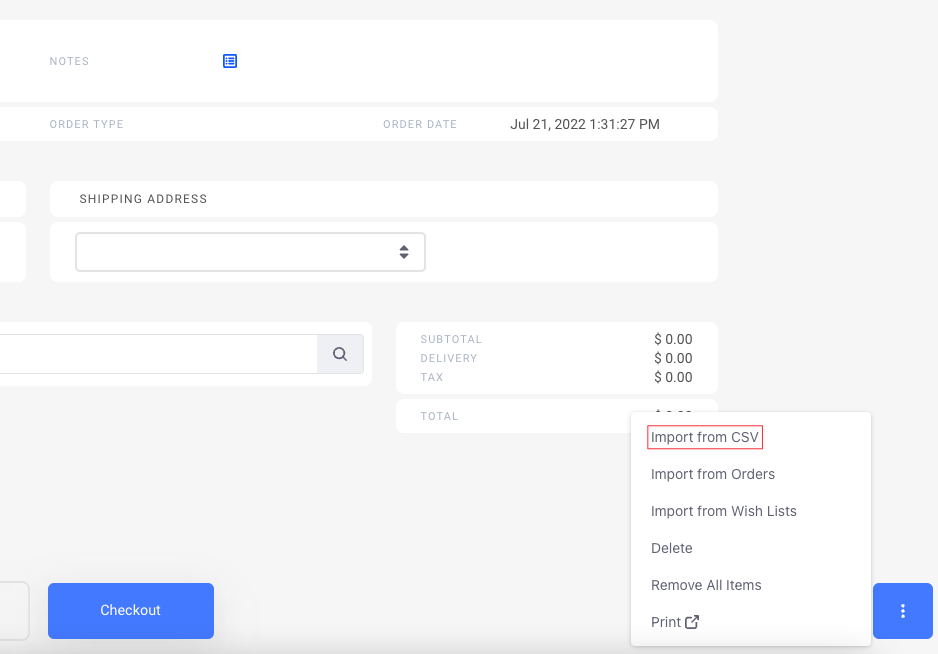
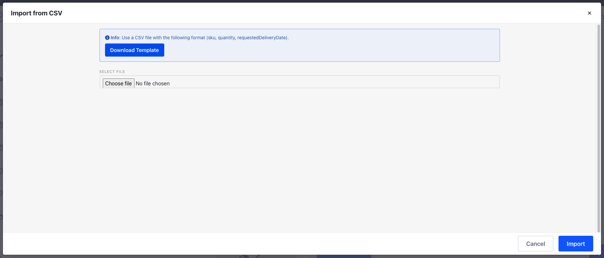
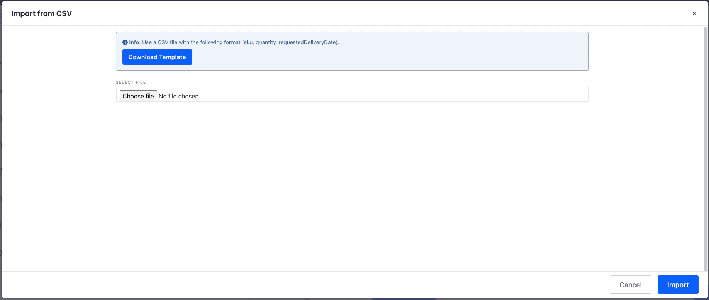
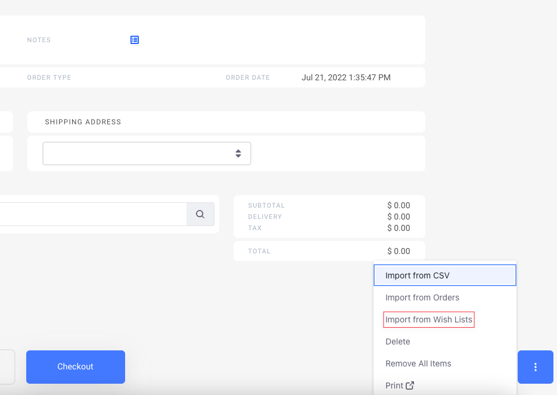
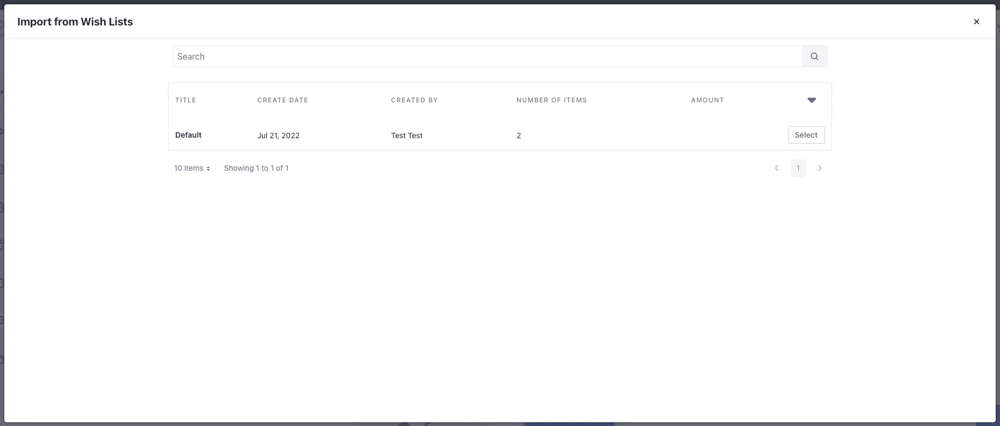
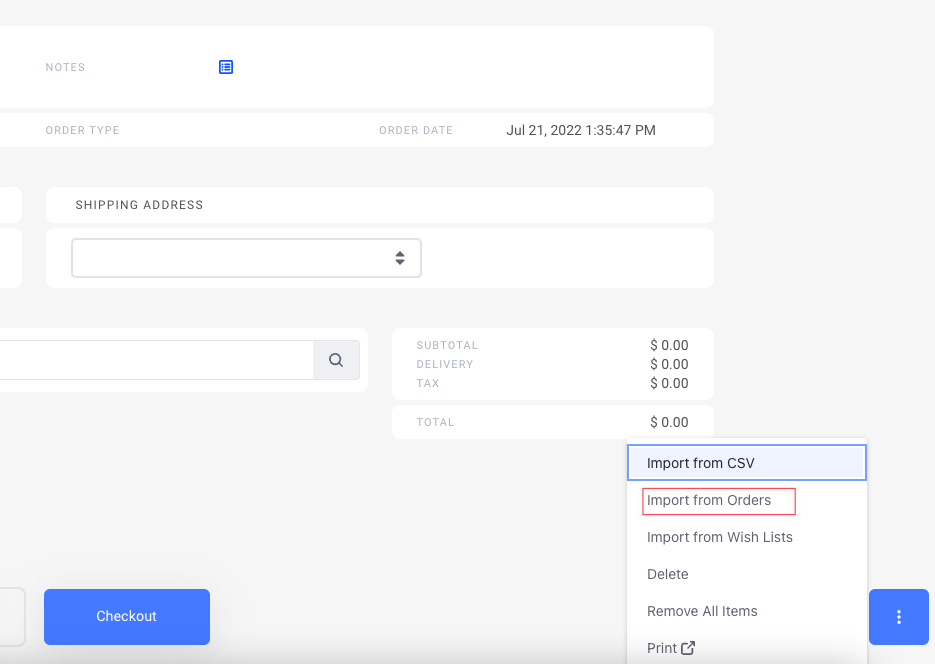
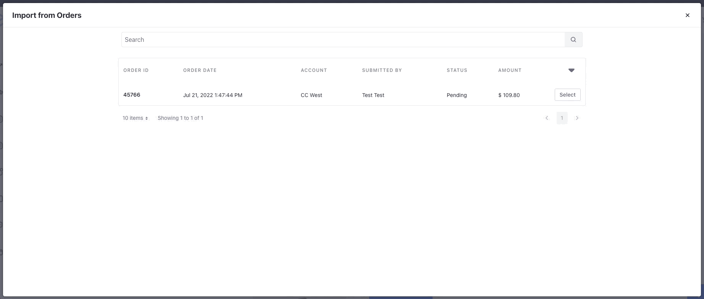
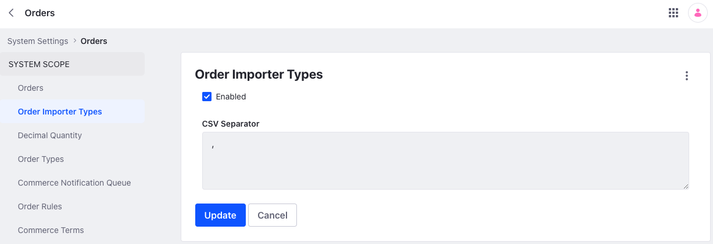
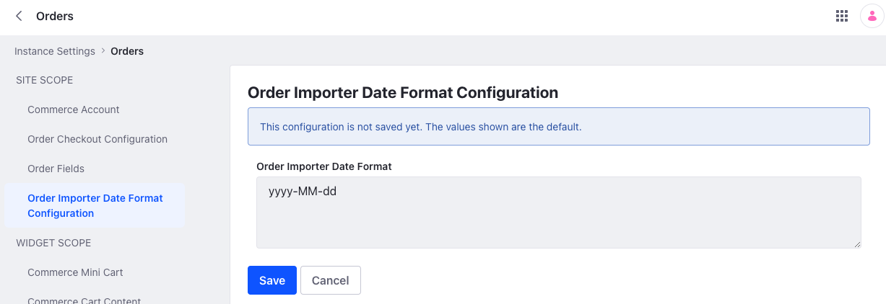

# Using Order Importer

{bdg-secondary}`Liferay DXP 7.4 U1+/GA5+`

There are two ways to create a new order on a Minium site:

1. Click the _Account Selector_ from the top right and select *Create New Order*.

1. Go to the *Pending Orders* screen and click *Add Order*.

## Importing Orders from a CSV File

You must first have the file containing orders in a specific format. See the format below:

`sku,quantity,requestedDeliveryDate`

The `requestedDeliveryDate` is optional and is expected in the default format `yyyy-MM-dd`. See [Order Importer Configuration](#order-importer-configuration) to change the default behavior.

To import an Order from a CSV file,

1. Create a Minium site by opening the Global Menu () and going to Control Panel &rarr; Sites. Click the _Add_ button and select Minium.

1. Create a new order and click the 3-dot icon () at the bottom right and select *Import from CSV*.

   

1. Click *Select File* and choose the CSV file you want to import. You can also download a template file by clicking on *Download Template*.

   

1. Click *Import* once to preview the items in your order and click *Import* once again to add them to your order.

   

## Importing Orders from Wish lists

You can have products in your wishlist that you want to add to an order quickly. To do so, ensure that you have the desired products in your wishlist first. See [Using Wish Lists](../../creating-store-content/using-wish-lists.md) for more information.

1. Create a new order and click on the 3-dot icon () at the bottom right.

1. Select *Import from Wish Lists* and select the desired wish list.

   

1. Click *Select* to preview the items in your order and click *Import* to add them to your order.

   

## Importing Orders from Past Orders

You can also import an order from your past orders.

1. Create a new order and click on the 3-dot icon () at the bottom right.

1. Select *Import from Past Orders* and select the appropriate order.

   

1. Click *Select* to preview the items in your order and click *Import* to add them to your order.

   

## Order Importer Configuration

You can change the default CSV separator and the requested delivery date format for the Order Importer.

**Default CSV Separator:** Open the Global Menu () and go to *Control Panel* &rarr; *System Settings*. Click *Orders* and select *Order Importer Types*. Change the value under *CSV Separator* and click *Save*.

**Requested Delivery Date Format:** Open the Global Menu () and go to *Control Panel* &rarr; *Instance Settings*. Click on *Orders* and select *Order Importer Date Format Configuration*. Change it to the desired format and click *Save*.

