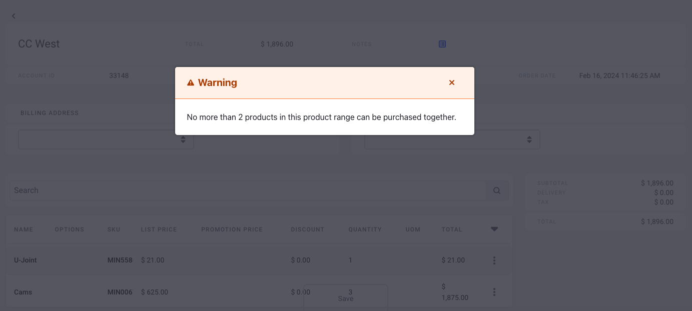
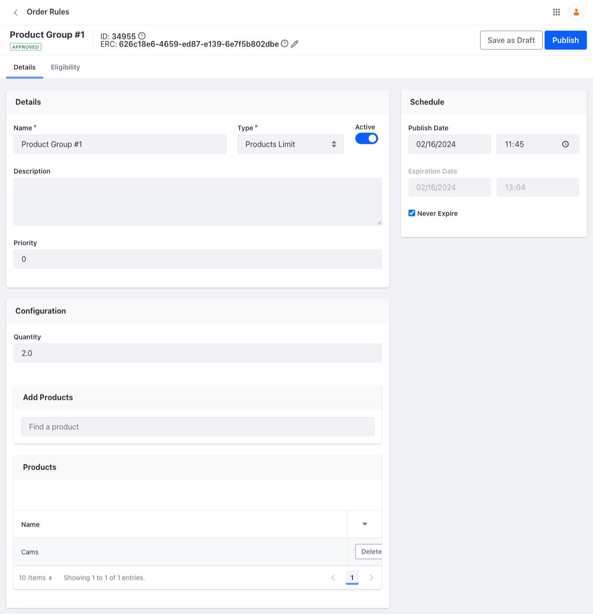
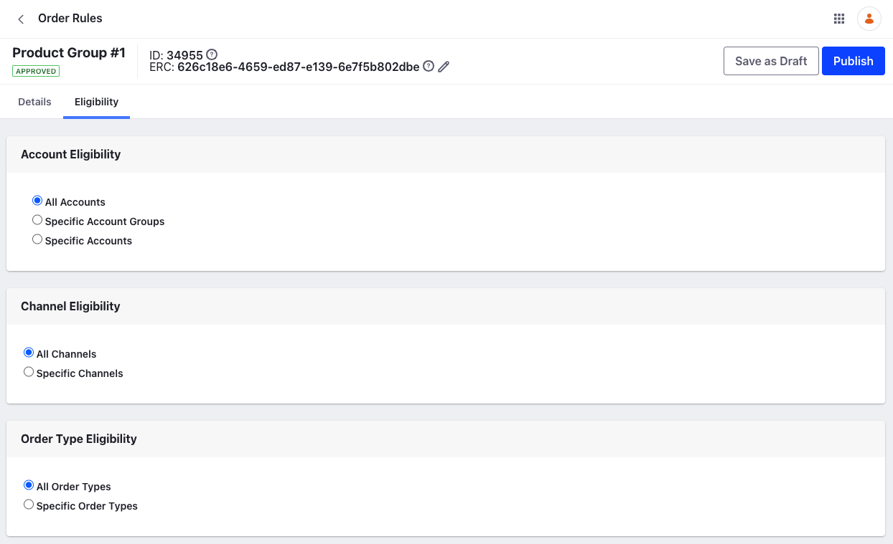

# Using the Products Limit Rule

{bdg-secondary}`Liferay DXP 2024.Q1+/Portal 7.4 GA112+`

You may want to prevent customers from purchasing products from a specific product group. For instance, a machines manufacturer may want to limit the purchase quantity of large machines to 1 per order. To do this, you can use the Products Limit rule and configure a group of products with their permissible purchase quantity.

!!! important
    This feature is currently behind a release feature flag. Read [Release Feature Flags](https://learn.liferay.com/web/guest/w/dxp/system-administration/configuring-liferay/feature-flags#release-feature-flags) for more information.

## Product Limit Rule Overview

When you apply an order rule, the buyer must fulfill the rule to continue checking out. For the Products Limit rule, the buyer must ensure that the product quantity is less than or equal to the configured amount.

## Adding the Products Limit Rule

The Products Limit rule is available out-of-the-box.

1. Open the *Global Menu* () and navigate to *Commerce* &rarr; *Order Rules*.

1. Click *Add* () and enter the following information.

   **Name:** Product Group #1

   **Description:** Testing the products limit rule

   **Type:** Products Limit

1. Click *Submit*.

   

   This opens a configuration view for the order rule. The Priority decides which order rule takes precedence when there's more than one rule. The lower number takes priority over the higher one. You can activate it using the Active toggle and configure the products and its quantity.

1. In the Configuration section, set the *quantity* for the products, for instance, `2`.

1. Search for products using the search bar and click *Select* for the products you want to add.

1. Click *Publish*.

A warning message appears if you check out a cart with products that both belong to the configured product group and exceed the configured quantity.

## Order Rule Eligibility

Under the eligibility tab, you can set the order rule eligibility for accounts, account groups, channels or order types. By default it is applicable to all of these. If you want to associate it with a specific entity, choose it by clicking the radio button and using the search bar.
