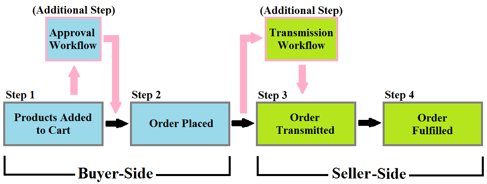

---
toc:
  - ./order-workflows/enabling-or-disabling-order-workflows.md
  - ./order-workflows/approving-or-rejecting-orders-in-order-workflows.md
uuid: 878ab093-e2c3-4741-b106-fb137c17a44e
taxonomy-category-names:
- Commerce
- Orders and Fulfillment
- Order Workflows
- Liferay Self-Hosted
- Liferay PaaS
- Liferay SaaS
---
# Order Workflows

Order workflows require the buyer or seller to give internal prior [approval](./order-workflows/approving-or-rejecting-orders-in-order-workflows.md) before [processing](./orders/processing-an-order.md) an order for the channel(s) you choose. To learn more about Liferay workflows in general, see [Introduction to Workflow](https://learn.liferay.com/w/dxp/process-automation/workflow/introduction-to-workflow).

You can activate the _Buyer Order Approval Workflow_, _Seller Order Acceptance Workflow_, or both in your order life cycle. The workflows, when enabled, mirror real world business procedures, such as all orders being reviewed by an order manager before submission.

## Related Topics

* [Enabling or Disabling Order Workflows](./order-workflows/enabling-or-disabling-order-workflows.md)
* [Approving or Rejecting Orders in Order Workflows](./order-workflows/approving-or-rejecting-orders-in-order-workflows.md)
* [Processing an Order](./orders/processing-an-order.md)
* [Introduction to Shipments](./shipments/introduction-to-shipments.md)
* [Order Life Cycle](./orders/order-life-cycle.md)