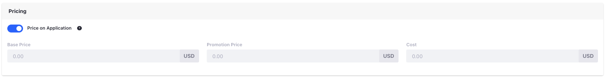
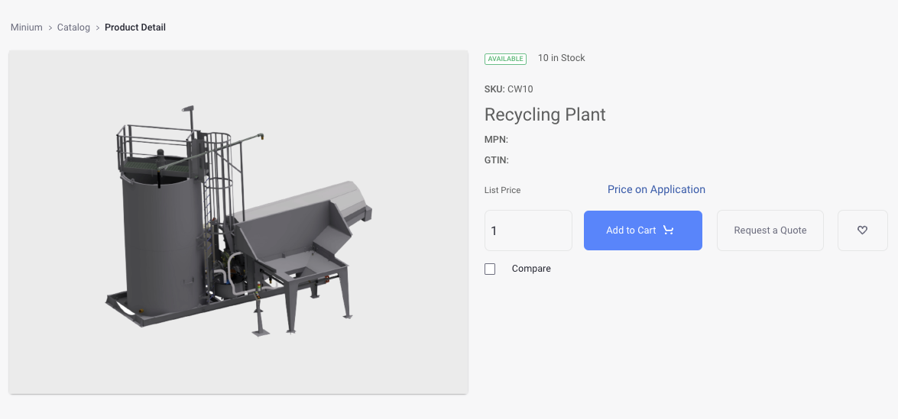
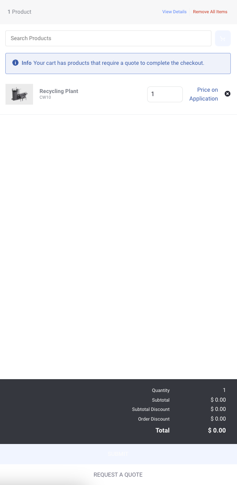
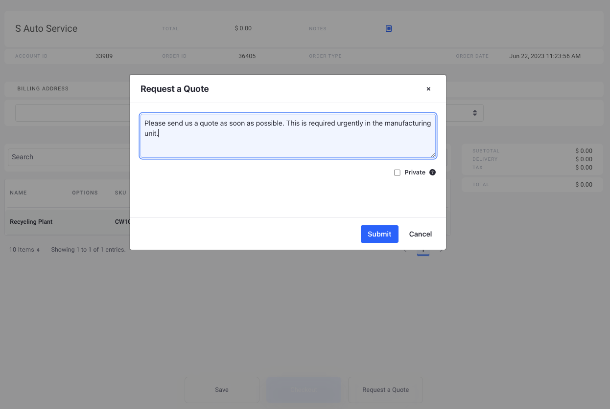
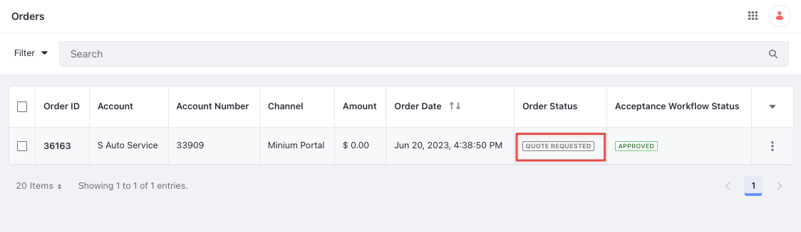
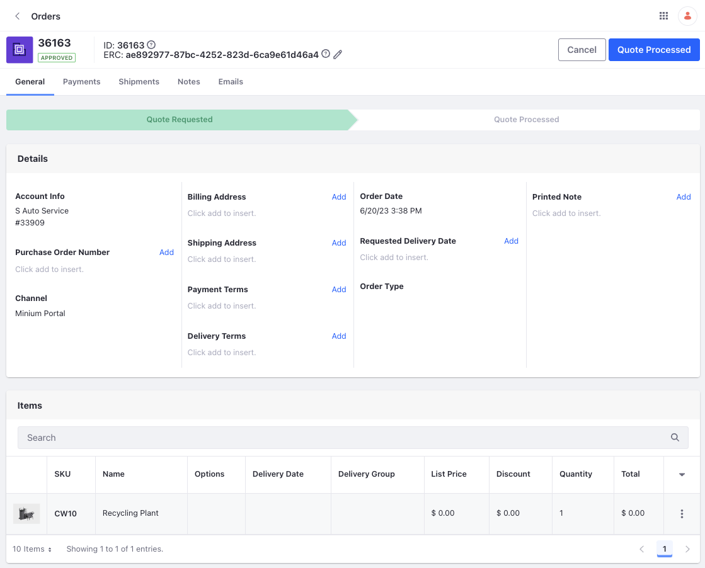

# Price on Application

{bdg-secondary}`Liferay DXP 7.4 U84+/GA84+`

!!! important
    Price on Application was released behind a [release feature flag](https://learn.liferay.com/web/guest/w/dxp/system-administration/configuring-liferay/feature-flags#release-feature-flags) in Liferay DXP 7.4 U84/GA84. It was made Generally Available (GA) in 2024.Q1/GA112.

If you have expensive or complex products in your catalog, you may not want customers to purchase them without help. If you want support staff to assist and intervene before making a purchase, you can hide pricing on those products and require your customers to request a quote. This is called *price on application*. Customers can optionally request quotes for regular products or baskets of goods. You can even selectively apply this to accounts or account groups so that some customers can order autonomously while others must request a quote.

## Enabling Price on Application for a Product

When creating a product, you can set it to be priced on application:

1. Open the *Global Menu* () and navigate to *Commerce* &rarr; *Products*.

1. Click *Add* () and create a new simple product.

1. Enter a name, select a catalog, and click *Submit*.

   This opens the product configuration page. Go to the *SKUs* tab and click on the *default* SKU.

1. Change the SKU to an appropriate identifier and under the *Pricing* section, enable the toggle for *Price on Application*.

   

   This disables three fields: *Base Price*, *Promotion Price* and *Cost*. You can also add additional information like media, attachments, and inventory for the product.

1. Click *Publish*.

1. Go back to the *Details* tab and click *Publish*.

Go to your storefront and find the product you just created. You should see the list price as *Price on Application* with a new button *Request a Quote*. You can add the product to cart, but you cannot check out.

## Requesting a Quote

The product detail's page contains a new button to request a quote.

1. Click *Request a Quote* from the product details page. Alternatively, if you wish to combine this product with other products, you can add them to cart, open the mini cart, and click on *Request a Quote*.

   !!! note
       If any item in the cart is priced on application, then the checkout button isn't available, and customers must request a quote.

   

   This opens the Pending Orders page.

1. If everything looks good with the order, you can click on *Request a Quote* at the bottom.

1. Enter an optional note and click *Submit*.

Only administrators can see the Private checkbox. If checked, the added note is visible only to them.

## Enabling Request a Quote on a Fully Priced Cart

If customers have a long standing relationship with you, they may still want a quote on their carts because of the number of products in it or the price. In such cases, you can enable requesting a quote on fully priced carts for the channel.

1. Open the *Global Menu* () and navigate to *Commerce* &rarr; *Channels*.

1. Select your channel and scroll down to the Orders section.

1. Use the toggle to enable *Allow Request a Quote on a Fully Priced Cart*.

1. Click *Save*.

When customers add products that don’t require a quote to their cart, they can either check out or request a quote from the mini cart or Pending Orders screen.

### Price on Application for Specific Accounts

With a custom price list or promotion list, you can require a product to be priced on application for some accounts, while others can check it out normally. Ensure that the product is not priced on application on the base price list or base promotion list.

1. Go back to the SKU created earlier and disable price on application.

1. Enter a base price (eg. $14,999).

1. Open the *Global Menu* () and navigate to *Commerce* &rarr; *Price Lists*.

1. Click *Add* () and enter the following information:

   **Name:** No Quote

   **Catalog:** Minium

   **Currency:** USD

1. Click *Submit*.

1. Click on the *Eligibility* tab and select *Specific Accounts* under Account Eligibility.

1. Find an account (eg. CC West) and click *Select*.

1. Click on the *Entries* tab.

1. Find the SKU created earlier and click *Select*.

1. From the Entries section, click the selected SKU and enable *Price on Application*.

1. Click *Save*.

1. Click *Publish*.

The account (CC West) must now request a quote for this product while all other accounts can purchase the product for its base price. You can follow the same steps as above to use a promotion list to price a SKU on application. Customer accounts eligible for the promotion must request a quote for the configured SKU. Other accounts can check out and submit an order as usual.

!!! important
    The default discovery logic for price lists and promotion lists is `hierarchy`. This works based on priority. The highest priority eligible price list or promotion list gets applied to the account.
    When using the `lowest` discovery logic for price lists and promotion lists, price on application has the highest precedence compared to price lists and promotion lists (price on application > price lists and promotion lists).
    Consider a scenario where an SKU is priced on application in the base price list. You have a long standing account that can buy the same SKU at a fixed price. To do this, you can create a custom price list or promotion list and set a price for the SKU and its eligibility for the specific account account. This takes precedence over the base price list (price on application) for that account. Other accounts must request a quote for the same SKU.

## Order Life Cycle of Products Priced on Application

When customers request a quote, their order has the status *Quote Requested*. This appears in the placed orders screen along with any notes sent by the customer. You can view these orders by opening the *Global Menu* () and navigating to *Commerce* &rarr; *Orders*.

After selecting the order, you can add notes or more information that the customer can view from the placed orders screen. After reviewing the quote, you can click *Quote Processed* to process the quote.

!!! note
    Image: “[CIFA Wash Batching Plant](https://www.cifa.com/en/batching-plants/recycling/cifa-wash)”