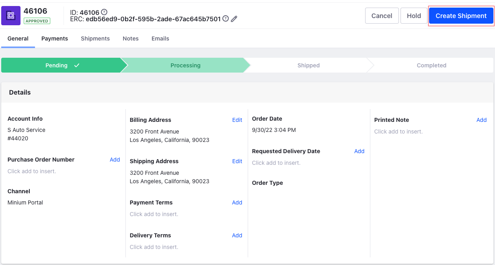

---
toc:
  - ./shipments/shipment-lifecycle-overview.md
  - ./shipments/creating-a-shipment.md
  - ./shipments/cancelling-a-shipment.md
  - ./shipments/shipments-management-reference-guide.md
uuid: f16181cf-fbd3-44b0-98fc-9ad41ad1b6b2
taxonomy-category-names:
- Commerce
- Orders and Fulfillment
- Shipments
- Liferay Self-Hosted
- Liferay PaaS
- Liferay SaaS
---
# Shipments

You can create *Shipments* when an order is in the [processing](./orders/processing-an-order.md) stage.

!!! note
    A single shipment may contain multiple orders, but the same account must create all the orders contained in the shipment.

To create a shipment,

1. Open the *Global Menu* () and go to *Commerce* &rarr; *Orders*.

1. Select an order that is in the *Processing* status.

1. Click *Create Shipment*.

   

Once you create a shipment, you are taken to the Shipments page where you can manage shipments and finish processing the order.