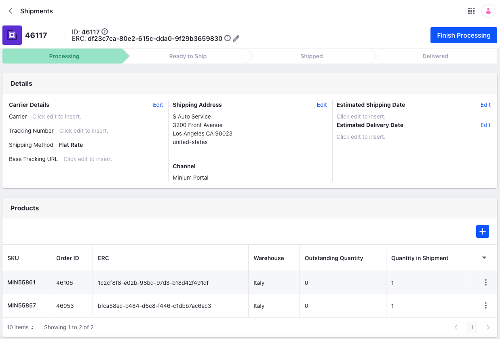
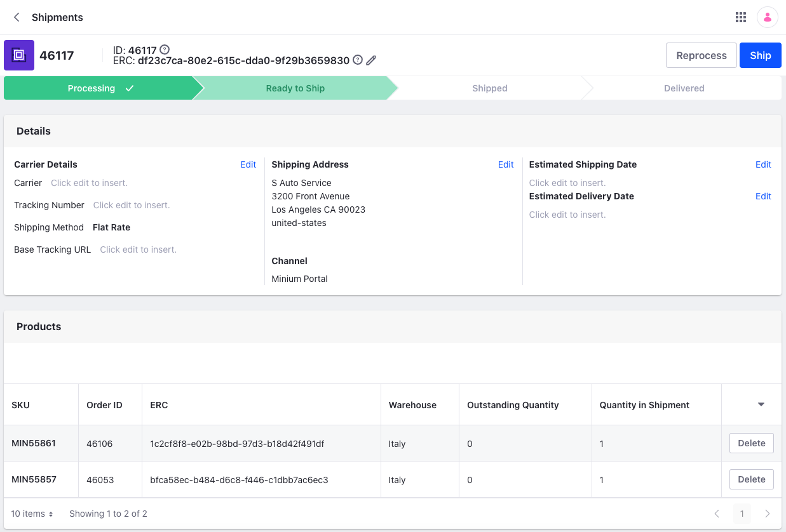
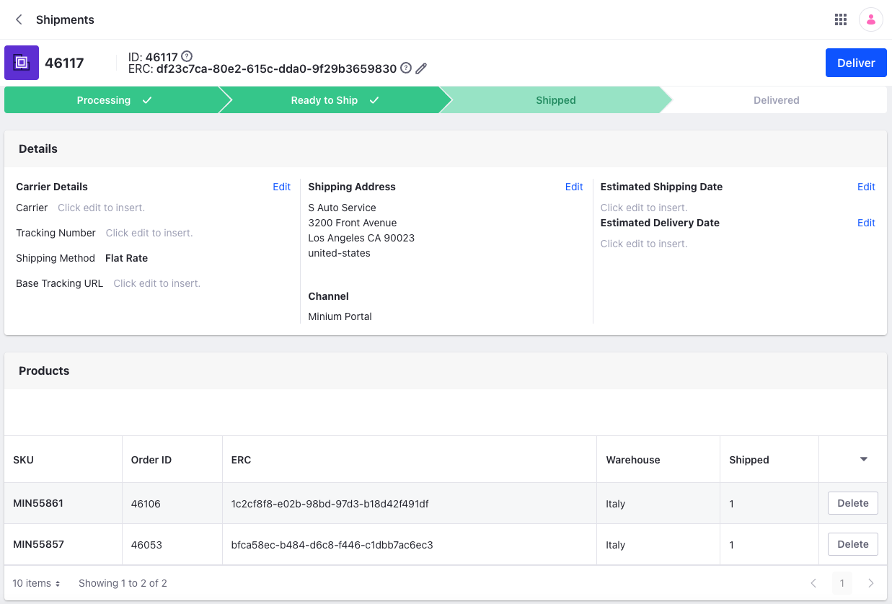
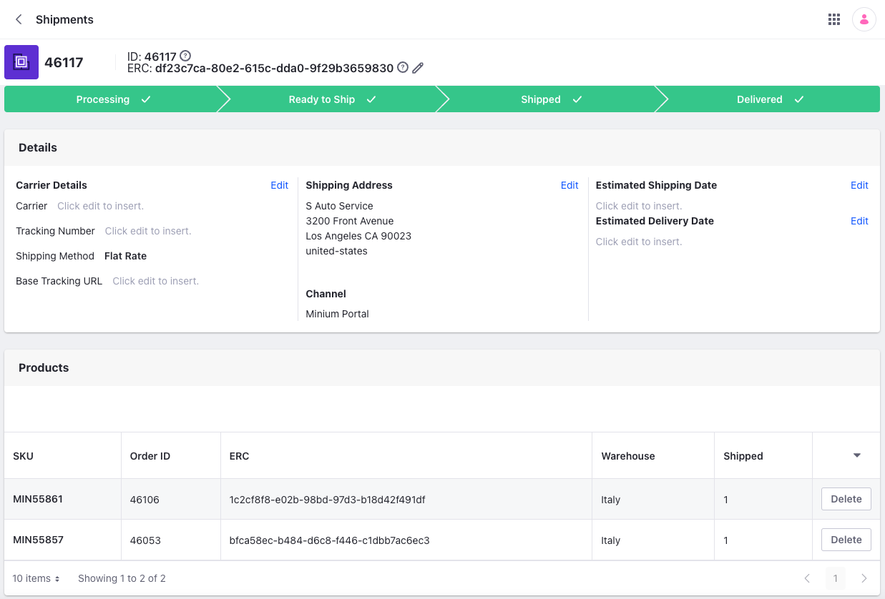
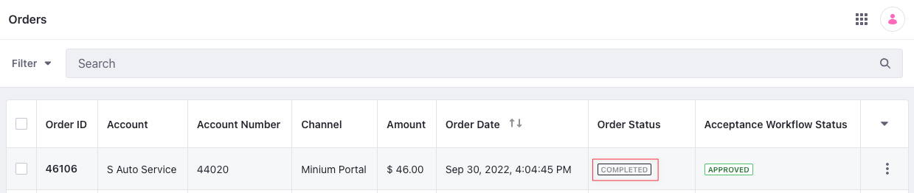
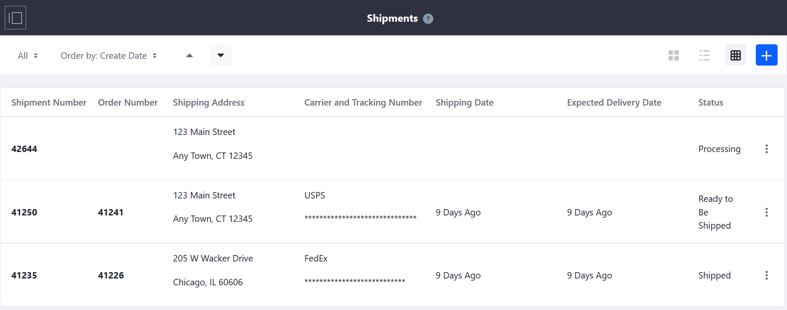
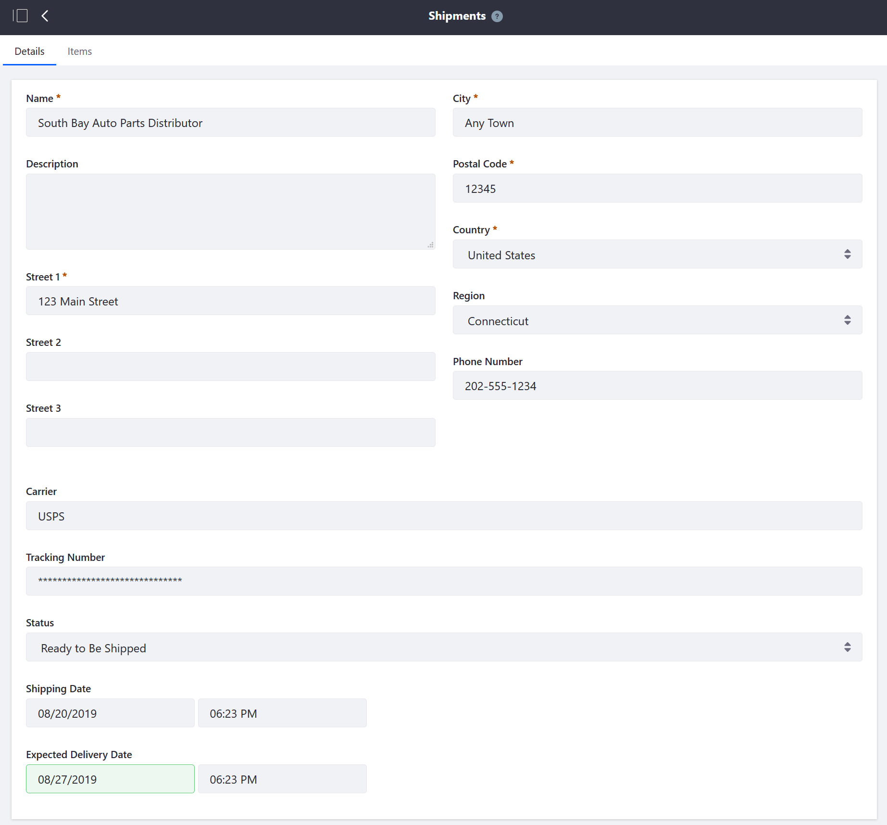
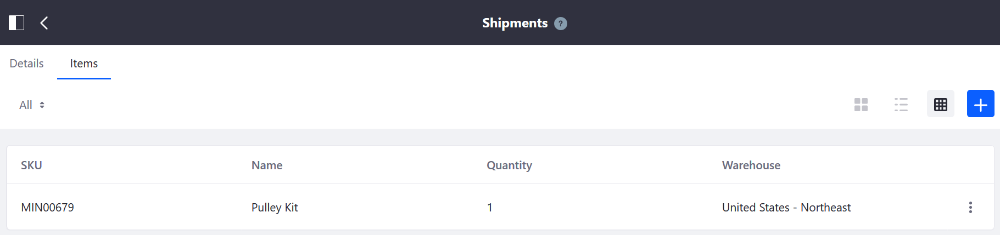

# Introduction to Shipments

There are four stages for a shipment.

* Processing
* Ready to Ship
* Shipped
* Delivered

!!! note
    Starting with Liferay DXP 7.4 U30/GA30, each shipment has an external reference code (ERC) displayed under the shipment ID. Click *Edit* () to change the default value. 

## Processing

Click *Finish Processing* after selecting the items in the shipment and quantities from their source warehouse. The order is ready to ship now. You can also view additional details such as the carrier, tracking number, shipping method, tracking URL, addresses, and estimated delivery and shipping dates here.



```{note}
Starting with Liferay DXP 7.4 U35/GA35, each item in the shipment also has an external reference code (ERC) associated with it. You can change this by clicking on the item and entering a value for the *External Reference Code* field.
```

## Ready to Ship

Now you can confirm all the details of the shipment. Once confirmed, click *Ship* to ship the order. This also moves the order's status from *Processing* to *Shipped*.



## Shipped

After shipping the order, both the order and the shipment move to the *Shipped* status. Upon delivery, you can click the *Deliver* button to mark the shipment as *Delivered*.



## Delivered

All the stages of a shipment are complete upon confirmation of delivery.



After delivery, the order moves to the *Completed* status. See the [Shipments Management Reference Guide](./shipments-management-reference-guide.md) to learn more about the specific features and fields.



## Liferay Commerce 2.1 and Below

Commerce 2.1 is virtually identical to the latest version, except that you access the *Orders* menu via the *Control Panel*. Select an order with the processing status and click *Create Shipment*.

See the [Shipments Management Reference Guide](./shipments-management-reference-guide.md) to learn more about the specific features and fields.

## Liferay Commerce 2.0 and Below

Store managers use the Shipments menu to create and track a shipment after [receiving an order](../orders/processing-an-order.md#commerce-2-0-and-below).

Navigate to the *Control Panel* &rarr; *Commerce* &rarr; *Shipments*.



The Shipments menu displays all created shipments in all statuses. Click *Add* () to add a new shipment.

Clicking on a particular shipment number (for example, *41250*) displays the shipment's Details tab and the Items tab. Clicking the *Order Number* (*41241*) shows the Orders menu.

### Details

The *Shipment Details* tab contains the following information:



| Field                  | Description                                                                                      |
| :--------------------- | :----------------------------------------------------------------------------------------------- |
| Name                   | Name of the Buyer                                                                                |
| Description            | Description field                                                                                |
| Street 1               | Shipping address' first line                                                                     |
| Street 2               | Shipping address' second line                                                                    |
| Street 3               | Shipping address' third line                                                                     |
| City                   | Shipping address' city                                                                           |
| Postal Code            | Shipping address' postal code                                                                    |
| Country                | Shipping address' country                                                                        |
| Region                 | Shipping address' state or province                                                              |
| Carrier                | Name of the carrier                                                                              |
| Tracking Number        | Shipment's tracking number generated by the **carrier**                                          |
| Shipment Status        | Drop-down menu with the options: *Processing*, *Ready to be Shipped*, *Shipped*, and *Delivered* |
| Shipping Date          | Date of shipment delivery to the carrier                                                         |
| Expected Delivery Date | Expected arrival date of the shipment                                                            |

## Items

The Shipment Items Tab contains the following information:



| Field     | Description                                 |
| :-------- | :------------------------------------------ |
| SKU       | SKU Number                                  |
| Name      | Name of the item                            |
| Quantity  | Number of items in the shipment             |
| Warehouse | Name of the warehouse sourcing the shipment |

Clicking *Add* () opens a window where you can add more items to the order.

## Related Topics

* [Creating a Shipment](./creating-a-shipment.md)
* [Canceling a Shipment](./cancelling-a-shipment.md)
* [Processing an Order](../orders/processing-an-order.md)
* [Shipments Management Reference Guide](./shipments-management-reference-guide.md)
