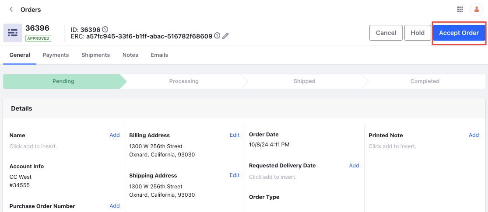
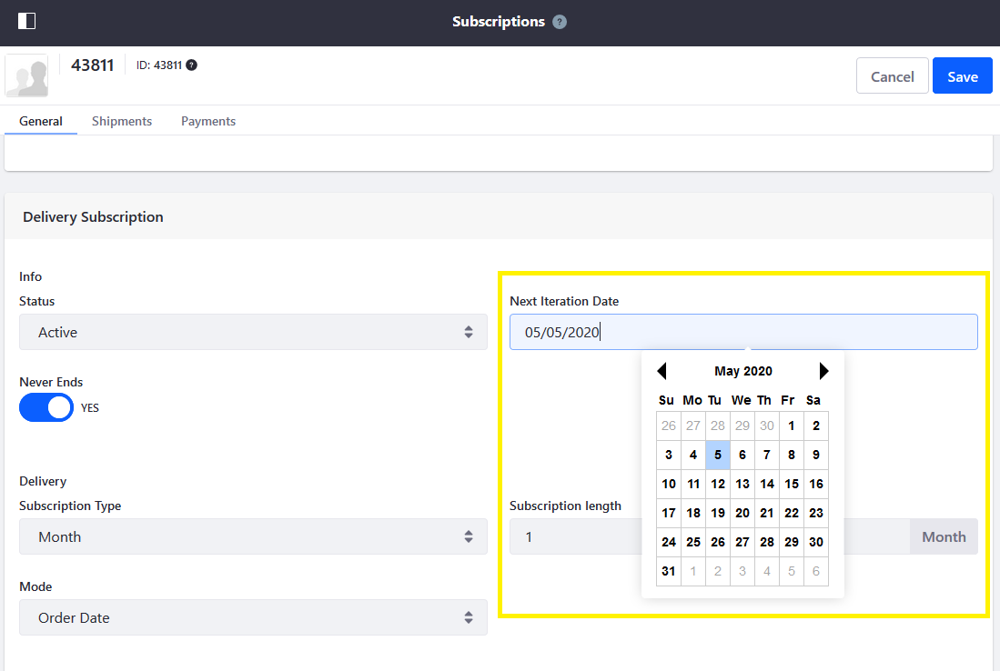
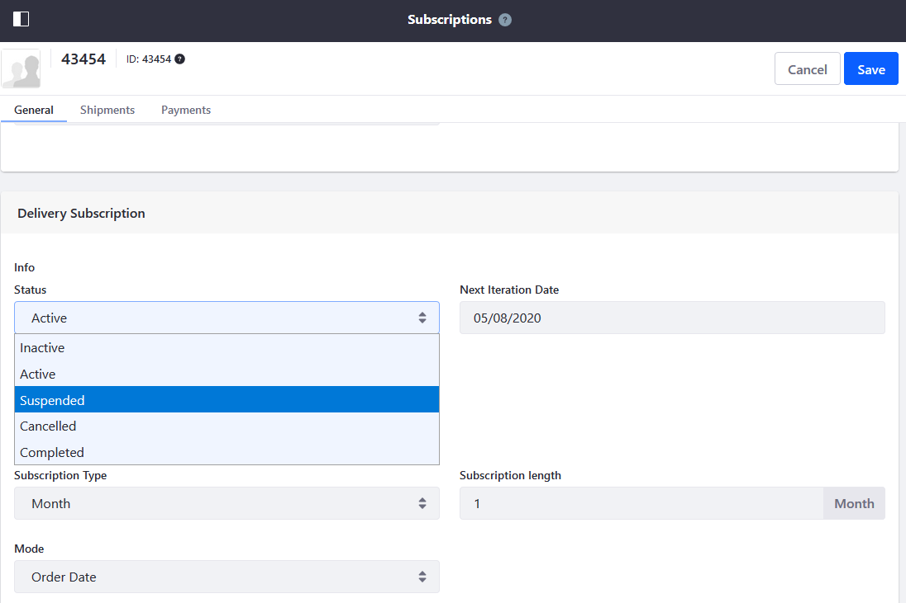
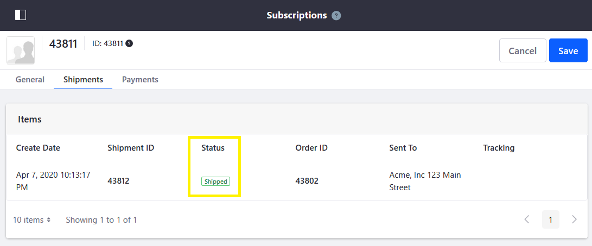
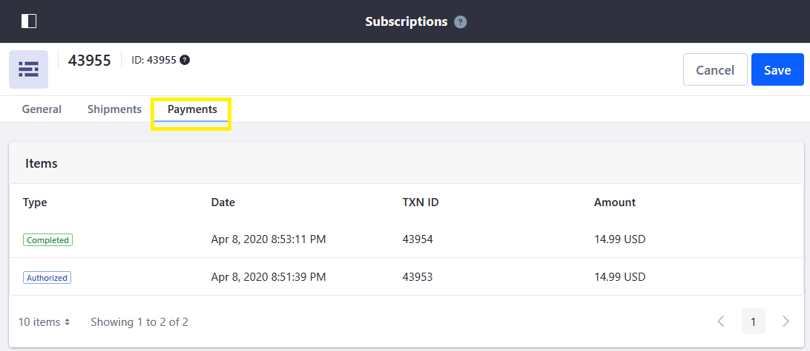
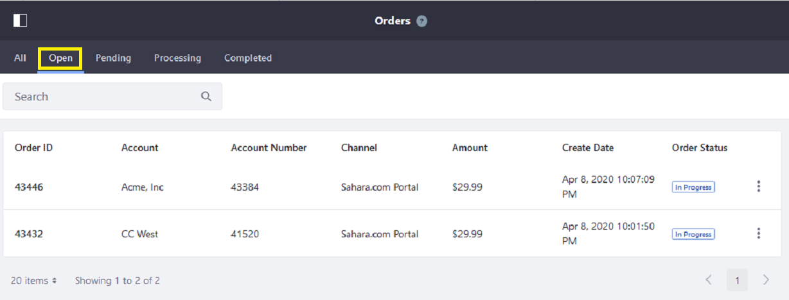
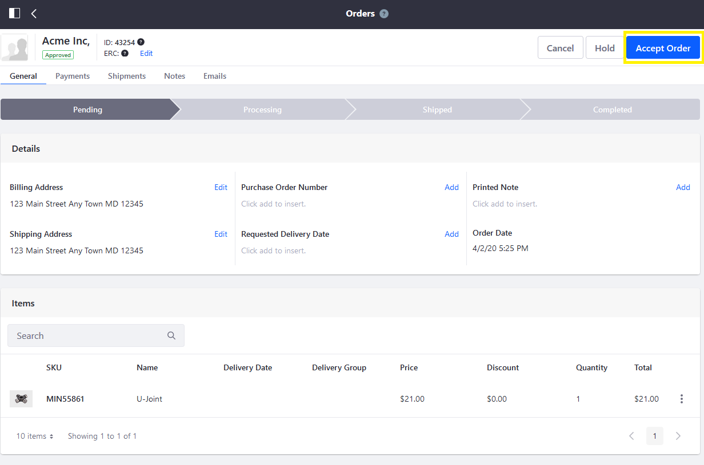

# Managing Subscriptions

In Liferay, you can manage orders and subscriptions under the Global Applications menu. 

1. Open the _Global Applications_ () menu and navigate to _Commerce_ &rarr; _Orders_.

1. Select an order.

1. Click _Accept Order_. This moves the order into the processing status.

   

1. After accepting the subscription order, it appears in the [Subscriptions application](./subscription-administration-reference-guide.md).

## Managing a Subscription Order

1. Open the _Global Applications_ () menu and navigate to _Commerce_ &rarr; _Subscriptions_.

1. Select a subscription order. The ID of a subscription is specific to it. It is not the same as the shipment ID or order ID.

1. You can make changes to either the payment or delivery options in the _General_ tab. For example, change the _Next Iteration Date_ under Delivery Subscription to an earlier date.

   

1. Click _Save_.

## Suspending or Canceling a Subscription Order

1. On the _General_ tab, select _Suspended_ or _Canceled_ from the _Status_ drop-down menu in the _Payment Subscription_ section.

1. Switch the _Never Ends_ toggle to _NO_.

1. Enter _1_ in the _Ends After_ field.

1. Next, scroll down to the _Delivery Subscription_ section.

1. Select _Suspended_ or _Canceled_ from the _Status_ drop-down menu.

   

1. Switch the _Never Ends_ toggle to _NO_.

1. Enter `1` in the _Ends After_ field.

1. Click _Save_ to apply the changes.

## Tracking Shipment Status

1. Go to _Shipments_. From here, store managers can track the shipment status of a subscription.

   

## Tracking Payment History

1. Go to _Payments_. From here, store managers can track the payment history of a subscription.

   

## Configuring Subscriptions

1. Open the _Global Applications_ () menu and navigate to _Control Panel_ &rarr; _System Settings_.

1. Go to _Commerce_ &rarr; _Catalog_.

1. Click _Subscriptions_.

   Review the following available configurations:

     - **Renew Check Interval** - Determines how often the system checks for renewals.
     - **Subscription Cancellation Allowed** - If checked, allows users to cancel a subscription.
     - **Subscription Suspension Allowed** - If checked, allows users to suspend a subscription.

1. Click _Save_.

## Commerce 2.1 and Below

For Commerce 2.1 and below, orders and subscriptions appear in the _Control Panel._

1. Open the _Control Panel_ and navigate to _Commerce_ &rarr; _Orders_.

1. Click on the _Open_ tab.

   

1. Click on the _Order ID_ to begin.

1. Click the _Pending_ button. This moves the order into the Pending status.

   

1. Click the _Accept Order_ button. This moves the order into the Processing status.

   

1. Once the subscription order has been accepted, follow the steps to create a shipment. See [Creating a Shipment](../shipments/creating-a-shipment.md) to learn more.

Once the order has been accepted, it appears on the [Subscriptions menu](./subscription-administration-reference-guide.md).

## Related Topics

- [Subscription Management Reference Guide](./subscription-administration-reference-guide.md)
- [Enabling Subscriptions for a Product](../../product-management/creating-and-managing-products/products/enabling-subscriptions-for-a-product.md)
- [Processing an Order](../orders/processing-an-order.md)
- [Orders Menu Reference Guide](../orders/orders-menu-reference-guide.md)
- [Shipments](../shipments.md)
