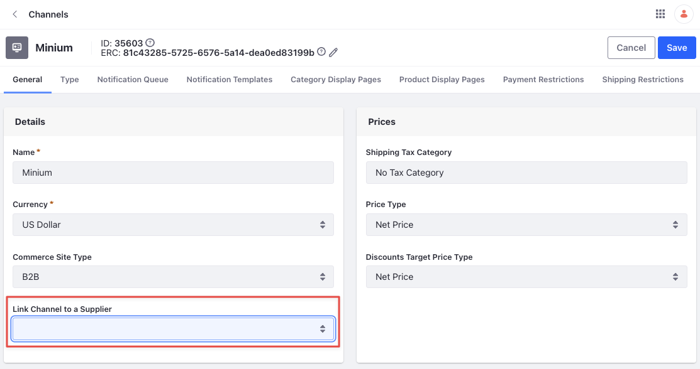
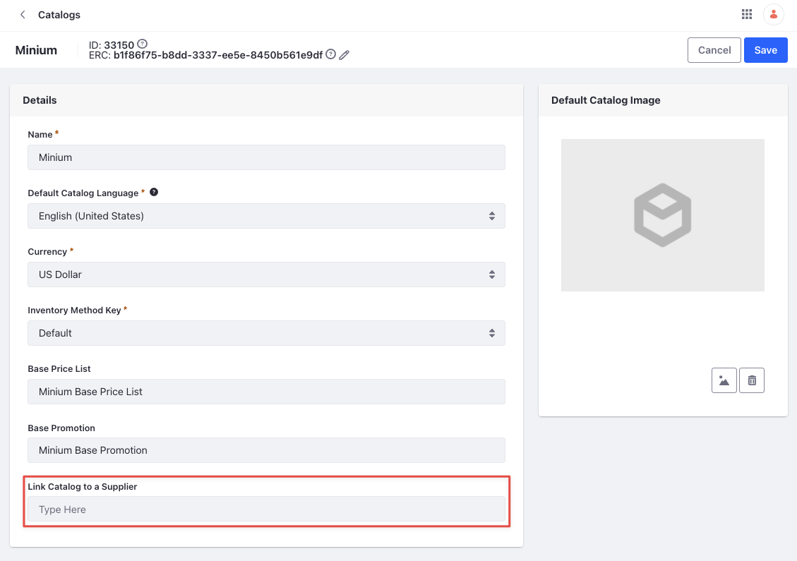

# Supplier Account

{bdg-secondary}`Available Liferay DXP 7.4 U84+/GA84+`

Liferay now supports a new account type called *Supplier*. This account type has all the features of Liferay accounts like the ability to add and manage addresses, users, organizations, account groups, and roles. In addition to that, it clearly distinguishes suppliers from customers. When creating a new account, choose the *Supplier* option from the *Type* dropdown. See [Accounts]() for more information on creating a new account. 

Unlike other account types, you can link a supplier account to a channel and catalog. This by itself doesn't enable much, but can be used in conjunction with the supplier role. Linking both the channel and catalog to a supplier account allows suppliers to manage their own orders and their own catalog of products.

## Linking a Channel to a Supplier Account

1. Open the *Global Menu* () and navigate to *Commerce* &rarr; *Channels*. 

1. Select a channel. 

1. Inside the *Details* card, use the *Link Channel to a Supplier* dropdown to select a supplier account. 

   

1. Click *Save*. 

## Linking a Catalog to a Supplier Account

1. Open the *Global Menu* () and navigate to *Commerce* &rarr; *Catalogs*. 

1. Select an existing catalog if you already have a supplier catalog created, or create a new one by clicking on the *Add* () button. 

1. After selecting the catalog, use the *Link Channel to a Supplier* dropdown to select a supplier account. 

   

1. Click *Save*. 

```{note}
Users with the *Supplier* role can create their own catalogs. When creating a new catalog as a supplier, a dropdown to select the supplier account is available at the time of creation itself. The catalog isn't created unless the supplier links their account correctly. 

Suppliers cannot change the supplier account linked to a catalog or channel, nor create their own channels. This is only possible for administrators. 
```

## Related Topics

* [Supplier](../../users-and-accounts/roles-and-permissions/commerce-roles-reference.md#supplier)
* [Account Supplier](../../users-and-accounts/roles-and-permissions/commerce-roles-reference.md#account-supplier)
* [Supplier Role](./supplier-role.md)
