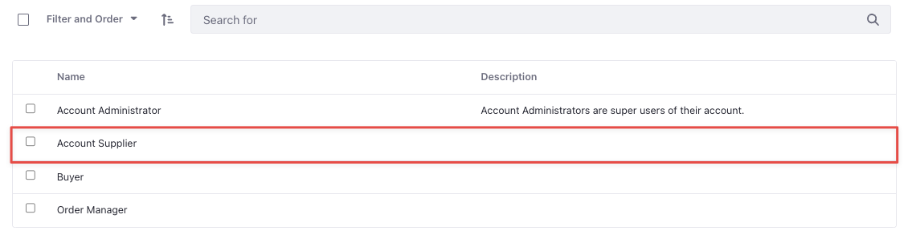

# Supplier Role

{bdg-secondary}`Available Liferay DXP 7.4 U84+/GA84+`

To enable suppliers to manage their own catalogs and channels, you must add at least one user with the *Account Supplier* role to a supplier account. This user can manage products present in the catalog linked to the supplier account. They can also manage orders, price lists, promotions, warehouses, and inventory present in the channel linked to their supplier account. Suppliers cannot create new discounts, but can override discounts present in price lists and promotions. See [Supplier](../../users-and-accounts/roles-and-permissions/commerce-roles-reference.md#supplier) for more information on all the permissions available.

## Assigning Users to the Supplier Account

Assigning a user to the account supplier role automatically assigns them with the new *Supplier* role as well. 

1. Open the *Global Menu* () and navigate to Control Panel → Accounts.

1. Select the supplier account and click on *Users*.

1. Click the *Add* button and select *Assign Users*. You can also invite users by choosing the [*Invite Users*](https://learn.liferay.com/web/guest/w/commerce/users-and-accounts/account-management/inviting-users-to-an-account) option.

1. Select a user and click *Assign*.

1. Click on the 3-dot () icon next to the assigned user and select *Assign Roles*. 

1. Select *Account Supplier*

   

1. Click *Done*. 

## Related Topics

* [Supplier](../../users-and-accounts/roles-and-permissions/commerce-roles-reference.md#supplier)
* [Account Supplier](../../users-and-accounts/roles-and-permissions/commerce-roles-reference.md#account-supplier)
* [Supplier Account](./supplier-account.md)
