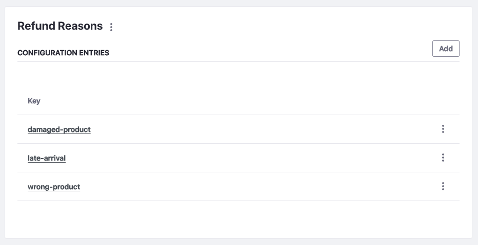

# Adding Reasons for Refunds

While processing a refund, it is mandatory to select a reason to complete the transaction. To add reasons for refunds,

1. Open the *Global Menu* () and navigate to *Control Panel* &rarr; *System Settings*.

1. Select the *Payment* option under Commerce.

1. Under Virtual Instance Scope, select *Refund Reasons*.

   !!! note

       This adds the refund reasons for all virtual instances. If you want to configure it for a specific instance, go to *Control Panel* &rarr; *Instance Settings*. Select Payment and click *Refund Reasons* from the left menu. 

1. Click *Add* to enter a reason and enter the following information.

   **Key:** wrong-product

   **Name:** Buyer ordered the wrong product or variant

   **Priority:** 0

   The key field is a unique identifier for the refund reason. The name field appears in the *Refund Reason* dropdown. The priority decides the order of reasons in the dropdown.

   

1. Click *Save*.

You can add multiple reasons with their own unique keys. 

## Commonly Added Refund Reasons

* Buyer ordered the wrong product or variant
* Seller shipped the wrong product or variant
* Received damaged or defective goods
* Buyer no longer needs the product
* Product did not match the description
