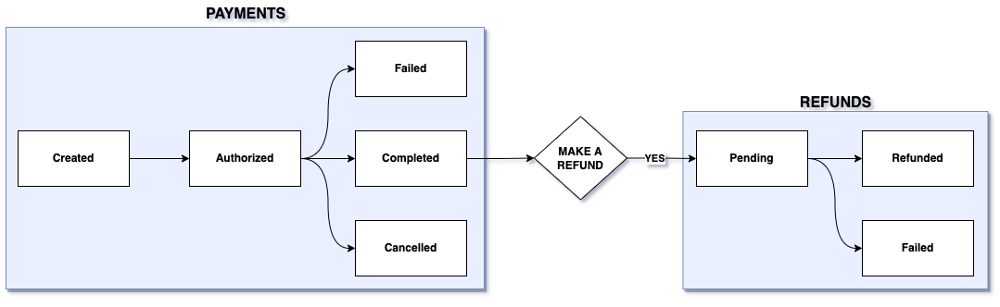

# Payments Reference

The Payments application displays the following information about each payment entry.

| Field      | Description                                                                                |
| :--------- | :----------------------------------------------------------------------------------------- |
| ID         | ID of the payment or refund                                                                |
| Type       | Specifies whether it is a payment or a refund                                              |
| ERC        | External reference code of the payment or refund                                           |
| Date       | Date of the transaction                                                                    |
| Amount     | Amount of the transaction                                                                  |
| Related To | Specifies whether the payment is related to an order or the refund is related to a payment |
| Related ID | Specifies the ID of the related order or payment                                           |
| Status     | Specifies the status of the payment or refund                                              |

## Status Reference

Each payment entry has a status that shows its current state in the payment life cycle. 

| Status     | Description                                                   |
| :--------- | :------------------------------------------------------------ |
| Authorized | Payment provider authorizes the payment                       |
| Cancelled  | Payment gets cancelled by the buyer                           |
| Completed  | Transaction is complete and the merchant receives the payment |
| Created    | Specifies the addition of a new payment entry                 |
| Failed     | Transaction fails for reasons other than cancellation         |
| Pending    | Specifies the creation of a refund that's not submitted yet   |
| Refunded   | Refund submission is complete                                 |
