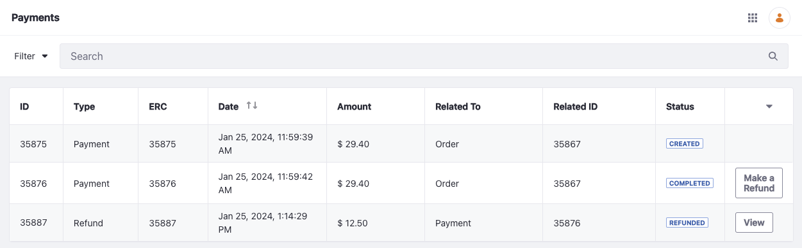
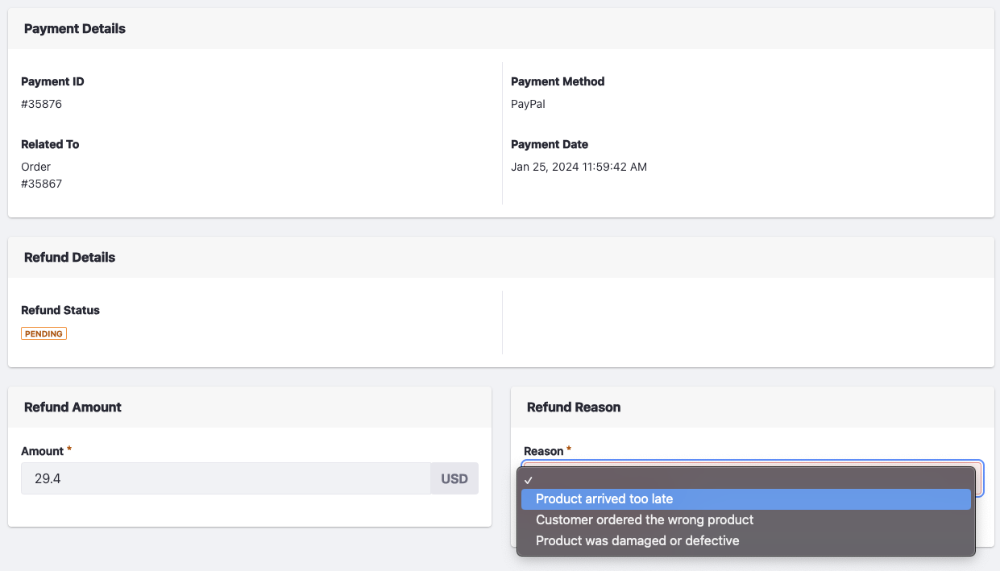
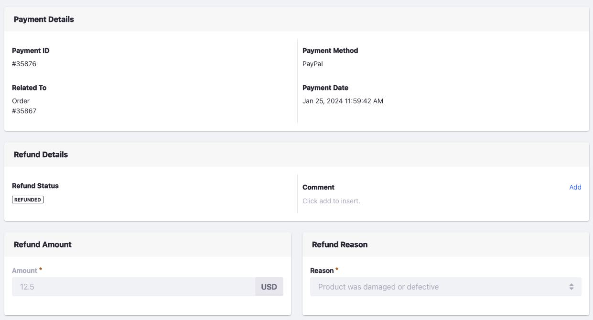

# Refunds

Liferay's new Payments application supports the creation of refunds for applicable payment methods. Once processed, the refund goes back to the original payment method. There are two main steps involved in refunding money. The first step is to create a refund on the required payment. The second step is to submit the refund after verifying all the necessary details. 

## Creating and Submitting a Refund

1. Open the *Global Menu* () and navigate to *Commerce* &rarr; *Payments*.

1. Find a payment in Completed status and click *Make a Refund*.

   

   This creates a new entry of type Refund in the Pending status. It opens the newly created refund for submission. You can also go back to the Payments page and click *View* next to the refund to submit it.

   

1. Enter the refund amount in the *Amount* field and select a reason from the *Reason Dropdown*. See [Adding Reasons for Refunds](./adding-reasons-for-refunds.md) to learn more about creating refund reasons. 

1. Click *Submit*. Alternatively, you can click *Save* to come back to it at a later stage. 

After submitting the refund, the refund entry moves to the Refunded status. If it fails, it goes to the Failed status. See [Payments Reference](./payments-reference.md) to learn more about the payments and refunds lifecycle and the different statuses available. 

## Filtering Payments and Refunds

1. Go to the Payments application and choose the *Filter* option.

1. There are two filters available: Type and Status.

   1. Click *Type* to choose between payments, refunds, or both. Use the checkboxes to make your selection. You can also use the *Exclude* toggle to filter out the type you checked.

   1. Click *Status* to choose between different statuses. Read [Payments Reference](./payments-reference.md) to learn more about payment statuses. As with type, you can use the *Exclude* toggle to filter out the status you checked.

   1. Click *Add Filter* to view results. Click the *Close* () button to remove a particular filter or click *Reset Filters* to remove them all.

## Searching Payments and Refunds

1. Use the search bar to enter a payment ID.

1. Click *Search* () or press enter to view the result.

You can also use the search bar after applying filters. 

## Related Topics

* [Adding Reasons for Refunds](./adding-reasons-for-refunds.md)
* [Payments Reference](./payments-reference.md)